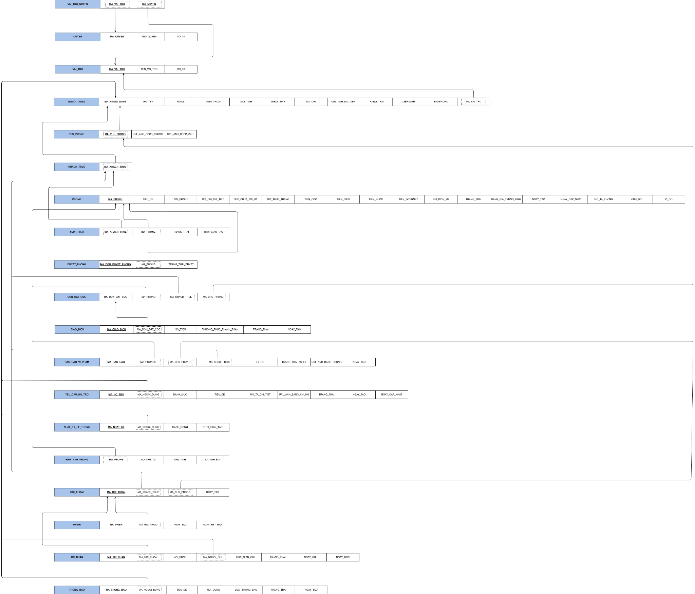

# 03 ERD

Traceability:
- `docs/design/design/05-data-design.md` section 4.1 Data Diagram.
- `docs/design/design/05-data-design.md` section 4.2 Data Specification.
- ERD image: `docs/assets/Design-009-c0aa677bee.png`.

## Source Diagram

## Textual Entity Relationship Summary

The source documentation provides table specifications and FK constraints. Cardinalities below follow documented FK direction and should be verified against the ERD image before implementation.

| Relationship | Documented Basis |
| --- | --- |
| `NGUOI_DUNG.MA_VAI_TRO -> VAI_TRO.MA_VAI_TRO` | User belongs to a role. |
| `CHU_PHONG.MA_CHU_PHONG -> NGUOI_DUNG.MA_NGUOI_DUNG` | Host is a user subtype. |
| `KHACH_THUE.MA_KHACH_THUE -> NGUOI_DUNG.MA_NGUOI_DUNG` | Tenant is a user subtype. |
| `YEU_THICH.MA_KHACH_THUE -> KHACH_THUE/NGUOI_DUNG`; `YEU_THICH.MA_PHONG -> PHONG.MA_PHONG` | Tenant favorites rooms; composite primary key. |
| `DUYET_PHONG.MA_PHONG -> PHONG.MA_PHONG` | Room/listing approval record links to a room. |
| `DON_DAT_COC.MA_PHONG -> PHONG.MA_PHONG` | Deposit booking is for a room. |
| `DON_DAT_COC.MA_KHACH_THUE -> KHACH_THUE/NGUOI_DUNG` | Deposit booking is created by a tenant. |
| `DON_DAT_COC.MA_CHU_PHONG -> CHU_PHONG.MA_CHU_PHONG` | Deposit booking involves a host. |
| `GIAO_DICH.MA_DON_DAT_COC -> DON_DAT_COC.MA_DON_DAT_COC` | Transaction belongs to a deposit booking. |
| `BAO_CAO_VI_PHAM.MA_PHONG -> PHONG.MA_PHONG` | Violation report may target a room. |
| `BAO_CAO_VI_PHAM.MA_CHU_PHONG -> CHU_PHONG.MA_CHU_PHONG` | Violation report may target a host. |
| `BAO_CAO_VI_PHAM.MA_KHACH_THUE -> KHACH_THUE.MA_KHACH_THUE` | Violation report is submitted by a tenant. |
| `YEU_CAU_HO_TRO.MA_PHONG -> PHONG.MA_PHONG` | Support request may reference a room. |
| `NHAT_KY_HE_THONG.MA_NGUOI_DUNG -> NGUOI_DUNG.MA_NGUOI_DUNG` | System log records actor. |
| `HINH_ANH_PHONG.MA_PHONG -> PHONG.MA_PHONG` | Room has ordered images. |
| `HOI_THOAI.MA_KHACH_THUE -> KHACH_THUE.MA_KHACH_THUE`; `HOI_THOAI.MA_CHU_PHONG -> CHU_PHONG.MA_CHU_PHONG` | Conversation connects tenant and host. |
| `PHIEN.MA_HOI_THOAI -> HOI_THOAI.MA_HOI_THOAI` | Session belongs to conversation. |
| `TIN_NHAN.MA_HOI_THOAI -> HOI_THOAI.MA_HOI_THOAI`; `TIN_NHAN.MA_NGUOI_GUI -> NGUOI_DUNG.MA_NGUOI_DUNG` | Message belongs to conversation and sender. |

## Entities

See [05 Database Schema](05-database-schema.md) for columns and constraints.

## Known ERD Gaps

- The source does not provide full textual cardinality for every relationship.
- The source includes `QUYEN` but no explicit join table between `VAI_TRO` and `QUYEN` in the data specification, while class specs include `Role.addPermission()` and `Permission`.
- The source mentions reviews in class specs, but the data-design table list shown in `05-data-design.md` does not include a dedicated review table in the extracted text.

## Cross References

- Database schema: [05 Database Schema](05-database-schema.md)
- Class specifications: [07 Class Specifications](07-class-specifications.md)
- Business rules: [01 Business Rules](01-business-rules.md)
