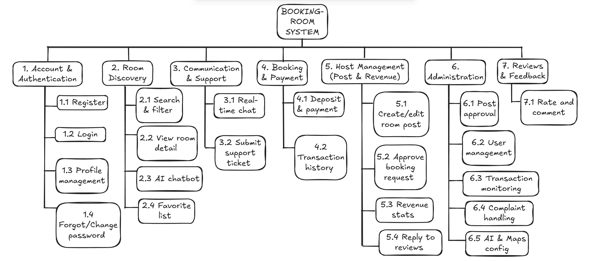
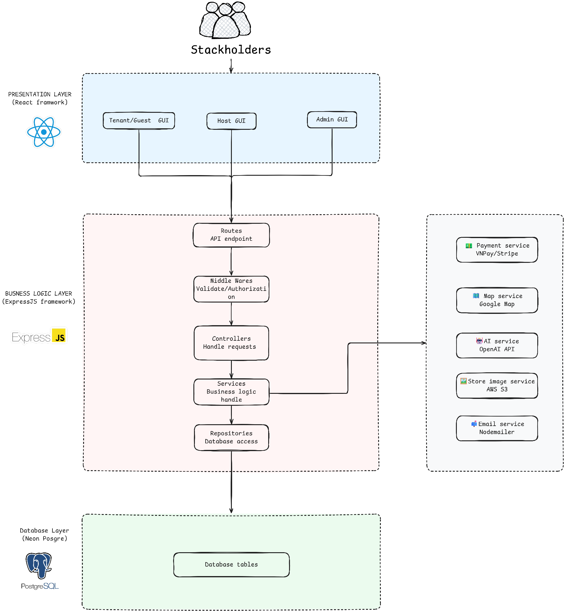

# 04 Architecture

Traceability:
- `docs/system.md` section 3-4.
- `docs/requirements/projectproposal.md` section "Kiến trúc phần mềm".
- `docs/design/design/04-architectural-design.md`.

## Architecture Style

The documented architecture is layered:

1. Presentation Layer
2. Business Logic Layer
3. Database Layer
4. External Services

Design goals from the proposal:
- Separation of concerns.
- Testability.
- Scalability.
- Maintainability.

## Source Diagrams

## Presentation Layer

| Item | Requirement |
| --- | --- |
| Technology | Next.js / React / TypeScript / Tailwind CSS. |
| Responsibility | Serve Tenant/Guest, Host, and Admin UI; collect user interactions; send HTTP requests to backend; render JSON/XML responses. |
| Route organization | `app/auth`, `app/guest`, `app/client`, `app/host`, `app/admin`. |

## Business Logic Layer

| Component | Responsibility |
| --- | --- |
| Routes | HTTP entry points that map endpoints to controllers; no business logic. |
| Middlewares | JWT authentication and authorization checks before request proceeds. |
| Controllers | Extract params/body, call services, format HTTP responses. |
| Services | Core business logic; may call external services. |
| Repositories | Only layer that communicates with database; isolates SQL/Knex from business logic. |

## Backend Modules

Source proposal lists these modules:

- Authentication Module: login, registration, authorization.
- Booking Module: room booking/deposit workflow.
- Payment Module: payment management.
- Content Module: rooms and listing content.
- Interaction Module: chat, notifications, support.
- AI Chatbot Module: receives user input, uses database/maps to filter room data, calls OpenAI API.

## Database Layer

| Item | Requirement |
| --- | --- |
| DBMS | PostgreSQL. |
| Hosting | Neon mentioned in docs. |
| Query/migration | Knex.js in repository layer. |
| Data guarantee | ACID and stable transaction processing. |

## External Services

| Service | Purpose |
| --- | --- |
| VNPAY / Stripe | Sandbox payment flow. |
| AWS S3 / Cloudinary | Image/static asset storage. |
| OpenAI API | AI room recommendation reasoning/explanations. |
| Google Maps / MapTiler / Mapbox | Room location, maps, POI distance. |
| Nodemailer | Email notifications. |
| SMS/Email provider | OTP and invoice/receipt sending. |

## Realtime Communication

- Socket.io supports direct Tenant/Host chat.
- Realtime notifications are also documented.
- Secure transport must use WSS/HTTPS.

## Deployment and Operations

| Area | Documented Requirement |
| --- | --- |
| Frontend hosting | Vercel free tier/subdomain. |
| Backend hosting | Render free tier or paid if insufficient. |
| Database | Neon free tier. |
| CI/CD | GitHub Actions or Jenkins mentioned in team role table. |
| Version control | GitHub flow: `main`, `dev`, `feature/*`; PR requires at least one reviewer. |

## Cross References

- Business rules: [01 Business Rules](01-business-rules.md)
- API expectations: [06 API Spec](06-api-spec.md)
- Database schema: [05 Database Schema](05-database-schema.md)
- Class specifications: [07 Class Specifications](07-class-specifications.md)
