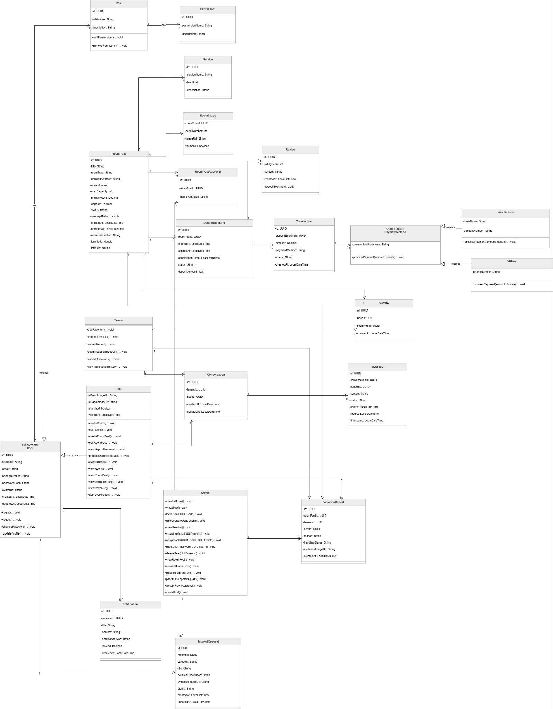

# 07 Class Specifications

Traceability:
- `docs/design/design/04-architectural-design.md` section 3.3 Class Specification.
- Class diagram image: `docs/assets/Design-008-f8a0e50562.jpg`.

## Source Class Diagram

## RoomPost

Properties:

| Property | Constraint | Description |
| --- | --- | --- |
| id | Unique | UUID of room post/listing. |
| title | Not Null | Display title. |
| roomType | Not Null | Room type. |
| detailedAddress | Not Null | Detailed address. |
| area | > 0 | Area in m2. |
| maxCapacity | > 0 | Maximum occupants. |
| monthlyRent | > 0 | Monthly rent in VND. |
| deposit | > 0, < monthlyRent | Required deposit. |
| status | Not Null | Pending, Approved, Locked, Rented, Available. |
| averageRating | 0.0-5.0 | Average rating. |
| createdAt / updatedAt |  | Timestamps. |
| roomDescription | Not Null | Detailed description. |
| longitude / latitude | Not Null | Map coordinates. |
| hostId | FK -> UserID | Host owner. |

Operations:
- `createRoomPost()`: create new post with default status Pending.
- `updateRoomDetails()`: update physical/commercial room info.
- `updateStatus(newStatus)`: transition room status, e.g. Available to Locked.
- `calculateAverageRating()`: recompute average after review creation.

## Service

Properties: `id`, `serviceName`, `fee`, `description`.

Operations:
- `addServiceToRoom()`
- `updateServiceFee()`

## DepositBooking

Properties:

| Property | Constraint |
| --- | --- |
| id | Unique |
| tenantId | Not Null |
| roomPostId | Not Null |
| createAt | Timestamp |
| expiredAt | `createAt + 15 mins` |
| appointmentTime | Timestamp |
| status | Processing, Confirmed, Expired, Cancelled |
| depositAmount | Required amount |

Operations:
- `createDepositBooking(tenantId, roomPostId, appointment, amount)`
- `updateStatus(newStatus)`
- `checkTimeout()`
- `cancelDepositBooking(reason: String)`

## Transaction

Properties:

| Property | Constraint |
| --- | --- |
| id | Unique |
| depositBookingId | Not Null |
| gatewayTracsaction | Third-party gateway reference; source spelling preserved. |
| amount | equals `DepositBooking.depositAmount` |
| paymentMethod | Only VNPay and BankTransfer according to class spec. |
| status | Pending, Success, Failed |
| createAt | Timestamp |

Operations:
- `createTransaction(depositBookingId, method)`
- `processWebhookCallback(gatewayId, responseCode)`
- `verifyPaymentStatus()`
- `getTransactionDetails()`

## RoomImage

Properties: `roomPostId`, `serialNumber`, `imageUrl`, `thumbnail`.

Operations:
- `uploadImage()` with `< 10MB`.
- `setAsThumbnail()`.

## Conversation

The source labels section 3.3.6 as `Class RoomPost` but properties describe a chat conversation. Treat the class name as a documentation inconsistency.

Properties: `id`, `tenantId`, `hostId`, `createdAt`, `updatedAt`.

Operations:
- `createConversation()`
- `getMessages()`

## Message

Properties: `id`, `conversationId`, `senderId`, `content`, `status` (`Sent`, `Delivered`, `Read`), `sentAt`, `readAt`, `timestamp`.

Operations:
- `sendMessage()`
- `updateStatusToRead()`

## Review

Properties: `id`, `ratingScore` (1-5), `content`, `createdAt`, `depositBookingId` unique.

Operations:
- `createReview()`
- `editReview()`

## User

Properties: `id`, `fullName`, `email`, `phoneNumber`, `passwordHash`, `avatarUrl`, `createdAt`, `updatedAt`.

Operations:
- `login()`
- `logout()`
- `changePassword()`
- `updateProfile()`

## Role and Permission

Role properties: `id`, `roleName`, `description`.

Role operations:
- `addPermission()`
- `removePermission()`

Permission properties: `id`, `permissionName`, `description`.

## Tenant

Operations:
- `addFavorite()`
- `removeFavorite()`
- `submitReport()`
- `submitSupportRequest()`
- `viewNotifications()`
- `viewTransactionHistory()`

## Host

Properties: `idFrontImageUrl`, `idBackImageUrl`, `isVerified`, `verifiedAt`.

Operations:
- `createRoom()`
- `editReview()` (source likely means edit room/review; preserve as documented)
- `createRoomPost()`
- `editRoomPost()`
- `viewDepositRequest()`
- `processDepositRequest()`
- `viewListRoom()`
- `viewRoom()`
- `viewRoomPost()`
- `viewListRoomPost()`
- `viewRevenue()`

## Admin

Properties: `id`, `fullName`, `email`, `phoneNumber`, `passwordHash`, `avatarUrl`, `role = ADMIN`, `createdAt`, `updatedAt`.

Operations:
- `viewListUser()`
- `viewUser()`
- `lockUser(UUID userId)`
- `unlockUser(UUID userId)`
- `viewUserList()` (duplicate of `viewListUser`)
- `viewUserDetail(UUID userId)`
- `assignRole(UUID userId, UUID roleId)`
- `resetUserPassword(UUID userId)`
- `deleteUser(UUID userId)` documented as soft-disable
- `viewRoomPost()`
- `viewListRoomPost()`
- `rejectRoomApproval()`
- `acceptRoomApproval()`
- `processSupportRequest()`
- `verifyHost()`
- `processViolationReport(reportId, newStatus)`

## SupportRequest

Properties: `ID`, `roomID`, `category`, `title`, `detailedDescription`, `evidenceImageUrl`, `status`, `createdAt`, `updatedAt`.

Operations:
- `createSupportRequest()`
- `viewSupportRequestDetail(UUID requestId)`
- `viewListSupportRequest()`
- `updateStatus(UUID requestId, String newStatus)`
- `addResolutionNote(UUID requestId, String note)`
- `closeSupportRequest(UUID requestId)`
- `reopenSupportRequest(UUID requestId)`
- `sendNotificationToUser(UUID requestId)`

## ViolationReport

Properties: `ID`, `roomID`, `hostID`, `tenantID`, `reason`, `processingStatus`, `evidenceImageUrl`, `createdAt`.

Operations:
- `createViolationReport()`
- `viewViolationReportDetail(UUID reportId)`
- `viewListViolationReport()`
- `updateProcessingStatus(UUID reportId, String status)`
- `acceptViolationReport(UUID reportId, String resolution)`
- `rejectViolationReport(UUID reportId, String rejectReason)`
- `applySanction(UUID targetId, String penaltyType)`
- `notifyReportResult(UUID reportId)`

## Cross References

- Database schema: [05 Database Schema](05-database-schema.md)
- API expectations: [06 API Spec](06-api-spec.md)
- Business rules: [01 Business Rules](01-business-rules.md)
