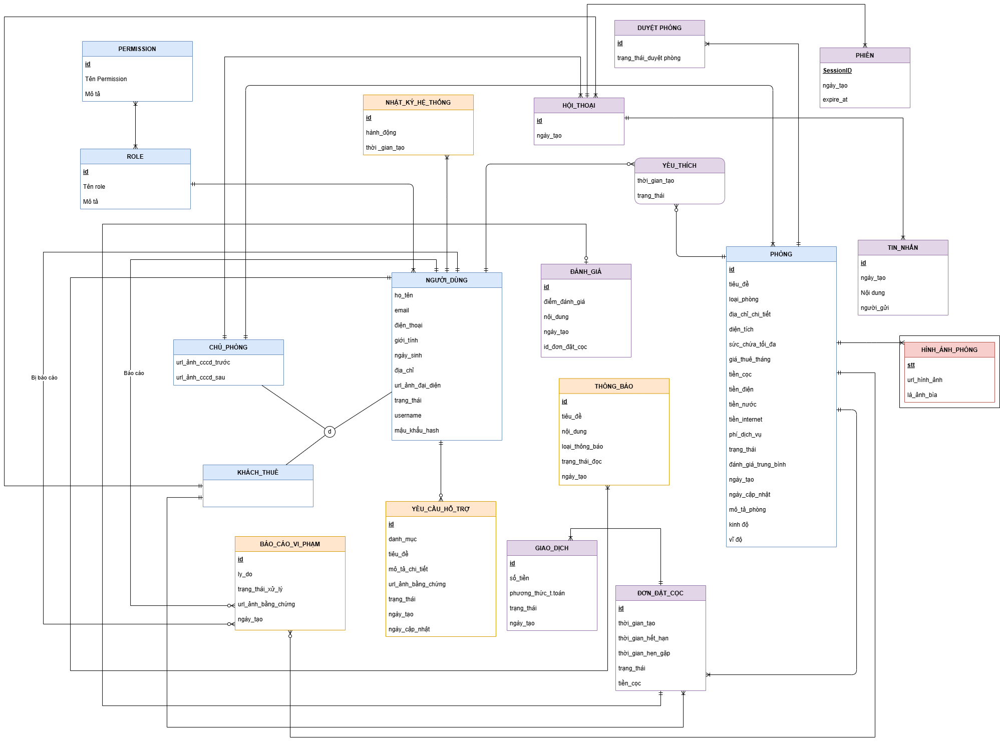

# Conceptual Model

| **2.1** | Business Rules Written by: 23120357 - Lê Nhật Thành Edited by: 23120357 - Lê Nhật Thành Reviewed by: Trần Đình Thi, Đặng Lê Đức Thịnh và Đỗ Phước Vinh, Lê Nguyễn Quốc Thái |
| --- | --- |

1. **Quy định về quản lý người dùng và xác thực**

| **Mã luật** | **Tên quy định** | **Mô tả chi tiết ràng buộc hệ thống** |
| --- | --- | --- |
| BR-01 | Phân định vai trò (Role) | Mỗi tài khoản người dùng khi đăng ký bắt buộc phải chọn một trong ba vai trò duy nhất: Tenant/Guest (Người thuê), Host (Chủ nhà), Admin (Quản trị viên) thì không được đăng ký. Một Email/Số điện thoại không được phép đăng ký song song nhiều vai trò trên cùng một tài khoản. |
| BR-02 | Xác thực tài khoản Host | Tài khoản Host sau khi đăng ký thành công sẽ ở trạng thái chưa kích hoạt chức năng đăng tin. Host bắt buộc phải cung cấp thông tin định danh (Ảnh mặt trước/mặt sau của CCCD) và được Admin phê duyệt thủ công thì mới có quyền đăng bài cho thuê phòng. |
| BR-03 | Khóa tài khoản vi phạm | Nếu một người dùng bị báo cáo từ 3 lần trở lên từ các tài khoản khác nhau và được Admin xác minh vi phạm tiêu chuẩn cộng đồng, tài khoản sẽ bị chuyển sang trạng thái Banned (Khóa). Tài khoản bị khóa sẽ không thể đăng nhập, không thể nhắn tin hay thực hiện giao dịch. |

2. **Quy định về đăng bài và kiểm duyệt phòng trọ **

| **Mã luật** | **Tên quy định** | **Mô tả chi tiết ràng buộc hệ thống** |
| --- | --- | --- |
| BR-04 | Trạng thái phòng trọ | Một phòng trọ trên hệ thống chỉ được phép tồn tại ở một trong các trạng thái logic sau: - Pending: Đang chờ Admin duyệt. - Approved: Đã duyệt, đang hiển thị công khai. - Rejected: Bị từ chối duyệt. - Locked: Phòng tạm khóa hiển thị công khai (do đang có khách thực hiện luồng thanh toán giữ phòng). - Rented: Đã có người thuê (Ẩn tạm thời khỏi danh sách tìm kiếm). - Hidden: Chủ nhà tự chủ động ẩn bài đăng. - Available: Phòng còn trống cho phép cho thuê |
| BR-05 | Thông tin bài đăng bắt buộc | Một bài đăng phòng trọ mới được coi là hợp lệ để gửi đi phê duyệt nếu và chỉ nếu thỏa mãn tất cả điều kiện sau: 1. Có đầy đủ tiêu đề, mô tả dài (>50 ký tự). 2. Định vị chính xác địa chỉ trên Google Maps API. 3. Có ít nhất 3 hình ảnh thực tế (dung lượng mỗi ảnh không quá 5MB). 4. Giá phòng và giá tiền đặt cọc phải lớn hơn 0. |
| BR-06 | Thời gian xử lý kiểm duyệt | Hệ thống quy định thời gian tối đa để Admin phê duyệt hoặc từ chối một bài đăng ở trạng thái Pending là 24 giờ làm việc. Quá thời gian này, hệ thống sẽ tự động gửi thông báo nhắc nhở (Notification) đến danh sách Admin. |

3. **Quy định về quy trình đặt phòng và giữ phòng **

| **Mã luật** | **Tên quy định** | **Mô tả chi tiết ràng buộc hệ thống** |
| --- | --- | --- |
| BR-07 | Đếm ngược giữ phòng | Khi người thuê nhấn nút "Tiến hành đặt cọc" trên giao diện chi tiết phòng, hệ thống sẽ tự động tạo một bản ghi Booking với trạng thái Processing và tạm khóa phòng đó. Hệ thống kích hoạt một bộ đếm ngược 15 phút. |
| BR-08 | Hết hạn thời gian giữ phòng | Nếu trong vòng 15 phút đếm ngược, hệ thống không nhận được tín hiệu thanh toán thành công từ cổng thanh toán: 1. Bản ghi Booking chuyển sang trạng thái Expired (Hết hạn). 2. Trạng thái của Room tự động chuyển ngược lại từ Locked về Approved để người khác có thể tìm thấy và đặt phòng. |
| BR-09 | Giới hạn đặt phòng song song | Để ngăn chặn hành vi spam hoặc phá hoại (giữ phòng ảo làm ảnh hưởng đến người thuê khác và chủ nhà): 1. Một tài khoản khách thuê tại một thời điểm chỉ được phép có tối đa 01 yêu cầu đặt phòng ở trạng thái Processing (đang trong 15 phút đếm ngược chờ thanh toán). 2. Khách thuê bắt buộc phải hoàn tất thanh toán hoặc chờ hết hạn (chuyển sang Expired) thì mới được bấm đặt cọc phòng tiếp theo. |

4. **Quy định về quy trình đặt phòng và giữ phòng **

| **Mã luật** | **Tên quy định** | **Mô tả chi tiết ràng buộc hệ thống** |
| --- | --- | --- |
| BR-10 | Định mức tiền đặt cọc | Số tiền đặt cọc giữ phòng do Host cấu hình khi đăng bài, tuy nhiên hệ thống áp đặt quy định ràng buộc nghiệp vụ: Tiền đặt cọc giữ phòng không được phép thấp hơn 500.000 VNĐ và không được vượt quá giá thuê của 1 tháng của chính phòng trọ đó. |
| BR-11 | Chính sách hủy phòng và hoàn cọc | Quyết định hoàn tiền cọc khi Guest bấm huỷ đặt phòng (Cancel Booking) dựa trên mốc thời gian hẹn gặp xem phòng được ghi nhận trong hệ thống: - Nếu Host từ chối việc đặt phòng của Guest vì lý do nào đó, hệ thống sẽ hoàn lại 100% tiền cọc cho Guest. - Nếu Host chấp nhận việc đặt phòng của Guest (với điều kiện Guest đã xem phòng và Guest không khiếu nại trong vòng 7 ngày) , hệ thống sẽ chuyển tiền đặt cọc cho Host (đã trừ phí 5% tiền đặt cọc). |
| BR-12 | Đóng băng tiền cọc tranh chấp | Trong trường hợp khách thuê đến xem phòng nhưng thực tế phòng không đúng mô tả và khách thuê bấm nút "Khiếu nại": Hệ thống sẽ thực hiện đóng băng khoản thanh toán cọc này. Số tiền này sẽ giữ lại ở tài khoản trung gian của hệ thống và không chuyển cho Host cho đến khi Admin vào cuộc phân xử xong (tối đa 3 ngày làm việc). |

5. **Q****uy định về đánh giá phòng**

| **Mã luật** | **Tên quy định** | **Mô tả chi tiết ràng buộc hệ thống** |
| --- | --- | --- |
| BR-13 | Điều kiện viết đánh giá | Một người dùng chỉ được quyền đánh giá sao (1-5 sao) và để lại bình luận cho bài đăng phòng trọ khi và chỉ khi tài khoản đó có lịch sử giao dịch Booking ở trạng thái Success (Đã hoàn tất quá trình thuê phòng thực tế và xác nhận nhận phòng thành công). |

| **2.2** | ERD |
| --- | --- |

Please include the ID and full name of the student who authored, reviewed, or updated this section.

Written by: 23120405 - Đỗ Phước Vinh, 23120360 - Đặng Lê Đức Thịnh

Edited by: 23120405 - Đỗ Phước Vinh, 23120360 - Đặng Lê Đức Thịnh

Reviewed by: Trần Đình Thi và Lê Nhật Thành, Lê Nguyễn Quốc Thái

