# User Interface and User Experience Design

| **5.1** | Screen Diagram |
| --- | --- |

Written by: 23120357 - Lê Nhật Thành , 23120360 - Đặng Lê Đức Thịnh

Edited by: 23120357 - Lê Nhật Thành , 23120360 - Đặng Lê Đức Thịnh

Reviewed by: Trần Đình Thi, Đỗ Phước Vinh, Lê Nguyễn Quốc Thái

[Draw a screen diagram illustrating the relationships and transitions between the screens]

[List the screens]

| **Seq** | **Screen** | **Description** |
| --- | --- | --- |
| **1.0** | **Xác thực và tài khoản** |  |
| 1.1 | Trang chủ (chưa đăng nhập tài khoản) | Điểm khởi đầu của hệ thống dành cho khách vãng lai, cung cấp nút điều hướng đến màn hình Đăng nhập. |
| 1.2 | Màn hình Đăng nhập | Cho phép nhập thông tin tài khoản. Phân quyền điều hướng theo 3 vai trò (Tenant, Host, Admin). |
| 1.2.1 | Quên mật khẩu | Màn hình được người dùng lựa chọn từ màn hình Đăng nhập, nhằm giúp người dùng khôi phục lại mật khẩu. |
| 1.3 | Màn hình Đăng ký | Giao diện đăng ký tài khoản mới khi người dùng kích hoạt từ luồng Đăng ký ở màn hình Đăng nhập. |
| **2.0** | **Phân hệ khách thuê (Tenant)** |  |
| 2.1 | Trang chủ của Tenant (Gợi ý phòng) | Màn hình chính của khách thuê sau khi đăng nhập, hiển thị danh sách phòng gợi ý. |
| 2.1.1 | AI Chatbot | Màn hình phụ trợ mở ra từ Trang chủ Tenant để hỗ trợ tư vấn tự động cho người dùng. |
| 2.1.2 | Hồ sơ Cá nhân | Màn hình phụ trợ từ Trang chủ của Tenant, cho phép xem thông tin cá nhân, đổi mật khẩu và avatar. |
| 2.2 | Danh sách phòng (Kết quả tìm kiếm) | Hiển thị các phòng tìm được sau khi người dùng nhập từ khóa tại Trang chủ của Tenant. |
| 2.2.1 | Bộ lọc nâng cao | *Màn hình phụ trợ* được mở ra từ Danh sách phòng để lọc chi tiết theo khoảng giá, vị trí và các tiện ích khác liên quan. |
| 2.3 | Chi tiết phòng | Hiển thị toàn bộ thông tin chi tiết của một phòng cụ thể (Hình ảnh, Tiện ích, Giá). |
| 2.3.1 | Đánh giá & Bình luận | Màn hình phụ trợ cho phép người dùng đọc feedback và các nhận xét chi tiết của phòng. |
| 2.3.2 | Bản đồ phòng (Google Maps API) | Màn hình xem vị trí trực quan của phòng trên bản đồ. |
| 2.3.3 | Hộp thư / Chat (Real-time) | Cửa sổ chat thời gian thực kết nối trực tiếp Tenant với Host để trao đổi thông tin chi tiết. |
| 2.4 | Xác nhận & Thanh toán | Màn hình hiển thị hóa đơn đặt cọc và chạy bộ đếm ngược 15 phút để người dùng hoàn tất giao dịch. |
| 2.5 | Thanh toán Thành công | Giao diện hiển thị hóa đơn khi giao dịch thành công, cho phép bấm xem lịch sử giao dịch, nhắn tin cho chủ phòng hoặc quay về Trang chủ. |
| 2.6 | Lịch sử Đặt phòng | Giao diện quản lý toàn bộ các trạng thái đơn đặt phòng của Tenant. |
| 2.6.1 | Popup Xác nhận Hủy | Màn hình phụ trợ dạng popup, yêu cầu nhập lý do trước khi hệ thống xử lý hủy đơn đặt phòng |
| **3.0** | **Phân hệ Chủ nhà (Host)** |  |
| 3.1 | Dashboard Chủ nhà | Giao diện tổng quan tình hình kinh doanh của Host và là trung tâm điều hướng của phân hệ. |
| 3.1.1 | Hộp thư / Chat (Real-time) | Màn hình phụ hỗ trợ Host phản hồi tin nhắn từ Tenant (chung giao diện chat với Tenant). |
| 3.2 | Quản lý Tin đăng | Giao diện danh sách các tin đăng phòng của chủ nhà (gồm cả tin chưa đăng và đã đăng). |
| 3.2.1 | Tạo/Sửa Bài đăng | Màn hình phụ để điền form chi tiết khi thêm mới hoặc chỉnh sửa một tin đăng phòng. |
| 3.3 | Thống kê Doanh thu | Giao diện xem dòng tiền và biểu đồ doanh thu theo thời gian của Host. |
| 3.4 | Quản lý Giao dịch (Host) | Giao diện xem lịch sử các giao dịch phát sinh liên quan đến phòng của Host. |
| **4.0** | **Phân hệ Quản trị viên (Admin)** |  |
| 4.1 | Dashboard Admin | Màn hình tổng quan của quản trị viên, điều hướng đến các tính năng quản lý hệ thống. |
| 4.1.1 | Quản lý Người dùng | Màn hình quản lý danh sách tài khoản (Khóa, mở, phân quyền). |
| 4.1.2 | Xử lý Khiếu nại | Màn hình tiếp nhận và giải quyết các khiếu nại của người dùng trên hệ thống. |
| 4.1.3 | Quản lý Duyệt bài đăng | Màn hình kiểm duyệt các tin đăng phòng của Host trước khi hiển thị công khai. |
| 4.1.4 | Quản lý Giao dịch (Admin) | Giao diện kiểm soát toàn bộ dòng tiền, giao dịch hệ thống. |
| 4.1.5 | Hỗ trợ người dùng | Giao diện tiếp nhận và phản hồi các yêu cầu hỗ trợ từ người dùng. |

| **5.2** | Screen Specifications |
| --- | --- |

**5.2.1. ****Screen “Dashboard Admin”**

Written by: 23120405 - Đỗ Phước Vinh

Edited by: 23120405 - Đỗ Phước Vinh

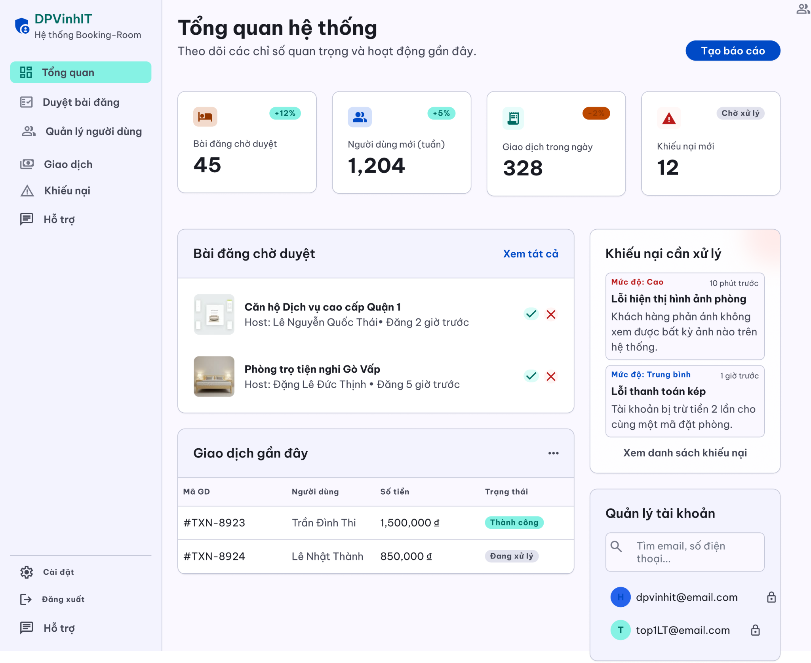

**Hình thức trình bày**

- Thanh điều hướng dọc (Sidebar) bên trái.
- Khung thống kê chỉ số cốt lõi (KPI Cards): Bài đăng chờ duyệt, Người dùng mới, Giao dịch trong ngày, Khiếu nại mới.
- Bảng dữ liệu rút gọn (DataGrid) cho: Bài đăng chờ duyệt, Giao dịch gần đây và Khiếu nại cần xử lý.
- Nút “Tạo báo cáo” (màu xanh).
- Ô nhập liệu tìm kiếm nhanh "Quản lý tài khoản".
- Các liên kết “Xem tất cả” / “Xem danh sách khiếu nại”.
**Xử lý sự kiện**

- Nhập Email/SĐT vào ô "Quản lý tài khoản" và nhấn Enter → hiển thị kết quả tìm kiếm.
- Nhấn nút “Tạo báo cáo” → trích xuất dữ liệu tổng quan thành file định dạng CSV/PDF.
- Nhấn các tab trên Sidebar hoặc nút “Xem tất cả” → chuyển tới màn hình Console tương ứng (Quản lý bài đăng, Giao dịch, Khiếu nại...).
**5.2.2.	****Screen “Quản lý người dùng”**

Written by: 23120405 - Đỗ Phước Vinh

Edited by: 23120405 - Đỗ Phước Vinh

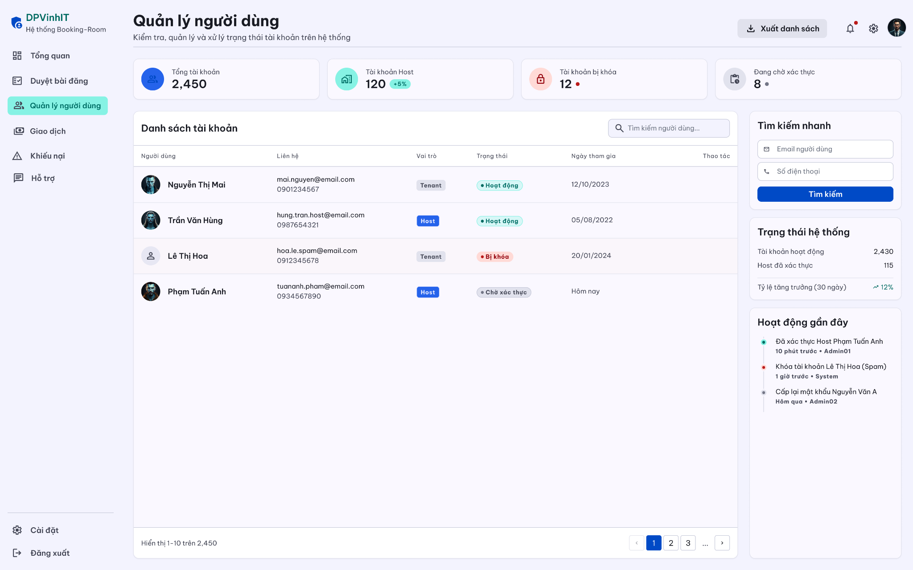

**Hình thức trình bày**

- Thanh Sidebar bên trái.
- Top-bar chứa thanh tìm kiếm (theo họ tên hoặc email) và bộ lọc (Vai trò, Trạng thái).
- Khung thống kê tổng quan: Tổng người dùng, Tổng tài khoản host và tài khoản bị khóa.
- Bảng dữ liệu danh sách toàn bộ người dùng trong hệ thống.
- Bảng thao tác bên phải có thanh tìm kiếm người dùng theo Email, SĐT và trạng thái hệ thống, hoạt động gần đây.
– Nút xuất báo cáo (màu xám trên header)

**Xử lý sự kiện **

- Vào trang hoặc reload → Hệ thống gọi hàm tải toàn bộ danh sách tài khoản từ bảng dữ liệu người dùng, hỗ trợ phân trang tự động.
- Thay đổi tùy chọn trên bộ lọc hoặc nhập từ khóa tìm kiếm → Bảng dữ liệu tự động làm mới và hiển thị kết quả tương ứng.
- Nhấn vào "avatar người dùng" → Điều hướng sang màn hình Chi tiết tài khoản để kiểm duyệt thông tin định danh và ảnh căn cước công dân (đối với chủ nhà).
**5.2.3. ****Screen “Xử lý khiếu nại”**

Written by: 23120405 - Đỗ Phước Vinh

Edited by: 23120405 - Đỗ Phước Vinh

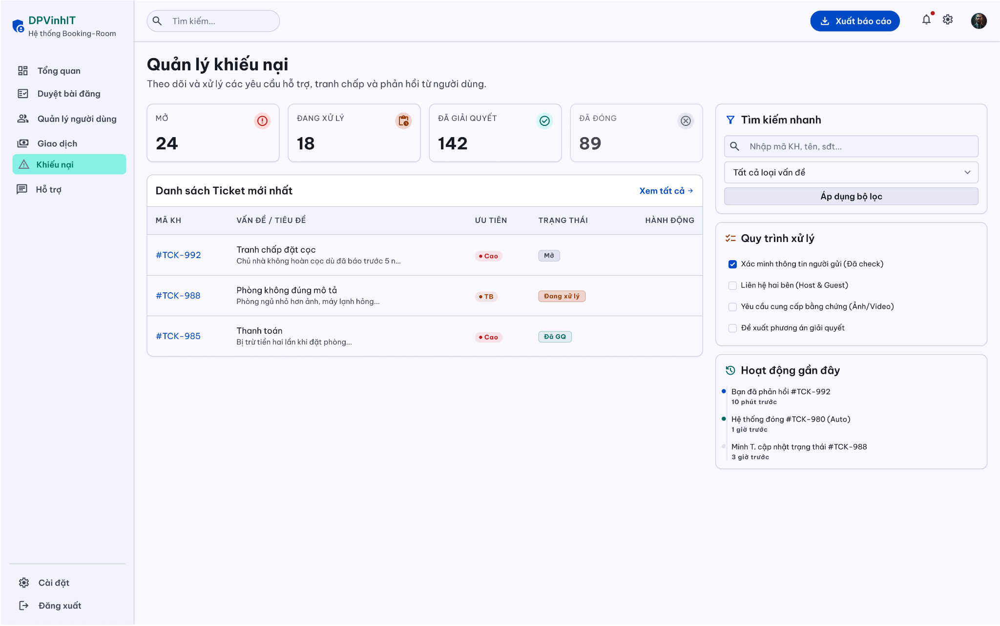

**Hình thức trình bày**

- Thanh Sidebar bên trái.
- Top-bar chứa khung tìm kiếm chung, nút “Xuất báo cáo” (màu xanh), icon thông báo và thông tin Admin.
- Khung thẻ chỉ số trạng thái xử lý: Mở, Đang xử lý, Đã giải quyết, Đã đóng.
- Bảng dữ liệu danh sách Ticket khiếu nại mới nhất.
- Bảng thao tác bên phải gồm: Bộ lọc tìm kiếm nhanh (theo mã/tên/sđt), Checklist "Quy trình xử lý", và Timeline "Hoạt động gần đây".
**Xử lý sự kiện**

- Vào trang hoặc reload → Hệ thống gọi hàm tải toàn bộ danh sách từ bảng báo cáo vi phạm, tự động đẩy các ticket trạng thái "Mở" hoặc có mức độ ưu tiên "Cao" lên đầu danh sách.
- Nhập từ khóa và nhấn “Áp dụng bộ lọc” → Bảng dữ liệu tự động làm mới danh sách ticket theo tiêu chí lọc.
- Tích chọn các checkbox trong khối Quy trình xử lý → Hệ thống lưu lại trạng thái tiến độ điều tra nội bộ của Admin đối với ticket đang chọn.
- Nhấn nút mã Ticket → Điều hướng sang màn hình Chi tiết khiếu nại để xem bằng chứng và lịch sử chat realtime.
**5.2.4.	****Screen “Quản lý duyệt bài đăng”**

Written by: 23120405 - Đỗ Phước Vinh

Edited by: 23120405 - Đỗ Phước Vinh

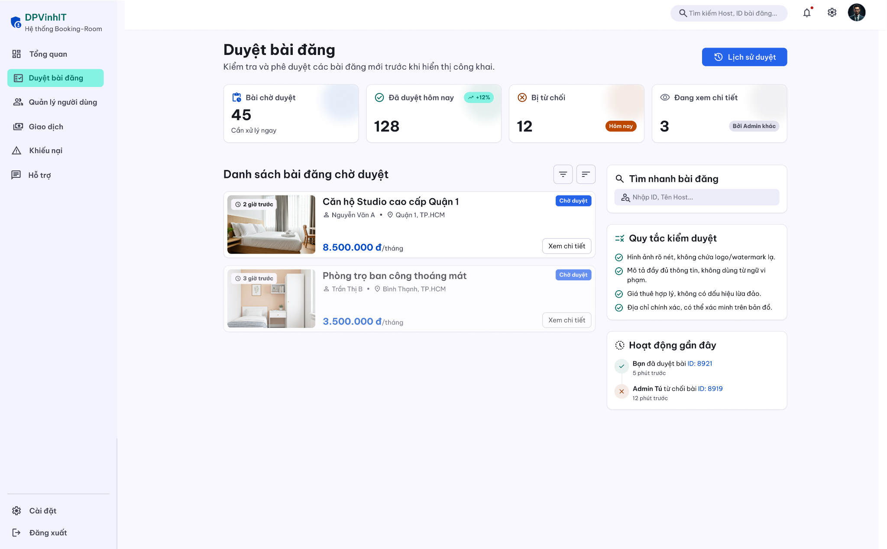

**Hình thức trình bày**

- Thanh Sidebar bên trái.
- Top-bar chứa thanh tìm kiếm bài đăng (theo tiêu đề hoặc tên chủ nhà) và bộ lọc trạng thái kiểm duyệt (Chờ duyệt, Đã duyệt, Từ chối).
- Khung thống kê tổng quan: Tổng số bài đăng, Số bài đăng đang chờ duyệt, bài đăng đã duyệt và bài đăng bị từ chối.
- Bảng dữ liệu danh sách bài đăng phòng trọ chi tiết (Mã bài đăng, Tiêu đề phòng, Thông tin chủ nhà, Ngày gửi yêu cầu, Trạng thái kiểm duyệt).
- Nút Phê duyệt nhanh (icon Tick xanh) và nút Từ chối nhanh (icon Dấu X đỏ) được tích hợp trực tiếp trên từng dòng của bảng dữ liệu. – Nút xuất báo cáo (màu xanh trên header).
**Xử lý sự kiện**

- Vào trang hoặc reload → Hệ thống gọi hàm tải toàn bộ danh sách bài đăng từ bảng dữ liệu phòng, tự động sắp xếp ưu tiên các bài đăng ở trạng thái Chờ duyệt (Pending) lên đầu và hỗ trợ phân trang tự động.
- Thay đổi tùy chọn trên bộ lọc hoặc nhập từ khóa tìm kiếm → Bảng dữ liệu tự động truy vấn lại, làm mới và hiển thị kết quả bài đăng tương ứng.
- Nhấn vào “Xem chi tiết” → Điều hướng sang màn hình Chi tiết bài đăng để kiểm duyệt toàn bộ thông tin hình ảnh thực tế, vị trí bản đồ, giá cả và mô tả chi tiết của phòng trọ.
**5.2.5.	****Screen “Quản lý giao dịch”**

Written by: 23120405 - Đỗ Phước Vinh

Edited by: 23120405 - Đỗ Phước Vinh

Reviewed by:

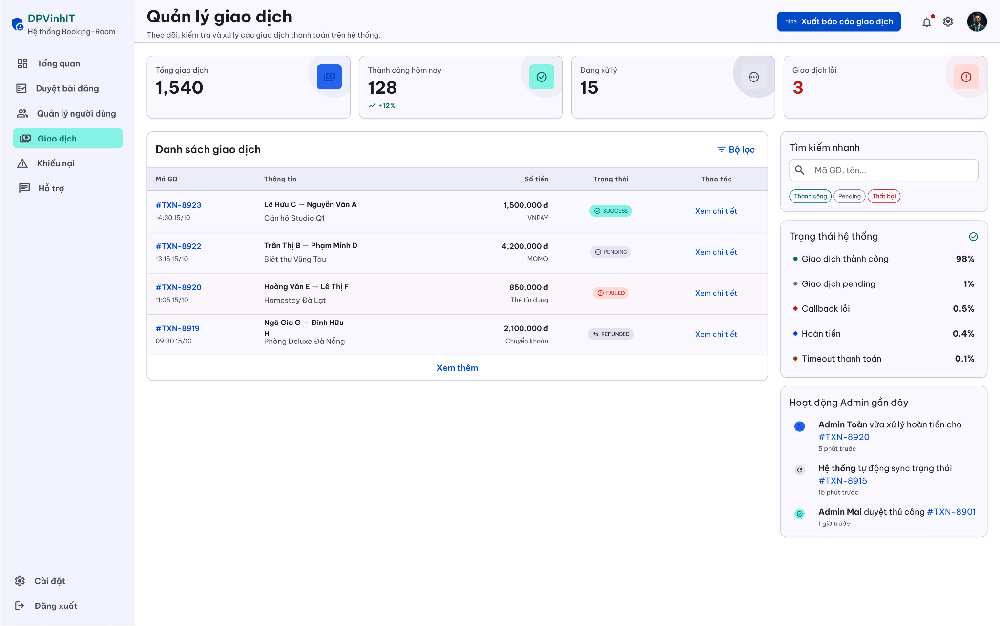

**Hình thức trình bày**

- Thanh Sidebar bên trái.
- Top-bar chứa bộ chọn khoảng thời gian và nút "Xuất báo cáo" (màu xanh dương).
- Khung biểu đồ cột/đường trực quan hóa xu hướng doanh thu và biến động dòng tiền hệ thống. Khung thống kê tổng hợp: Tổng giao dịch, Số giao dịch thành công, Giao dịch đang xử lý và Giao dịch lỗi.
- Bảng dữ liệu lịch sử giao dịch chi tiết
**Xử lý sự kiện**

- Vào trang hoặc reload→ Hệ thống gọi hàm tải toàn bộ lịch sử dòng tiền từ bảng dữ liệu giao dịch, mặc định hiển thị dữ liệu của tháng hiện tại và tự động vẽ lên biểu đồ.
- Thay đổi khoảng thời gian hoặc lựa chọn bộ lọc phương thức/trạng thái → Bảng dữ liệu tự động làm mới, cập nhật mảng danh sách bản ghi và cập nhật lại biểu đồ tương ứng.
- Nhấn chọn vào "Xem chi tiết" trên bảng → Điều hướng sang trang Biên lai chi tiết giao dịch phục vụ việc đối soát mã tham chiếu với cổng thanh toán bên thứ ba.
**5.2.6.	****Screen “Hỗ trợ người dùng”**

Written by: 23120405 - Đỗ Phước Vinh

Edited by: 23120405 - Đỗ Phước Vinh

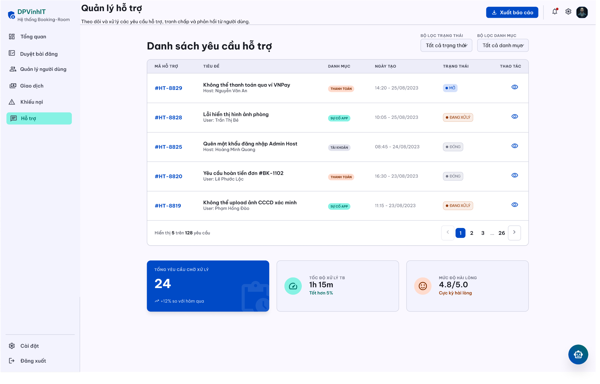

**Hình thức trình bày**

- Thanh Sidebar bên trái.
- Top-bar chứa thanh tìm kiếm và nút "Xuất báo cáo" (màu xanh dương).
- Bảng dữ liệu danh sách yêu cầu hỗ trợ chi tiết, có tích hợp thanh phân trang ở cuối bảng.
- Khung thống kê ở dưới cùng: Tổng yêu cầu chờ xử lý, Tốc độ xử lý trung bình và Mức độ hài lòng.
**Xử lý sự kiện**

- Vào trang hoặc reload → Hệ thống gọi hàm tải toàn bộ danh sách các yêu cầu hỗ trợ kỹ thuật từ bảng dữ liệu hỗ trợ, hỗ trợ phân trang tự động và tổng hợp số liệu hiển thị lên các thẻ thống kê hiệu suất.
- Thay đổi tùy chọn trên bộ lọc trạng thái/danh mục hoặc nhập từ khóa tìm kiếm → Bảng dữ liệu tự động truy vấn lại, làm mới và hiển thị kết quả tương ứng.
- Nhấn vào biểu tượng "Xem chi tiết" (icon con mắt) trên cột thao tác → Điều hướng sang màn hình Chi tiết yêu cầu hỗ trợ để Admin kiểm tra mô tả chi tiết lỗi phần mềm và xem hình chụp sự cố thực tế.
- Nhấn nút "Xuất báo cáo" → Trích xuất danh sách yêu cầu hỗ trợ hệ thống thành tệp tin định dạng báo cáo.
**5.2.7. Screen “Tổng quan của chủ phòng”**

Written by: 23120352 - Lê Nguyễn Quốc Thái

Edited by: 23120352 - Lê Nguyễn Quốc Thái

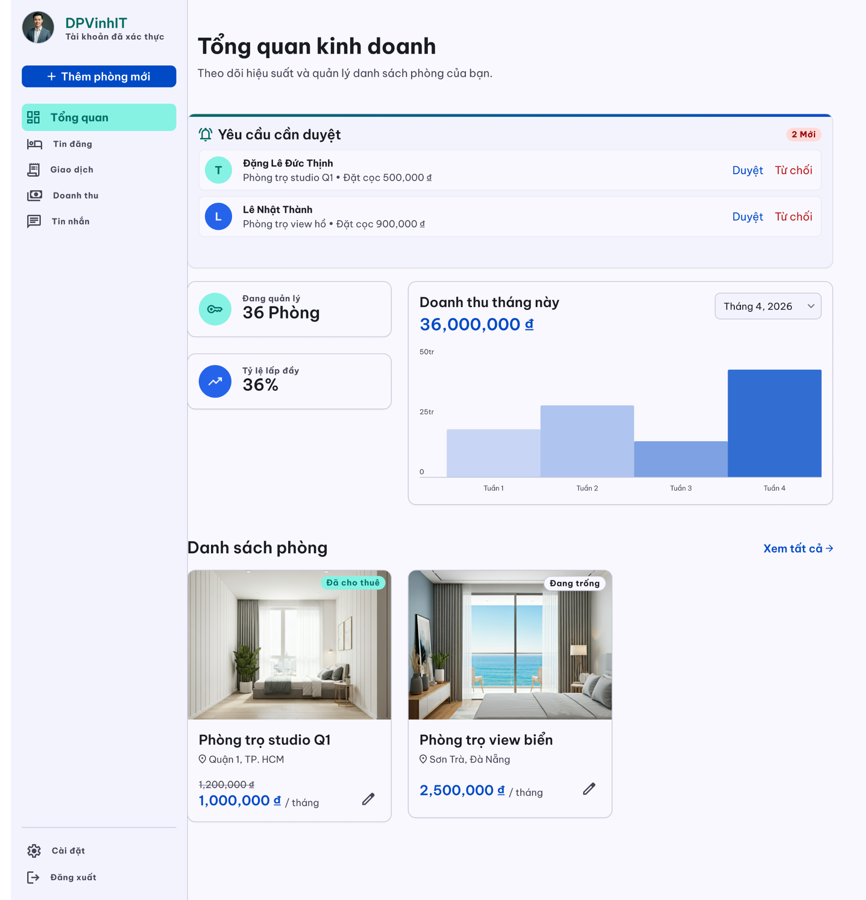

**H****ình thức trình bày:**

- Thanh Sidebar:
  - **Thông tin tài khoản:** Hiển thị ảnh đại diện, tên chủ phòng ("DPVinhIT") và trạng thái "Tài khoản đã xác thực".
  - **Nút chức năng chính:** Nút "+ Thêm phòng mới" với biểu tượng dấu cộng nổi bật.
  - **Danh mục điều hướng:** Danh sách các mục quản lý bao gồm "Tổng quan" (đang kích hoạt), "Tin đăng", "Giao dịch", "Doanh thu", "Tin nhắn", "Cài đặt" và "Đăng xuất"
- Màn hình chính:
- **Yêu cầu cần duyệt:** Danh sách các yêu cầu đặt cọc/thuê phòng đang chờ xử lý.
- **Khối thông tin kinh doanh:** Hai thẻ thông tin nhỏ hiển thị "Đang quản lý: 36 Phòng" và "Tỷ lệ lấp đầy: 36%". Biểu đồ cột thể hiện biến động doanh thu theo từng tuần kèm bộ lọc thời gian.
- **Danh sách phòng:** Khu vực hiển thị danh sách các phòng hiện có dưới dạng lưới thẻ (Card), bao gồm hình ảnh, trạng thái (Đã cho thuê/Đang trống), tên phòng, địa chỉ, giá tiền và biểu tượng chỉnh sửa.
**Xử lý sự kiện:**

- **Ấn nút "+ Thêm phòng mới":** Hệ thống điều hướng người dùng đến biểu mẫu khởi tạo và nhập thông tin cho phòng trọ mới.
- **Ấn mục "Tin đăng" / "Giao dịch" / "Doanh thu" / "Tin nhắn": **Hệ thống chuyển đổi giao diện sang màn hình chức năng tương ứng.
- **Ấn mục "Cài đặt":** Hệ thống mở trang cấu hình thông tin tài khoản, mật khẩu hoặc cấu hình hệ thống.
- **Ấn mục "Đăng xuất":** Hệ thống xóa phiên làm việc hiện tại và đưa người dùng quay trở lại màn hình đăng nhập.
- **Ấn nút "Duyệt":** Hệ thống cập nhật trạng thái yêu cầu thành chấp nhận, chuyển đổi trạng thái phòng liên quan và gửi thông báo xác nhận đến khách hàng.
- **Ấn nút "Từ chối":** Hệ thống hủy bỏ yêu cầu thuê/đặt cọc, giải phóng trạng thái chờ của phòng và thông báo lại cho khách hàng.
- **Ấn vào ảnh hoặc vùng thông tin chung của thẻ phòng:** Hệ thống điều hướng đến trang hiển thị chi tiết trạng thái, thông tin chi tiết và lịch sử thuê của phòng đó.
- **Ấn vào biểu tượng cây bút (Chỉnh sửa) ở góc dưới thẻ phòng:** Hệ thống kích hoạt chế độ chỉnh sửa, cho phép thay đổi hình ảnh, giá thuê, địa chỉ hoặc mô tả của phòng.
**5.2.8. Screen “Quản lý tin đăng của chủ phòng”**

Written by: 23120352 - Lê Nguyễn Quốc Thái

Edited by: 23120352 - Lê Nguyễn Quốc Thái

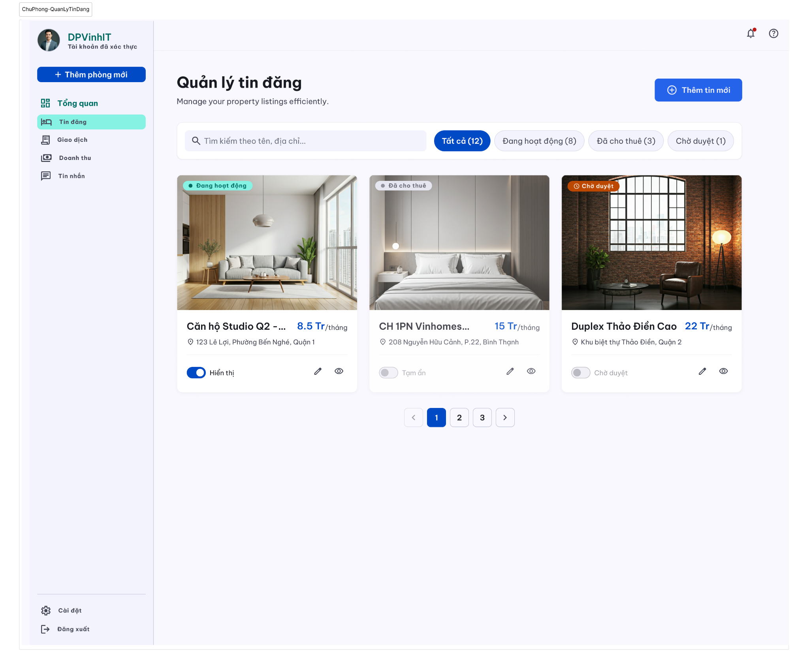

**Hình thức trình bày:**

- **Tiêu đề chức năng:** Tiêu đề lớn "Quản lý tin đăng".
- **Nút hành động nhanh:** Nút "+ Thêm tin mới" màu xanh dương nằm ở phía bên phải đối xứng với tiêu đề.
- **Thanh công cụ lọc và tìm kiếm:** Bao gồm ô nhập dữ liệu "Tìm kiếm theo tên, địa chỉ..." có biểu tượng kính lúp và hàng nút bấm chuyển đổi bộ lọc trạng thái.
- **Danh sách thẻ tin đăng:** Khu vực hiển thị các tin đăng, mỗi thẻ gồm hình ảnh phòng, nhãn trạng thái phía trên (Đang hoạt động/Đã cho thuê/Chờ duyệt), tên bài đăng, giá tiền/tháng, địa chỉ, chỉnh sửa và xem chi tiết.
- **Thanh phân trang: **Nằm dưới cùng ở trung tâm màn hình chính với các nút điều hướng chuyển trang.
**Xử lý sự kiện:**

- **Ấn nút "+ Thêm tin mới":** Điều hướng đến trang tạo bài đăng mới.
- **Ấn các nút bộ lọc trạng thái ("Tất cả", "Đang hoạt động",...):** Tải lại danh sách tin đăng theo trạng thái được chọn.
- **Ấn nút gạt "Hiển thị / Tạm ẩn":** Thay đổi trạng thái hiển thị của tin đăng ra môi trường công cộng.
- **Ấn vào biểu tượng cây bút:** Mở biểu mẫu chỉnh sửa thông tin của tin đăng đó.
- **Ấn vào các nút phân trang:** Chuyển đổi và hiển thị dữ liệu của trang tương ứng.
- **Ấn vào ảnh hoặc tiêu đề bài đăng trên thẻ tin đăng:** Hệ thống điều hướng đến trang xem chi tiết nội dung tin đăng dưới góc nhìn của người thuê.
**5.2.9. Screen “Quản lý và thống kê doanh thu của chủ phòng”**

Written by: 23120352 - Lê Nguyễn Quốc Thái

Edited by: 23120352 - Lê Nguyễn Quốc Thái

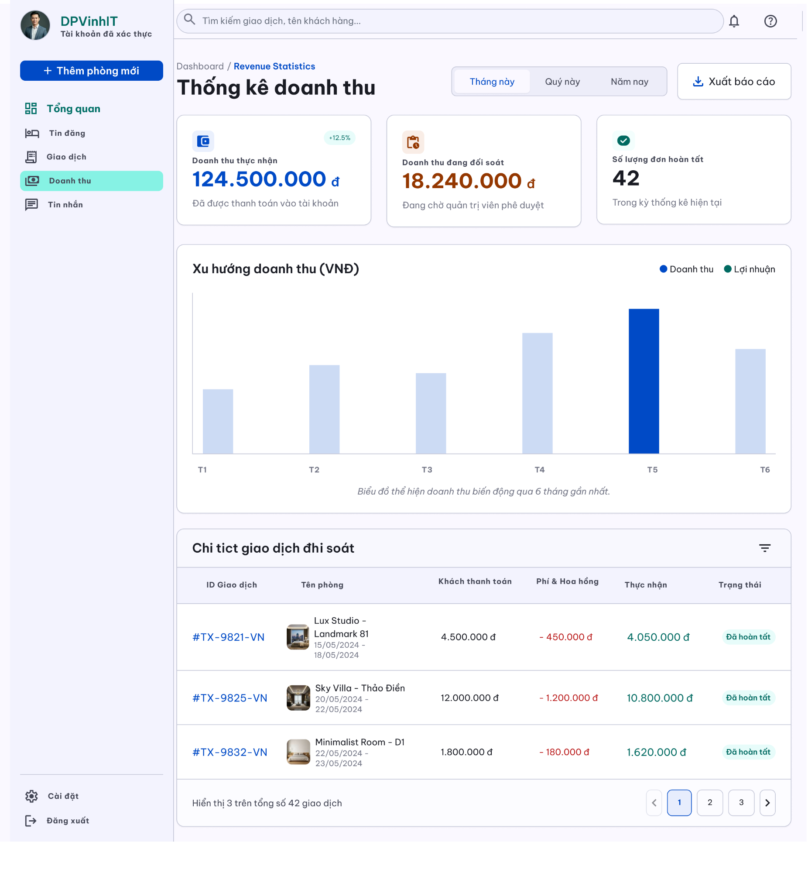

**Hình thức trình bày:**

- **Tiêu đề chức năng:** Đường dẫn *Dashboard/Revenue Statistics*, tiêu đề lớn "Thống kê doanh thu", nhóm nút lọc thời gian ("Tháng này", "Quý này", "Năm nay") và nút "Xuất báo cáo" có biểu tượng tải xuống.
- **Khối thẻ chỉ số:** Gồm ba thẻ tổng hợp: "Doanh thu thực nhận", "Doanh thu đang đối soát", và "Số lượng đơn hoàn tất".
- **Khối đồ thị xu hướng:** Biểu đồ cột "Xu hướng doanh thu (VNĐ)" thể hiện biến động qua 6 tháng gần nhất.
- **Khối bảng chi tiết giao dịch:** Bảng dữ liệu "Chi tiết giao dịch đối soát" có nút biểu tượng bộ lọc nâng cao, bao gồm các cột: ID Giao dịch, Tên phòng (kèm hình ảnh và thời gian thuê), Khách thanh toán, Phí & Hoa hồng, Thực nhận, và Trạng thái.
- **Thanh điều hướng dữ liệu:** Dòng thông báo số lượng "Hiển thị 3 trên tổng số 42 giao dịch" đặt song song với cụm nút phân trang
**Xử lý sự kiện:**

- **Ấn nhóm nút lọc thời gian ("Tháng này" / "Quý này" / "Năm nay"):** Thay đổi mốc thời gian và tải lại toàn bộ dữ liệu thống kê trên thẻ chỉ số, biểu đồ và bảng chi tiết.
- **Ấn nút "Xuất báo cáo":** Khởi chạy tiến trình trích xuất và tải xuống tệp dữ liệu báo cáo tài chính (Excel/PDF).
- **Ấn biểu tượng bộ lọc tại bảng chi tiết:** Hiển thị các tùy chọn lọc dữ liệu giao dịch nâng cao.
- **Ấn vào mã "ID Giao dịch":** Điều hướng trực tiếp đến trang xem chi tiết biên lai và tiến trình đối soát của giao dịch đó.
- **Ấn vào các nút phân trang:** Chuyển đổi và cập nhật danh sách các dòng giao dịch ở trang tương ứng.
**5.2.10. Screen “Quản lý lịch sử cho thuê phòng và giao dịch của chủ phòng”**

Written by: 23120352 - Lê Nguyễn Quốc Thái

Edited by: 23120352 - Lê Nguyễn Quốc Thái

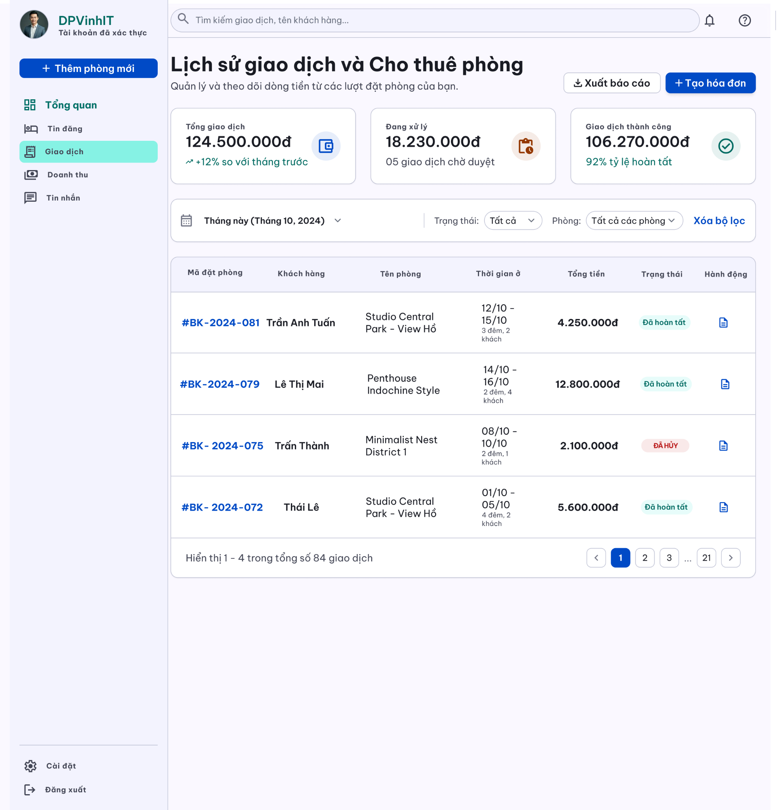

**Hình thức trình bày:**

- **Tiêu đề chức năng:** Tiêu đề lớn "Lịch sử giao dịch và Cho thuê phòng" kèm dòng mô tả phụ "Quản lý và theo dõi dòng tiền từ các lượt đặt phòng của bạn." ngay phía dưới.
- **Nút hành động nhanh:** Nút "Xuất báo cáo" và nút "+ Tạo hóa đơn" đặt ở phía bên phải đối xứng với tiêu đề.
- **Khối thẻ tổng quan:** Gồm ba thẻ thông tin tài chính: "Tổng giao dịch", "Đang xử lý", và "Giao dịch thành công".
- **Thanh công cụ lọc dữ liệu:** Chứa bộ lọc thời gian dạng danh sách thả xuống (đang chọn "Tháng này"), bộ lọc "Trạng thái", bộ lọc "Phòng" và nút chức năng "Xóa bộ lọc".
- **Bảng danh sách lịch sử giao dịch:** Bảng hiển thị thông tin gồm các cột: Mã đặt phòng, Khách hàng, Tên phòng, Thời gian ở (số đêm, số khách), Tổng tiền, Trạng thái (Đã hoàn tất/Đã hủy) và Hành động (biểu tượng tệp tài liệu).
**Xử lý sự kiện:**

- **Ấn nút "Xuất báo cáo":** Trích xuất và tải xuống tệp dữ liệu lịch sử giao dịch.
- **Ấn nút "+ Tạo hóa đơn":** Điều hướng người dùng sang biểu mẫu lập hóa đơn thanh toán mới.
- **Thay đổi các giá trị bộ lọc hoặc ấn "Xóa bộ lọc": **Tải lại dữ liệu tương ứng trong bảng lịch sử theo các điều kiện lọc được áp dụng.
- **Ấn vào mã "Mã đặt phòng":** Điều hướng đến trang hiển thị thông tin chi tiết của đơn đặt phòng và lịch trình cụ thể.
- **Ấn vào biểu tượng tệp tài liệu tại cột Hành động:** Mở hoặc tải xuống hóa đơn/biên lai chi tiết của giao dịch tương ứng.
**5.2.11. Screen “Thêm bài đăng mới của chủ phòng”**

Written by: 23120352 - Lê Nguyễn Quốc Thái

Edited by: 23120352 - Lê Nguyễn Quốc Thái

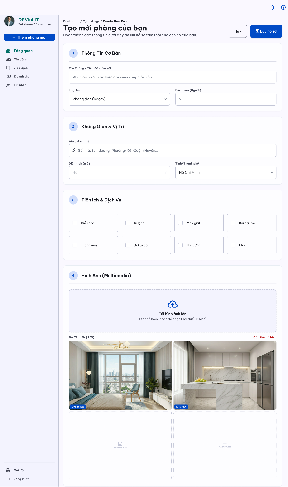

**Hình thức trình bày:**

- **Tiêu đề chức năng:** Đường dẫn *Dashboard / My Listings / Create New Room*, tiêu đề lớn "Tạo mới phòng của bạn" kèm mô tả phụ, cùng cặp nút hành động "Hủy" và "Lưu hồ sơ".
- **Khối "1. Thông Tin Cơ Bản":** Gồm các trường nhập liệu: Ô nhập văn bản "Tên Phòng / Tiêu đề niêm yết", danh sách thả xuống "Loại hình" và ô nhập số "Sức chứa (Người)".
- **Khối "2. Không Gian & Vị Trí":** Gồm ô nhập văn bản "Địa chỉ chi tiết" có biểu tượng định vị, ô nhập số "Diện tích (m2)" và danh sách thả xuống chọn "Tỉnh/Thành phố".
- **Khối "3. Tiện Ích & Dịch Vụ":** Lưới danh sách các hộp kiểm (Checkbox) để tích chọn tiện ích bao gồm: Điều hòa, Tủ lạnh, Máy giặt, Nơi đậu xe, Thang máy, Giờ tự do, Thú cưng, và Khác.
- **Khối "4. Hình Ảnh (Multimedia)":** Khu vực tải ảnh lên gồm một vùng kéo thả lớn ("Tải hình ảnh lên") và danh sách các ô lưới hiển thị ảnh đã tải.
**Xử lý sự kiện:**

- **Ấn nút "Hủy": **Hệ thống hủy bỏ toàn bộ tiến trình nhập liệu và quay lại màn hình quản lý danh sách trước đó.
- **Ấn nút "Lưu hồ sơ":** Hệ thống thực hiện kiểm tra tính hợp lệ của dữ liệu, lưu thông tin phòng mới vào cơ sở dữ liệu và hiển thị thông báo thành công.
- **Ấn vào vùng "Tải hình ảnh lên": **Kích hoạt hộp thoại của hệ điều hành để người dùng chọn và tải tệp hình ảnh từ thiết bị lên.
- **Thay đổi giá trị trong các ô nhập liệu, danh sách thả xuống hoặc hộp kiểm:** Hệ thống ghi nhận các giá trị thay đổi vào biểu mẫu tạm thời.
**5.2.12. Screen “Chỉnh sửa thông tin bài đăng của chủ phòng”**

Written by: 23120352 - Lê Nguyễn Quốc Thái

Edited by: 23120352 - Lê Nguyễn Quốc Thái

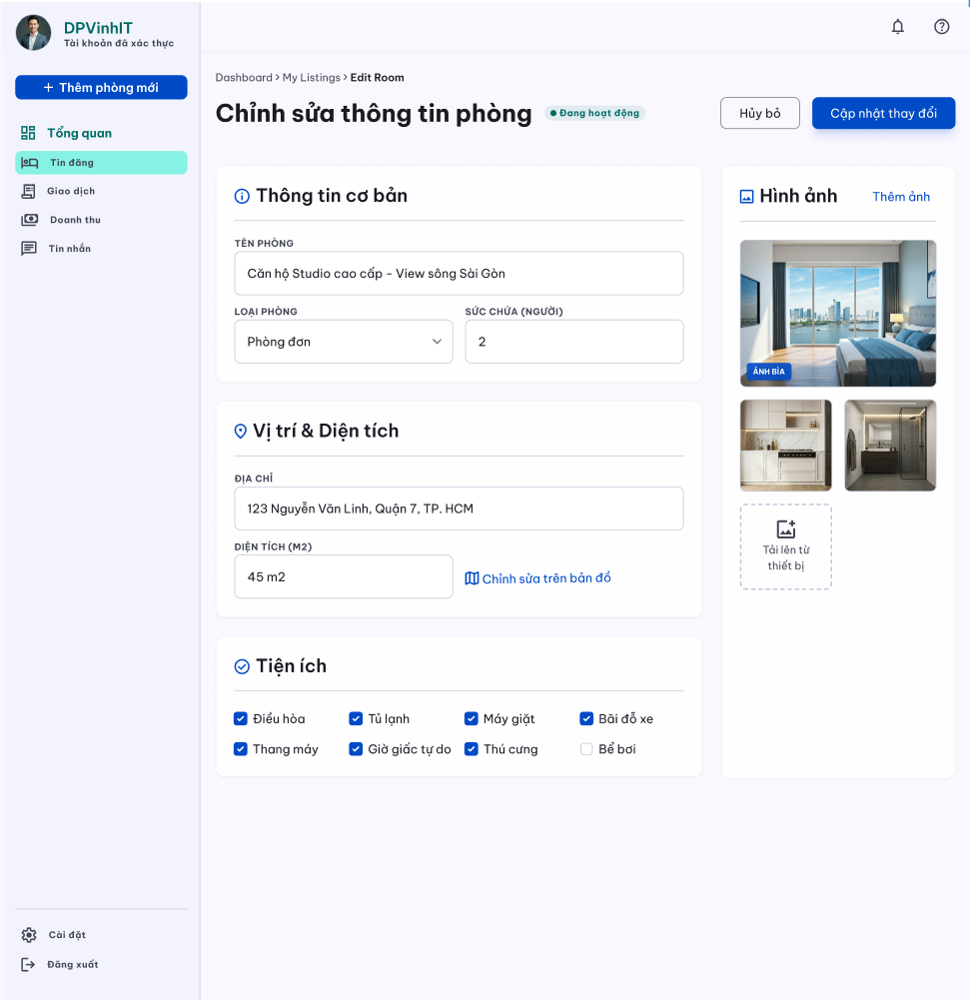

**Hình thức trình bày:**

- **Tiêu đề chức năng:** Đường dẫn *Dashboard / My Listings / Edit Room*, tiêu đề lớn "Chỉnh sửa thông tin phòng" kèm nhãn trạng thái bài đăng ("Đang hoạt động"). Góc phải đối xứng có cặp nút hành động "Hủy bỏ" và "Cập nhật thay đổi".
- **Khối "Thông tin cơ bản":** Gồm ô nhập văn bản "TÊN PHÒNG", danh sách thả xuống "LOẠI PHÒNG" (đang chọn "Phòng đơn") và ô nhập số "SỨC CHỨA (NGƯỜI)".
- **Khối "Vị trí & Diện tích":** Gồm ô nhập văn bản "ĐỊA CHỈ", ô nhập văn bản/số "DIỆN TÍCH (M2)" và một liên kết văn bản "Chỉnh sửa trên bản đồ" có biểu tượng bản đồ.
- **Khối "Tiện ích":** Danh sách các hộp kiểm (Checkbox) đã được tích chọn sẵn (Điều hòa, Tủ lạnh, Máy giặt, Bãi đỗ xe, Thang máy, Giờ giấc tự do, Thú cưng) và hộp kiểm chưa tích chọn (Bể bơi).
- **Tiêu đề khối:** Tiêu đề "Hình ảnh" kèm nút liên kết văn bản màu xanh "Thêm ảnh".
- **Khu vực hiển thị đa phương tiện:** Gồm một ô ảnh lớn phía trên có nhãn góc dưới "ẢNH BÌA", hai ô ảnh nhỏ hiển thị không gian phụ phía dưới, và một ô trống nét đứt tích hợp biểu tượng "Tải lên từ thiết bị".
**Xử lý sự kiện:**

- **Ấn nút "Hủy bỏ":** Hệ thống hủy bỏ toàn bộ dữ liệu đang chỉnh sửa và quay lại màn hình quản lý tin đăng trước đó.
- **Ấn nút "Cập nhật thay đổi":** Hệ thống thực hiện kiểm tra dữ liệu đầu vào (Validation), cập nhật các thay đổi của phòng vào cơ sở dữ liệu và hiển thị thông báo thành công.
- **Ấn nút "Chỉnh sửa trên bản đồ":** Hệ thống hiển thị cửa sổ bản đồ tương tác (Pop-up bản đồ) để chủ phòng định vị lại tọa độ chính xác của bất động sản.
- **Ấn nút "Thêm ảnh" hoặc ô "Tải lên từ thiết bị":** Kích hoạt hộp thoại của hệ điều hành để người dùng chọn và tải thêm tệp hình ảnh mới lên hệ thống.
- **Thay đổi trạng thái các hộp kiểm (Checkbox) hoặc trường nhập liệu:** Hệ thống ghi nhận trạng thái chỉnh sửa mới của biểu mẫu (Form state).
**5.2.13. Screen “****Trang chủ Tenant“**

Written by: 23120359 - Trần Đình Thi

Edited by: 23120359 - Trần Đình Thi

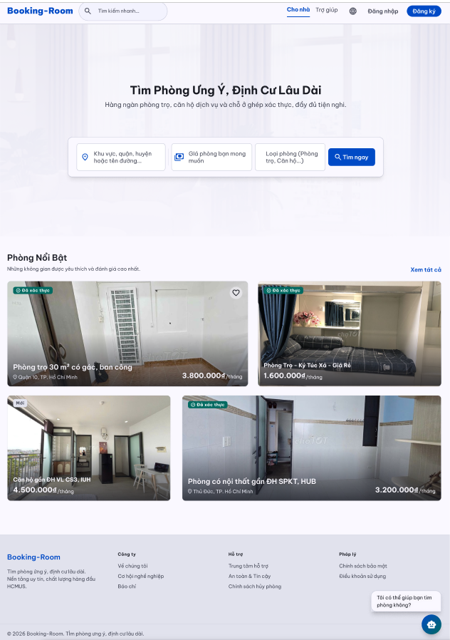

**Hình thức trình bày**

- **Top-bar / Header**:
  - Tiêu đề lớn: “Tim Phòng Ứng Ý, Định Cư Lâu Dài”.
  - Dòng phụ: “Hàng ngàn phòng trọ, căn hộ dịch vụ và chỗ ở ghép xác thực, đầy đủ tiện nghi.”
  - Bộ lọc tìm kiếm gồm 3 ô nhập/chọn:
    - “Khu vực, quận, huyện hoặc tên đường…” (dropdown hoặc autocomplete)
    - “Giá phòng bạn mong muốn” (dropdown hoặc slider)
    - “Loại phòng (Phòng trọ, Căn hộ…)” (dropdown)
  - Nút “Tìm ngay” màu xanh dương để kích hoạt tìm kiếm.
- **Khu vực Phòng Nổi Bật**:
  - Tiêu đề “Phòng Nổi Bật” kèm link “Xem tất cả” (góc phải).
  - Hiển thị dạng lưới (grid) các thẻ phòng. Mỗi thẻ gồm:
    - Ảnh đại diện (placeholder).
    - Badge “Đã xác thực” (màu xanh).
    - Tiêu đề phòng.
    - Địa chỉ (có icon vị trí).
    - Giá thuê/tháng (định dạng VND).
- **Footer**: Chia 3 cột: “Công ty” (Về chúng tôi, Cơ hội nghề nghiệp, Đào chí?), “Hỗ trợ” (Trung tâm hỗ trợ, An toàn & Tin cậy, Chính sách hủy phòng), “Pháp lý” (Chính sách bảo mật, Điều khoản sử dụng). Có thể thêm thông tin thương hiệu “Booking-Room”.
- **AI Chatbot**: (góc phải màn hình) một icon hoặc khung chat với dòng chữ “Tôi có thể giúp bạn tìm phòng không?” – mở khung hội thoại khi click.
**Xử lý sự kiện**

- **Vào trang / reload**:
  - Hệ thống tải danh sách các phòng “Nổi bật” (theo tiêu chí đánh giá cao, lượt xem nhiều, hoặc mới nhất) và hiển thị vào khu vực grid.
  - Các bộ lọc tìm kiếm để trống hoặc giá trị mặc định (ví dụ: tất cả khu vực).
  - Nếu đã đăng nhập, có thể hiển thị đề xuất cá nhân hóa (tùy chọn).
- Nhấn “Tìm ngay” (hoặc thay đổi bộ lọc):
  - Hệ thống thu thập các giá trị từ 3 bộ lọc: địa điểm, khoảng giá, loại phòng.
  - Gửi request đến API tìm kiếm (có phân trang, sắp xếp).
  - Chuyển hướng sang trang “Bộ lọc tìm kiếm” với bộ lọc theo yêu cầu.
- **Nhấn “Xem tất cả”**:
  - Điều hướng đến trang danh sách phòng đầy đủ với bộ lọc mở rộng.
- **Nhấn vào một thẻ phòng**:
  - Điều hướng sang trang “Chi tiết phòng”
- **Nhấn vào icon AI Chatbot**:
  - Điều hướng sang trang “AI Chatbot”
**5.2.14. Screen “Bộ lọc tìm kiếm ”**

Written by: 23120359 - Trần Đình Thi

Edited by: 23120359 - Trần Đình Thi

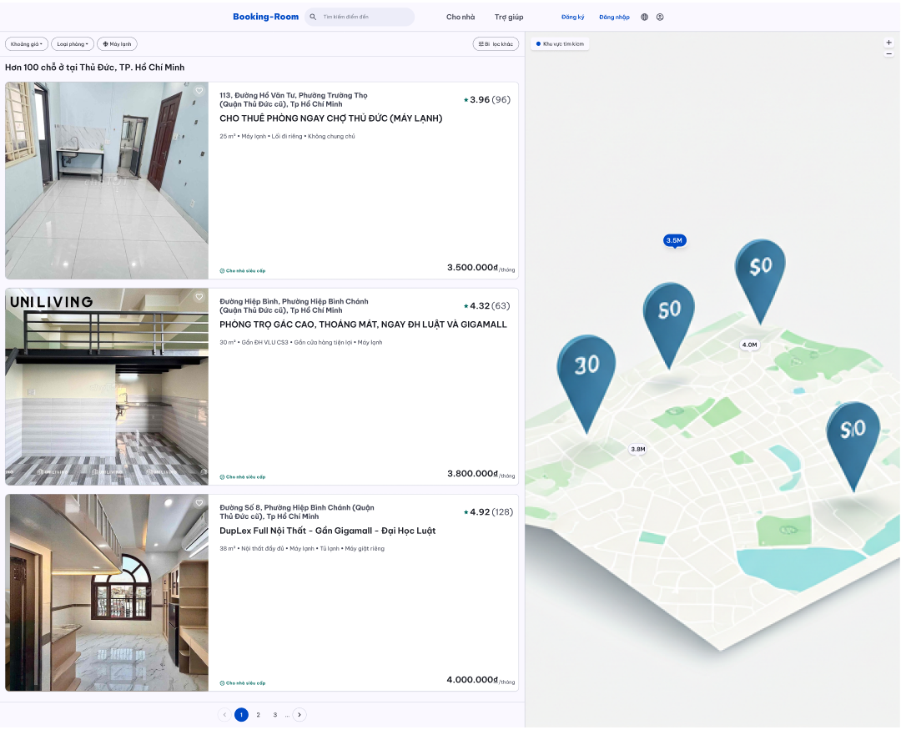

**Hình thức trình bày**

- **Bộ lọc khu vực: **Tìm kiếm theo khu vực yêu cầu
- **Bộ lọc thông thường**:
  - Khoảng giá (tối thiểu – tối đa)
  - Loại phòng (phòng trọ, căn hộ, ở ghép)
  - Tiện ích (máy lạnh, máy giặt, tủ lạnh, ban công, chỗ để xe, thang máy)
  - Lọc khác: chứa các bộ lọc nâng cao
- **Khu vực nội dung chính** :
  - Tiêu đề tóm tắt: hiển thị số lượng kết quả và khu vực đang tìm kiếm.
  - Danh sách kết quả dạng thẻ (card). Mỗi thẻ bao gồm:
    - Ảnh đại diện của phòng (placeholder hoặc ảnh thật).
    - Địa chỉ chi tiết (số nhà, tên đường, phường, quận).
    - Điểm đánh giá trung bình (ví dụ 3.96) và số lượng đánh giá (96).
    - Tiêu đề phòng (ngắn gọn, nổi bật).
    - Diện tích (ví dụ 25 m²).
    - Các tiện ích chính dạng tag: “Máy lạnh”, “Lối đi riêng”, “Không chung chủ”, “Gần ĐH VLUC53”, “Gần cửa hàng tiện lợi”, “Nội thất đầy đủ”, “Máy giặt riêng”, …
    - Giá thuê theo tháng (định dạng VND, ví dụ 3.800.000đ).
  - Phân trang (pagination) ở cuối danh sách (có thể hiển thị số trang hoặc nút “>”).
**Xử lý sự kiện**

- **Vào trang / reload:**
  - Hệ thống nhận các tham số tìm kiếm từ URL (địa điểm, giá, loại phòng, tiện ích).
  - Gọi API tìm kiếm với các tham số đó, mặc định sắp xếp theo độ phù hợp hoặc mới nhất.
  - Hiển thị danh sách kết quả dạng thẻ, cập nhật số lượng kết quả và tiêu đề khu vực.
  - Bộ lọc sidebar được khôi phục trạng thái từ URL.
- **Thay đổi bộ lọc:**
  - Thu thập tất cả giá trị lọc hiện tại.
  - Gửi request tìm kiếm mới lên server.
  - Làm mới danh sách kết quả và tiêu đề số lượng.
  - Cập nhật URL (thay đổi query parameters) để có thể share link.
- **Nhấn vào một thẻ phòng bất kỳ:**
  - Điều hướng sang trang “Chi tiết phòng”.
- **Nhấn vào phân trang (chuyển trang):**
  - Gọi API với cùng bộ lọc nhưng tham số offset/page thay đổi.
  - Cập nhật danh sách kết quả, cuộn lên đầu trang.
**5.2.15. Screen “Chi tiết phòng”**

Written by: 23120359 - Trần Đình Thi

Edited by: 23120359 - Trần Đình Thi

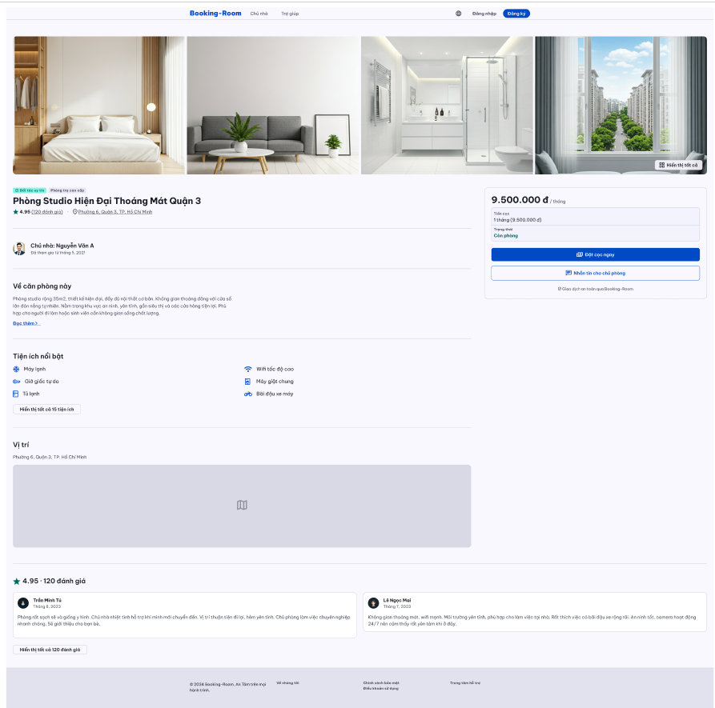

**Hình thức trình bày**

- **Khu vực header / tiêu đề**: Tiêu đề phòng, Điểm đánh giá trung bình, số lượng đánh giá và Địa chỉ rút gọn
- **Khu vực hình ảnh / gallery:** Thông ảnh liên quan đến phòng.
- **Khu vực thông tin chủ phòng (Host Info)**: Tên chủ phòng, thời gian tham gia, avatar.
- **Khu vực mô tả chi tiết (Về căn phòng này)**: Đoạn văn mô tả ngắn (khoảng 3-4 dòng)
- **Khu vực tiện ích**: Hiển thị dưới dạng danh sách các icon/tag: Máy lạnh, Tủ lạnh, Máy giặt, Điều hòa, Wifi, Chỗ để xe, …
- **Khu vực vị trí (Bản đồ):**
  - Địa chỉ chi tiết (số nhà, đường, phường, quận).
  - Bản đồ nhúng (Google Maps API) hiển thị marker vị trí phòng.
- **Khu vực đánh giá:**
  - Tiêu đề: “Điểm trung bình – số đánh giá”.
  - Hiển thị danh sách các đánh giá (mỗi đánh giá gồm: avatar, tên người đánh giá, thời gian, dung
- **Khu vực action(bên phải):**
  - Khung hiển thị giá thuê theo tháng.
  - Thông tin tiền cọc .
  - Trạng thái phòng.
  - Nút bấm chính màu xanh: “Đặt cọc ngay”.
  - Nút bấm phụ: “Nhắn tin cho chủ phòng.
  - Dòng cam kết: “Giao dịch an toàn qua Booking-Room” kèm icon khiên.
**Xử lý sự kiện**

- **Vào trang / reload **theo roomId từ URL: Hệ thống gọi API lấy toàn bộ dữ liệu của phòng (thông tin cơ bản, ảnh, tiện ích, chủ phòng, đánh giá).
- **Nhấn “Đọc thêm…” **(mở rộng mô tả): Chuyển sang trạng thái hiển thị toàn bộ mô tả, nút đổi thành “Thu gọn”.
- **Nhấn vào icon / link “Hiển thị tất cả ảnh”:** Mở modal lightbox hoặc gallery trượt để xem toàn bộ ảnh của phòng.
- **Nhấn vào số đánh giá hoặc “Xem tất cả đánh giá”**: Cuộn trang đến khu vực đánh giá
- **Nhấn nút “Đặt cọc ngay”:**
  - Kiểm tra đăng nhập: nếu chưa đăng nhập → chuyển hướng đến trang đăng nhập, sau đó quay lại.
  - Nếu đã đăng nhập: chuyển sang màn hình “Thanh toán đặt cọc”.
- **Nhấn nút “Nhắn tin cho chủ phòng”**: Mở khung chat realtime
- **Nhấn vào avatar hoặc tên chủ phòng**: Chuyển đến trang “Hồ sơ công khai của Host”
**5.2.16. Screen “Thanh toán đặt cọc“**

Written by: 23120359 - Trần Đình Thi

Edited by: 23120359 - Trần Đình Thi

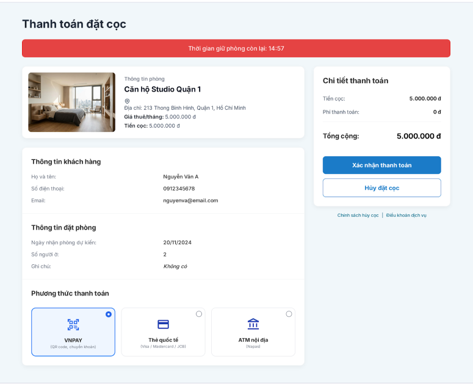

**Hình thức trình bày**

- **Khu vực thông báo đếm ngược **Dòng chữ: “Thời gian giữ phòng còn lại: 14:57” (định dạng mm:ss, đếm lùi từ 15 phút = 900 giây), cùng màu nền đỏ để cảnh báo.
- **Khu vực thông tin phòng: **Tiêu đề “Thông tin phòng”, Tên phòng, địa chỉ chi tiết, giá thuê/tháng và tiền cọc yêu cầu và ảnh thumbnail nhỏ.
- **Khu vực thông tin khách hàng: **Họ và tên, Số điện thoại, Email
- **Khu vực thông tin đặt phòng: **Ngày nhận phòng dự kiến, số người ở, ghi chú (nếu có).
- **Khu vực phương thức thanh toán:**
  - Ba lựa chọn dạng radio hoặc thẻ:
    - VNPAY (QR code, chuyển khoản)
    - Thẻ quốc tế (Visa / Mastercard / JCB)
    - ATM nội địa (Napas)
  - Mặc định chọn một phương thức, highlight khi được chọn.
- **Khu vực chi tiết thanh toán: **Tiền cọc, Phí thanh toán, Tổng cộng: số tiền cần thanh toán (in đậm, cỡ lớn).
- **Khu vực nút hành động:**
  - Nút “Xác nhận thanh toán” (nền màu xanh).
  - Nút “Hủy đặt cọc” (đường viền).
  - Chính sách và Điều khoản
**Hình thức trình bày**

- **Vào trang:**
  - Hệ thống nhận thông tin từ phiên đặt cọc trước đó (roomId, ngày nhận phòng, số người ở, ghi chú…).
  - Hiển thị đầy đủ thông tin phòng, khách hàng, đặt phòng.
  - Bắt đầu bộ đếm ngược 15 phút (lấy từ server để đồng bộ, tránh tấn công client).
  - Mặc định chọn phương thức thanh toán VNPAY.
- **Thay đổi phương thức thanh toán: **Cập nhật giao diện active (vì phí thanh toán có thể thay đổi).
- **Nhấn “Xác nhận thanh toán”:**
  - Hệ thống tạo bản ghi DepositBooking với trạng thái PENDING, khóa phòng tạm thời (15 phút).
  - Gửi request tạo giao dịch thanh toán đến backend.
  - Backend tạo link thanh toán với cổng thanh toán tương ứng (VNPAY, giả lập thẻ quốc tế, ATM).
  - Chuyển hướng trình duyệt đến trang thanh toán của bên thứ ba (sandbox).
- **Nhấn “Hủy đặt cọc”:**
  - Hiển thị hộp thoại xác nhận hủy.
  - Nếu xác nhận: hủy phiên đặt cọc, giải phóng khóa phòng (nếu có), điều hướng về trang chi tiết phòng.
- **Khi bộ đếm ngược về 00:00:**
  - Tự động hủy phiên đặt cọc (tương tự như nhấn “Hủy đặt cọc”), hiển thị thông báo “Hết thời gian giữ phòng, vui lòng thử lại”.
  - Chuyển hướng về trang chi tiết phòng.
- **Nhận kết quả callback từ cổng thanh toán (sau khi chuyển hướng):**
  - Nếu thành công: cập nhật trạng thái DepositBooking thành COMPLETED, phòng chuyển sang RENTED, gửi email xác nhận cho cả Tenant và Host, chuyển sang màn hình “Đặt cọc thành công”.
  - Nếu thất bại hoặc hủy: cập nhật trạng thái FAILED hoặc CANCELLED, giải phóng khóa phòng, hiển thị thông báo lỗi và cho phép thử lại (quay lại trang thanh toán)
- **Nhấn Chính sách/ Điều khoản: **Chuyển hướng đến trang chính sách/ điều khoản
**5.2****.17. Screen “Thanh toán thành công”**

Written by: 23120359 - Trần Đình Thi

Edited by: 23120359 - Trần Đình Thi

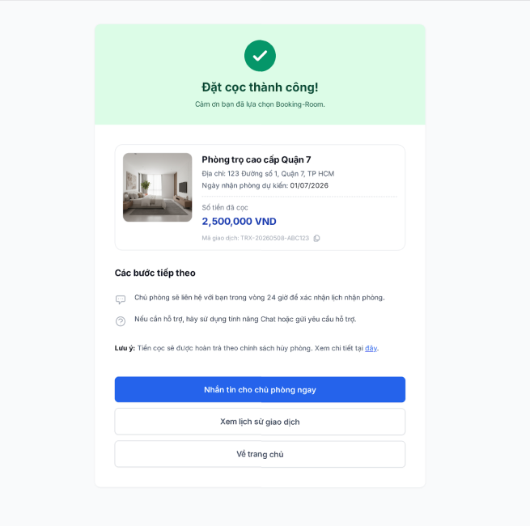

**Hình thức trình bày**

- **Bố cục: **Dạng một cột, căn giữa, khung trắng nổi bật trên nền xám nhạt.
- **Khu vực thông báo kết quả**:
  - Biểu tượng dấu ✓ trong vòng tròn màu xanh lá.
  - Tiêu đề lớn: “Đặt cọc thành công!”
  - Dòng phụ: *“*Cảm ơn bạn đã lựa chọn Booking-Room*.”*
- **Khu vực thông tin phòng đã đặt cọc**: Tên phòng, Địa chỉ chi tiết, Ngày nhận phòng dự kiến, Số tiền đã cọc (in đậm, cỡ lớn, định dạng VND) và nã giao dịch
- Khu vực các bước tiếp theo (hướng dẫn):
  - *“Chủ phòng sẽ liên hệ với bạn trong vòng 24 giờ để xác nhận lịch nhận phòng.”*
  - *“Nếu cần hỗ trợ, hãy sử dụng tính năng Chat hoặc gửi yêu cầu hỗ trợ.”*
- **Khu vực lưu ý chính sách:**
  - Dòng chữ nhỏ: *“Lưu ý: Tiền cọc sẽ được hoàn trả theo chính sách hủy phòng. Xem chi tiết tại đây.”*
- **Khu vực nút hành động**:
  - “Nhắn tin cho chủ phòng ngay” (màu xanh chính)
  - “Xem lịch sử giao dịch” (đường viền)
  - “Về trang chủ” (link hoặc nút phụ)
**Xử lý sự kiện**

- **Vào trang (sau khi thanh toán thành công):**
  - Hệ thống nhận tham số transactionId hoặc bookingId từ callback.
  - Hiển thị thông tin phòng, số tiền, mã giao dịch từ dữ liệu giao dịch thực tế.
- **Nhấn “Copy” mã giao dịch:**
  - Sao chép mã giao dịch vào clipboard.
  - Hiển thị thông báo “Đã sao chép” (toast) trong 2 giây.
- **Nhấn “Nhắn tin cho chủ phòng ngay”: **Mở khung chat realtime (có thể là modal hoặc trang chat) với chủ phòng tương ứng
- **Nhấn “Xem lịch sử giao dịch”: **Chuyển hướng đến trang danh sách giao dịch của Tenant (UC11), có thể highlight giao dịch vừa tạo.
- **Nhấn “Về trang chủ”: **Chuyển hướng về trang chủ
- **Nhấn link “Xem chi tiết tại đây” (chính sách hủy phòng): **Mở popup hoặc chuyển sang trang hiển thị chi tiết chính sách hủy cọc
**5.2.18. Screen “AI Chatbot”**

Written by: 23120359 - Trần Đình Thi

Edited by: 23120359 - Trần Đình Thi

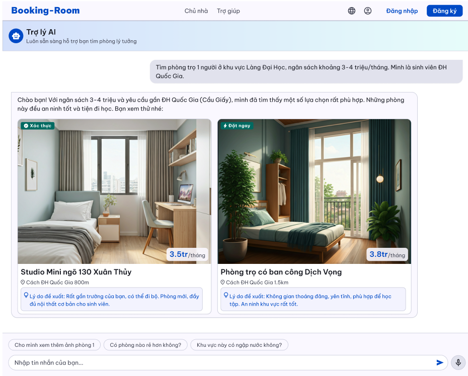

**Hình thức trình bày**

- **Header**: Tiêu đề “Trợ lý AI” kèm icon robot, dòng mô tả “Luôn sẵn sàng hỗ trợ bạn tìm phòng lý tưởng”.
- **Khung chat**: Hiển thị các bong bóng hội thoại.
  - Bong bóng bên trái (màu xám nhạt): phản hồi của AI.
  - Bong bóng bên phải (màu xám): tin nhắn của người dùng.
- **Khu vực kết quả đề xuất dạng thẻ (rich media cards):**
  - Mỗi thẻ hiển thị ảnh thumbnail, huy hiệu (“Xác thực”, “Đặt ngay”), giá tiền nổi bật, tiêu đề phòng, khoảng cách đến điểm mốc, và khung “Lý do đề xuất” (ví dụ: “Rất gần trường của bạn, có thể đi bộ. Phòng mới, đầy đủ nội thất cho sinh viên.”).
  - Có thể có nhiều thẻ (cuộn dọc nếu cần).
- **Các gợi ý hành động:** nằm phía trên thanh nhập liệu, dạng nút bấm nhỏ:
- **Thanh nhập liệu:**
  - Ô text “Nhập tin nhắn của bạn…”
  - Nút gửi (icon giấy máy bay).
**Xử lý sự kiện**

- **Mở khung chat**: Hiện thị đoạn chat trước (nếu có)
- **Người dùng nhập tin nhắn (text) và nhấn gửi **:
  - Hệ thống hiển thị tin nhắn của người dùng trong khung chat.
  - Gửi nội dung (kèm ngữ cảnh hội thoại) lên backend.
  - Backend truy vấn database lọc phòng phù hợp (dựa trên các thực thể: vị trí, ngân sách, tiện ích, …).
  - Gửi prompt kèm dữ liệu phòng đã lọc đến OpenAI API.
  - Nhận phản hồi từ AI (dạng text + danh sách phòng đề xuất).
  - Hiển thị bong bóng phản hồi của AI, kèm các thẻ đề xuất (nếu có).
- **Nhấn vào nút tên phòng trong thẻ đề xuất**: Chuyển hướng đến trang “Chi tiết phòng” tương ứng
- **Đóng khung chat: **Lưu lịch sử hội thoại hiện tại (theo phiên) để khi mở lại có thể tiếp tục (tuỳ chọn)
.
