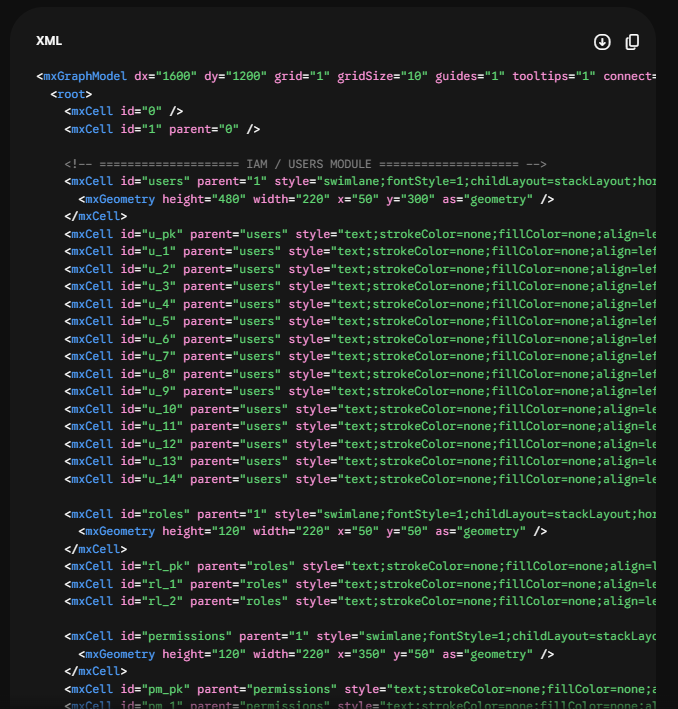
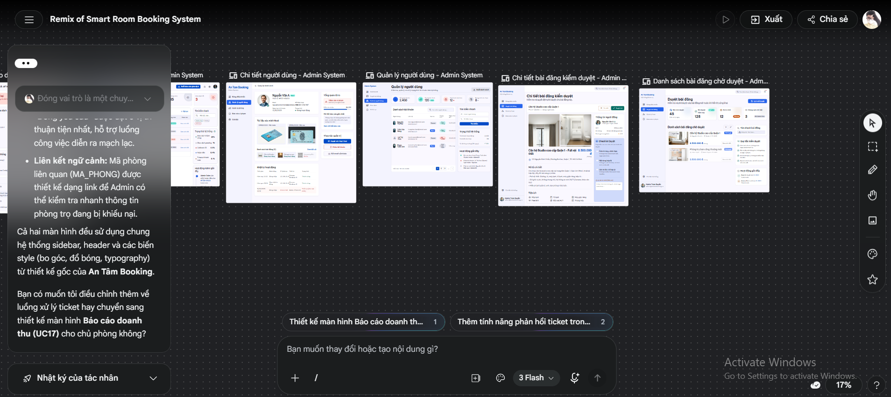
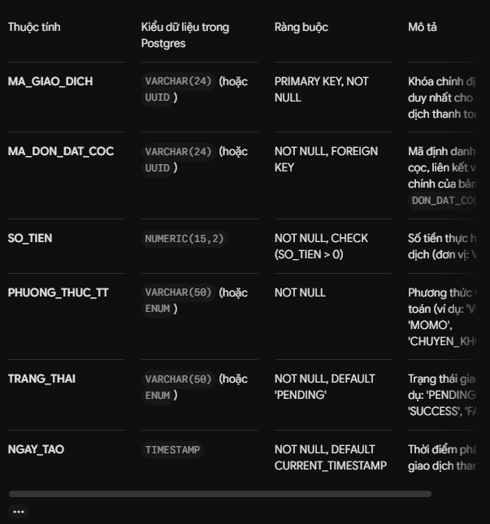
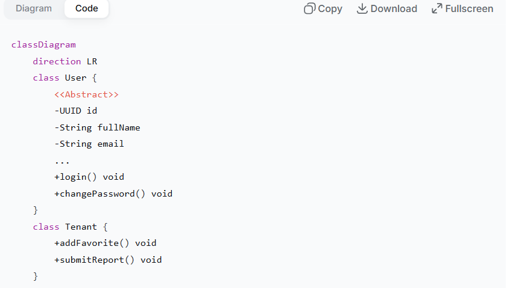
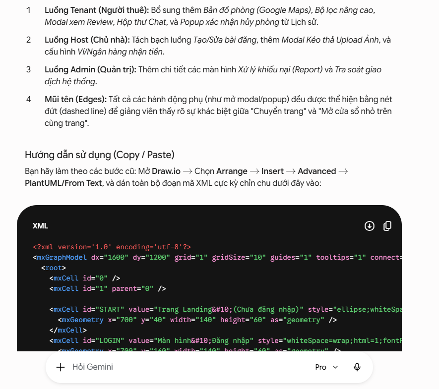
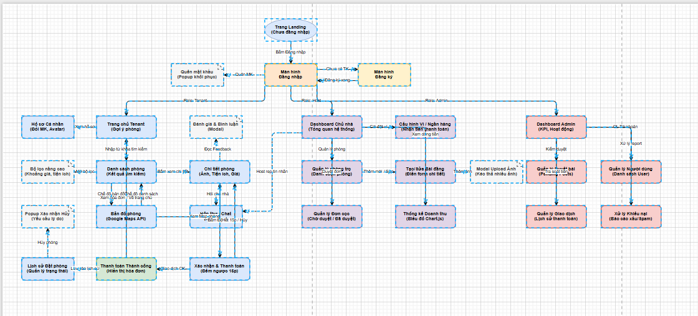
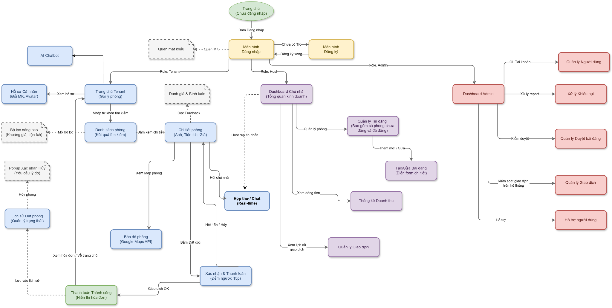

# AI Usage Declaration

Based on the provided AI Usage Guideline document, teams must submit their AI usage declaration here. Students are encouraged to leverage AI tools creatively and effectively in this project.

**6.1 Sử dụng Gemini Pro lên ý tưởng thiết kế ERD**

- **Tên công cụ:** Gemini Pro, [Draw.io](http://draw.io)
- **Thời gian truy cập:** 8:12 ngày 15/5/2026
- **Mục đích: **Sử dụng Gemini để phân tích yêu cầu nghiệp vụ và dữ liệu từ tài liệu, nhận diện các Thực thể (Entity), trích xuất các Thuộc tính (Attribute) cốt lõi cùng Khóa chính/Khóa ngoại (PK/FK) và đề xuất cấu trúc biểu đồ ERD đạt chuẩn. Đảm bảo hệ thống hóa các bảng dữ liệu mạch lạc, chuẩn hóa cơ sở dữ liệu, tránh dư thừa dữ liệu và xác định đúng các mối quan hệ (1-1, 1-N, N-N) để tối ưu hóa thiết kế kiến trúc cơ sở dữ liệu.
- **Thực hiện:**
Trước tiên, em tổng hợp các Functional Features của hệ thống từ Template1-Requirements vào một file [**functional-features.**](http://functional-features.md)**docx **và sau đó cung cấp cho Gemini Pro.

Tiếp theo, để định hướng Agent sinh ra bản phác thảo và cấu trúc ERD đạt chất lượng học thuật cao, các tiêu chí đánh giá kết quả như:

- **Chính xác, chuẩn thiết kế CSDL:** Nhận diện đúng các Thực thể mạnh, Thực thể yếu. Phân bổ chính xác Khóa chính (Primary Key) và Khóa ngoại (Foreign Key). Xử lý triệt để các mối quan hệ nhiều-nhiều (N-N) bằng cách tự động đề xuất các Thực thể kết hợp (Associative Entity).
- **Tối ưu chuẩn hóa dữ liệu:** Đảm bảo cấu trúc các bảng tuân thủ dạng chuẩn 3 (3NF). Tuyệt đối tránh gom nhóm sai bản chất các trường thông tin, không để xảy ra tình trạng lặp lại dữ liệu hay thiết kế các bảng có quá nhiều thuộc tính dư thừa vô nghĩa. – **Rõ ràng, logic:** Đảm bảo bố trí các nhóm thực thể có liên quan chặt chẽ (như nhóm User, nhóm Thanh toán) ở gần nhau, nhằm giảm thiểu sự chồng chéo của các đường quan hệ (relationship lines) trên biểu đồ, giúp giao diện trực quan và dễ theo dõi hơn.
Để đảm bảo ERD đầy đủ và chính xác, em đã thiết lập System Prompt như sau:

*“Bạn hãy đóng vai là một Chuyên gia thiết kế Cơ sở dữ liệu, đây là bài tập của môn Nhập Môn CNPM. Đọc hiểu file *[***functional-features.***](http://functional-features.md)***docx*** *và đề xuất ý tưởng thiết kế biểu đồ ERD (Entity-Relationship Diagram). Yêu cầu bắt buộc: Trích xuất chính xác các Entity, Attribute, Khóa chính, Khóa ngoại. Thiết lập cấu trúc các mối quan hệ 1-1, 1-N, N-N tuân thủ nghiêm ngặt lý thuyết chuẩn hóa cơ sở dữ liệu. Output là mã XML (hoặc PlantUML) và chia theo từng phân hệ dữ liệu. ”*

- **Kết quả:** Sau khi Agent cung cấp mã PlantUML/XML. Sau đó, em dùng Draw.io, vào Edit Diagram (hoặc Insert Advanced) paste phần mã vào để dựng và xem lại ERD, chỉnh sửa lại bố cục để các đường nối không bị cắt chéo, chỉnh sửa lại tên Thực thể (Bảng) và Thuộc tính (Cột) theo đúng chuẩn đặt tên (naming convention) gọn gàng, rõ nghĩa hơn và bổ sung/loại bỏ những trường dữ liệu còn thiếu hoặc dư thừa trong quá trình AI sinh ra.
- **Hình ảnh kết quả nhận được:**

**6.2 Sử dụng Stitch AI lên ý tưởng thiết kế giao diện GUI**

- **Tên công cụ:** Stitch AI, Figma
- **Thời gian truy cập:** 09:30 ngày 21/5/2026
- **Mục đích:** Sử dụng Stitch AI để sinh ra các bản phác thảo (wireframes/mockups) giao diện người dùng ban đầu dựa trên mô tả chức năng và kiến trúc hệ thống. Việc này giúp hình dung nhanh chóng bố cục (layout) và luồng tương tác (user flow).
Sau đó, sử dụng Figma để chuẩn hóa các thành phần UI, đảm bảo giao diện đạt độ hoàn thiện cao, tuân thủ nguyên tắc thiết kế UI/UX và khớp 100% với các trường dữ liệu trong biểu đồ ERD.

- **Thực hiện:**
Trước tiên, em tổng hợp danh sách các màn hình cần thiết từ Screen Diagram và đặc tả chức năng (Functional Features) cùng với các trường dữ liệu từ Data Diagram vào một đoạn văn bản tóm tắt, sau đó cung cấp làm đầu vào cho Stitch AI.

Tiếp theo, để định hướng Agent sinh ra bản phác thảo UI/UX đạt tiêu chuẩn của một hệ thống quản trị (Admin Dashboard) chuyên nghiệp, em đã đặt ra các tiêu chí đánh giá kết quả như:

- Tuân thủ nguyên tắc UI/UX: Bố cục (Layout) hợp lý, phân bổ rõ ràng các vùng chức năng (Thanh điều hướng Sidebar, Top-bar, Bảng dữ liệu trung tâm). Các thành phần tương tác (Button, Textbox, Dropdown) phải được bố trí thuận tiện, tối ưu hóa hành trình của người dùng.
- Tính nhất quán (Consistency): Đồng bộ về phong cách thiết kế Minimalist (tối giản), sử dụng hệ thống thẻ (Card) có bo góc, đổ bóng nhẹ. Đảm bảo tính nhất quán về màu sắc, typography và hệ thống badge trạng thái xuyên suốt các màn hình.
- Bám sát yêu cầu dữ liệu: Giao diện sinh ra không được "bịa" thêm chức năng ngoài luồng, phải thể hiện được chính xác và đầy đủ các trường thông tin cốt lõi đã được định nghĩa trong Data Diagram.
Để đảm bảo Stitch AI hiểu rõ bối cảnh và yêu cầu, em đã thiết lập System Prompt như sau:

*“Bạn hãy đóng vai trò là một chuyên gia thiết kế UI/UX. Dựa trên tài liệu đặc tả chức năng của hệ thống quản lý Booking Room, hãy lên ý tưởng và sinh ra các bản phác thảo giao diện (mockup) cho các màn hình Admin: Dashboard, Quản lý người dùng, Quản lý giao dịch, Xử lý khiếu nại, Hỗ trợ người dùng. Yêu cầu bắt buộc: Sử dụng phong cách thiết kế Minimalist, layout dạng Dashboard có Sidebar cố định bên trái, tông màu sáng, hiện đại. Trình bày rõ cấu trúc từng màn hình bao gồm Header, bộ lọc (Filters), Bảng dữ liệu (DataGrid) và các nút thao tác Action buttons bám sát đúng cơ sở dữ liệu cung cấp.”*

- **Kết quả:** Sau khi sinh ra giao diện ban đầu. Sau đó, em dùng Figma và edit cho phù hợp với quy mô đồ án, xóa bớt các giao diện cho những tính năng không có trong mô tả đồ án, màu sắc dễ nhìn, thao tác phù hợp với thói quen và tần suất sử dụng của người dùng.
- **Hình ảnh minh họa kết quả:**

**6.3 ****Công cụ Google Gemini để hỗ trợ viết Data Specification cho Data Diagram:**

- **Công cụ sử dụng: **Google Gemini (Phiên bản: 3.5 Flash).
- **Thời gian truy cập:** 20:28 ngày 19/5/2026
- **Mục đích:** Hỗ trợ tự động hóa quá trình lập bảng Data Specification dựa trên Data Diagram, giúp chuẩn hóa tài liệu kỹ thuật và tối ưu hóa thời gian.
- **Quy trình thực hiện**:
  - Chuẩn bị dữ liệu đầu vào: Cung cấp cho mô hình hình ảnh trực quan của Data Diagram, kèm theo danh sách các định nghĩa thô của từng bảng (bao gồm: Tên thuộc tính, Kiểu dữ liệu và Các ràng buộc cơ bản).
  - Thiết lập câu lệnh: "Hãy tạo bảng Data Specification tương ứng cho bảng X trong Data Diagram. Yêu cầu định dạng bảng gồm 4 cột: Thuộc tính, Kiểu dữ liệu, Ràng buộc và Mô tả chi tiết."
- **Xử lý và Kiểm duyệt đầu ra:**
  - Dựa trên ngữ cảnh của hình ảnh và text, Gemini sẽ tổng hợp và xuất ra một bảng đặc tả hoàn chỉnh.
  - Lưu ý quan trọng: Thông tin tại cột Mô tả được AI tự động suy luận dựa trên tên biến. Em bắt buộc phải rà soát, đối chiếu lại với nghiệp vụ thực tế của hệ thống để tinh chỉnh và nghiệm thu độ chính xác.
Hình ảnh kết quả minh họa:

**6.4. Công cụ DeepSeek hỗ trợ vẽ Class Diagram**

- Công cụ: Phiên bản DeepSeek phổ thông
- Thời gian truy cập: 18/05/2025
- Mục đích: Hỗ trợ tự động hóa quá trình xây dựng Class Diagram từ các yêu cầu nghiệp vụ và đặc tả Use Case đã có, giúp chuẩn hóa cấu trúc dữ liệu, xác định các lớp, thuộc tính, phương thức và mối quan hệ giữa các lớp một cách nhanh chóng, từ đó tối ưu thời gian thiết kế hệ thống.
- Quy trình:
  - Cung cấp cho mô hình các tài liệu đã có: Danh sách các Use Case (UC01 → UC23) từ Template 1 – Requirement Analysis và ERD (Entity Relationship Diagram).
  - Thiết lập câu lệnh (Prompt): Dựa trên các Use Case và ERD đã cung cấp, hãy tạo Class Diagram bằng cú pháp draw.io cho hệ thống Booking-Room.
- Kết quả nhận được (mẫu):

**6.5 Sử dụng Gemini Pro lên ý tưởng thiết kế Screen Diagram**

- **Tên công cụ:** Gemini Pro, Draw io
- **Thời gian truy cập:** 19:00 ngày 22/5/2026
- **Mục đích: **Sử dụng Gemini Pro để hỗ trợ tạo Screen Diagram nhằm mô tả luồng hoạt động giữa các screen trong project
- **Đầu vào:**
- Các ảnh của một số console chính được thiết kế trong Figma

- Câu prompt: “Hãy vẽ giúp tôi Screen Diagram mô tả luồng hoạt động của đồ án dựa trên các ảnh console tôi vừa gửi , xuất dưới dạng code XML”
- **Kết quả:**

- Import code XML này vào draw.io

- Sau khi chỉnh sửa và kiểm tra lại :

