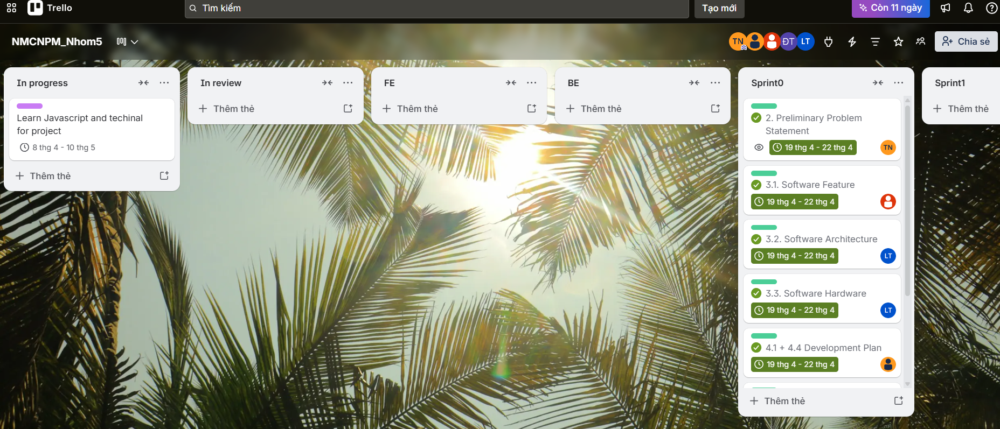
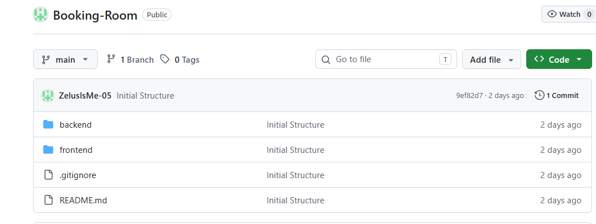

**Hệ thống đặt phòng trọ: Booking-Room**

** Nhóm 5**

**Mục lục**

[***Các nội dung chính	1***](#_heading=h.qnfiwtwx55gg)

[***1 Bảng đánh giá đóng góp	2***](#_heading=h.dj9kg44sq5z0)

[***2 Phát biểu sơ lược dự án	3***](#_heading=h.4wwhsl6kqsjs)

[***3 Đề xuất giải pháp	4***](#_heading=h.z4c9bw4h6zj1)

[***4 Kế hoạch phát triển***](#_heading=h.1m11mhgigvsa)[***	10***](#_heading=h.7t48mvex93mk)

[***5 Kế hoạch nhân sự & Chi phí	11***](#_heading=h.fe7br1vl4d7r)

[***6 Công cụ hỗ trợ	13***](#_heading=h.fm515ejqq48x)

[***7 Khai báo sử dụng AI	14***](#_heading=h.w3mabw7bsjyr)

[***8 Presentation	16***](#_heading=h.hvqjutxnld87)

[***9 Reflective Report	17***](#_heading=h.v4h332d5yk3y)

**Đề xuất dự án **

# Các nội dung chính

Tài liệu tập trung về các chủ đề:

- Tạo ra tài liệu Project Proposal
- Hoàn chỉnh Project Proposal với các nội dung cơ bản sau:
- Phát biểu sơ lược dự án
- Đề xuất giải pháp
- Kế hoạch phát triển
- Kế hoạch nhân sự & Chi phí
- Tài liệu này sẽ được sử dụng làm dữ liệu đầu vào cho các công cụ AI để xác minh chất lượng của các sản phẩm dự án tiếp theo.

# Bảng đánh giá đóng góp

| **MSSV** | **Thành viên** | **Vai trò** | **Tỷ lệ đóng góp** |
| --- | --- | --- | --- |
| 23120352 | Lê Nguyễn Quốc Thái | Dev + Designer | 20% |
| 23120357 | Lê Nhật Thành | Teamlead + BA | 20% |
| 23120359 | Trần Đình Thi | Dev + Tester | 20% |
| 23120360 | Đặng Lê Đức Thịnh | Dev + Designer | 20% |
| 23120405 | Đỗ Phước Vinh | Dev + Tester | 20% |

# Phát biểu sơ lược dự án

Written by: 23120357 - Lê Nhật Thành

Edited by: 23120357 - Lê Nhật Thành

Reviewed by: Lê Nguyễn Quốc Thái, Trần Đình Thi, Đặng Lê Đức Thịnh và Đỗ Phước Vinh

- **Business Description:**
**Bối cảnh:**

Trong bối cảnh đô thị hóa tại các thành phố lớn (như TP.HCM), nhu cầu tìm kiếm phòng trọ, căn hộ của sinh viên và người lao động là rất lớn. Tuy nhiên, quy trình truyền thống đang gặp nhiều khó khăn như thông tin không minh bạch, tình trạng lừa đảo tiền cọc, và khó khăn trong việc trao đổi trực tiếp giữa chủ nhà và người thuê.

**Vấn đề cốt lõi:**

- **Người thuê: **Mất nhiều thời gian lọc thông tin, lo ngại về tính xác thực của phòng và gặp khó khăn khi cần hỗ trợ ngay lập tức.
- **Chủ nhà: **Việc quản lý phòng trọ vẫn thủ công như ghi chép tay, khó theo dõi hóa đơn,...
- Thiếu sự kết nối trực tiếp và minh bạch giữa chủ trọ và người thuê
**Giải pháp**

Hệ thống **Booking Room **được xây dựng nhằm giải quyết vấn đề này trên nền tảng số hóa. Hệ thống tập trung vào tính tác cao (Realtime-chat), sự tiện lợi (Tìm kiếm và lọc thông tin) và sự an toàn về mặt thông tin rõ ràng do một bên thứ ba quản lý (Admin sẽ phê duyệt cái bài từ chủ trọ , quản lý giao dịch).

- **Operating Environment:**
- **Phía người dùng (Client-side)**: Ứng dụng chạy trên trình duyệt web (Chrome, Edge..) hỗ trợ HTML5 và JavaScript. Giao diện được tối ưu hóa bằng **Next.js** để đảm bảo tốc độ tải trang và trải nghiệm mượt mà
- **Phía máy chủ (Server-side)**: Hệ thống chạy trên môi trường **Node.js** sử dụng framework **Express **và hệ quản trị CSDL PostgreSQL
- **Kết nối **: Cần có kết nối Internet
- **Design & Implementation Constraints:**
- **Công nghệ Frontend: **Sử dụng thư viện **React **với framework **Next.js **
- **Công nghệ Backend: **Xây dựng trên Node.js (Express), sử dụng thư viện Knex để hỗ trợ truy vấn (query) và quản lý cấu trúc database (migration/seed).
- **Tính năng thông minh: **Bắt buộc tính hợp **AI Chatbot** để tự động hóa quy trình hỗ trợ khách hàng
- **Giao tiếp: **Phải đảm bảo tính năng nhắn tin thời gian thực (**Real-time chat**) giữa người thuê và chủ nhà
- **Bảo mật: **Sử dụng JWT cho xác thực , mật khẩu phải được băm (hash) trước khi lưu

# Đề xuất giải pháp

#### Phần mềm

##### Tính năng

*Written by: 2*3120405 - Đỗ Phước Vinh

*Edited by: 23120405 - *Đỗ Phước Vinh

*Reviewed by: *Lê Nguyễn Quốc Thái, Trần Đình Thi, Đặng Lê Đức Thịnh và Lê Nhật Thành

| **Nhu cầu** | **Yêu cầu** |
| --- | --- |
| Là người dùng mới, tôi muốn tạo tài khoản trên hệ thống để có thể sử dụng các dịch vụ đặt phòng hoặc đăng tin. | Đăng ký |
| Là người dùng đã có tài khoản, tôi muốn đăng nhập vào hệ thống để sử dụng các dịch vụ. | Đăng nhập |
| Là người dùng đã đăng ký, tôi muốn mật khẩu đăng nhập của tôi không dễ dàng dò được. | Bảo vệ mật khẩu |
| Là người thuê, tôi muốn tìm phòng theo khoảng tiền có thể thuê, địa điểm, dịch vụ,... | Tra cứu phòng |
| Là người dùng sử dụng hệ thống, tôi muốn hệ thống xử lý những tác vụ không quá 2s. | Xử lý và phản hồi nhanh |
| Là người thuê, tôi muốn xem thông tin mô tả chi tiết của một phòng cụ thể. | Xem chi tiết phòng |
| Là người thuê/ chủ phòng, tôi muốn nhắn tin trực tiếp với chủ phòng/ người thuê. | Trao đổi với chủ phòng/ người thuê |
| Là người thuê/ chủ phòng, tôi muốn gửi yêu cầu hỗ trợ với mô tả vấn đề gặp phải với cho quản trị viên | Yêu cầu hỗ trợ sự cố |
| Là người thê, tôi muốn sau khi nhắn tin với chủ phòng tôi muốn chủ phòng nhận được tin nhắn ngay lập tức. | Xử lý realtime |
| Là người dùng đã, đang hoặc đã từng thuê, tôi có thể chấm điểm, có những ý kiến/ bình luận về một phòng cụ thể. | Đánh giá và bình luận phòng |
| Là người thuê, tôi muốn thanh toán trực tuyến khoản tiền cọc để giữ phòng ngay lập tức mà không cần đến gặp trực tiếp chủ phòng. | Đặt cọc trực tuyến |
| Là người thuê, tôi muốn thực hiện đặt phòng với nhiều lựa chọn phương thức thanh toán để tiện cho người thuê. | Đặt phòng trực tuyến |
| Là chủ phòng, tôi muốn đăng thông tin phòng lên website để tìm người thuê. | Đăng phòng |
| Là chủ phòng, tôi muốn có thể chỉnh sửa thông tin của phòng đã đăng. | Cập nhật thông tin phòng |
| Là chủ phòng, tôi muốn nhận được thông báo qua email và có thể phê duyệt yêu cầu đặt phòng/ đặt cọc nếu phòng đã có người khác thuê hoặc người thuê không phù hợp | Xử lý đặt cọc/ đặt phòng |
| Là chủ phòng, tôi muốn biết doanh thu đặt phòng theo tháng, quý, năm | Thống kê doanh thu đặt phòng |
| Là quản trị viên, tôi muốn có quyền duyệt bài đăng của chủ phòng trước khi hiển thị lên web để đảm bảo nội dung không vi phạm nội quy của website. | Phê duyệt bài đăng |
| Là quản trị viên, tôi muốn quản lý danh sách tài khoản để dễ dàng theo dõi thông tin và hỗ trợ người dùng khi cần. | Quản lý tài khoản |
| Là quản trị viên, tôi muốn theo dõi toàn bộ lịch sử giao dịch trên hệ thống để kiểm soát và hỗ trợ giải quyết tranh chấp khi cần thiết. | Quản lý giao dịch hệ thống |
| Là quản trị viên, tôi muốn xem danh sách các yêu cầu hỗ trợ từ người dùng để kịp thời giải đáp thắc mắc và xử lý sự cố | Quản lý yêu cầu hỗ trợ |
| Là quản trị viên, tôi muốn phản hồi các yêu cầu hỗ trợ của người dùng để giải quyết vấn đề của họ một cách nhanh chóng | Phản hồi yêu cầu hỗ trợ |
| Là người thuê, tôi muốn lưu lại các phòng mà tôi quan tâm để dễ dàng tìm lại sau này. | Lưu phòng yêu thích |
| Là người thuê, tôi muốn xem lại lịch sử các giao dịch đặt cọc và thanh toán để dễ dàng kiểm tra và làm bằng chứng khi cần thiết. | Xem lịch sử thanh toán |
| Là người thuê, tôi muốn xem danh sách các phòng mà tôi quan tâm để so sánh và đưa ra quyết định. | Xem danh sách phòng yêu thích |
| Là người thuê, tôi muốn có một trợ lý ảo tương tác và tự động gợi ý các căn phòng phù hợp dựa trên những tiêu chí tôi đưa ra, với yêu cầu sau: Trợ lý ảo phải cung cấp thông tin mô tả rõ ràng của từng phòng và chứa liên kết đến trang đặt phòng. Các gợi ý mà trợ lý ảo đưa ra phải có tính chính xác và phản ánh đúng với dữ liệu thực tế. Các gợi ý phải được giải thích lý do vì sao được đề xuất, so sánh ưu/nhược điểm của từng gợi ý. | Chatbot hỗ trợ tìm phòng. |

##### Kiến trúc phần mềm

*Written by: 2312*0352 - *L*ê Nguyễn Quốc Thái

*Edited by: 2312035 - L*ê Nguyễn Quốc Thái

*Reviewed by: *Đỗ Phước Vinh, Trần Đình Thi, Đặng Lê Đức Thịnh và Lê Nhật Thành

Hệ thống được thiết kế theo Layered Architecture nhằm đảm bảo tính:

- **Separation of Concerns:** mỗi lớp có trách nhiệm rõ ràng và độc lập, giúp giảm sự phụ thuộc và tăng tính rõ ràng trong thiết kế.
- **Testability:** có thể kiểm thử từng lớp bằng cách mock các lớp phụ thuộc, đảm bảo việc kiểm thử đơn vị (unit test) hiệu quả và chính xác.
- **Scalability:** giúp mở rộng tổ chức code và deploy theo từng phần.
- **Maintainability:** dễ bảo trì và nâng cấp do các thành phần được tách biệt rõ ràng, giúp việc sửa lỗi hoặc thay đổi không ảnh hưởng toàn hệ thống.
Kiến trúc tổng thể được chia thành 4 thành phần chính:

- ***Presentation Layer******: ***
  - **Công nghệ sử dụng:**sử dụng **Next.js (React framework).**
  - **Vai trò:** Đảm nhận vai trò giao tiếp trực tiếp với người dùng cuối. Tầng này nhận các tương tác từ người dùng, gửi Request xuống Business Logic Layer và Response dữ liệu lên giao diện một cách trực quan.
- ***Business Logic Layer******:***
  - **Công nghệ: **Sử dụng **Node.js kết hợp Express.js** để xây dựng hệ thống API theo kiến trúc RESTful API.
  - **Vai trò:** Đóng vai trò xử lý logic nghiệp vụ, xác thực người dùng và điều phối dữ liệu giữa frontend và hệ thống lưu trữ.
    - **Xác thực và phân quyền: **Áp dụng **JWT (JSON Web Token)** để:
      - Xác thực danh tính người dùng.
      - Phân quyền theo vai trò (Guest, Host, Admin).
    - **Gồm các Modules chính:**
      - **Authentication Module:** Quản lý đăng nhập, đăng ký và phân quyền.
      - **Booking Module:** Xử lý quy trình đặt phòng.
      - **Payment Module:** Quản lý thanh toán.
      - **Content Module:** Quản lý phòng và nội dung.
      - **Interaction Module:** Chat, thông báo và hỗ trợ người dùng.
      - **AI Chatbot Module:** Nhận input từ người dùng, gọi xuống database và API của Google Map để lấy thông tin các phòng, lọc dữ liệu và gọi đến API của OpenAI.
    - **Xử lý tác vụ nền: **Hệ thống hỗ trợ các tác vụ chạy ngầm như:
      - Tự động cập nhật trạng thái booking.
      - Xử lý các tiến trình không đồng bộ.
    - **Giao tiếp thời gian thực: **Tích hợp **Socket.io** nhằm hỗ trợ:
      - Chat trực tiếp giữa người dùng và chủ phòng.
      - Gửi thông báo tức thời (real-time notification).
      - Tách biệt logic truy cập dữ liệu khỏi business logic.
- ***Database Layer******: ***
  - **Cơ sở dữ liệu chính: **Sử dụng **PostgreSQL** được triển khai tại Cloud Database **Neon **nhằm đảm bảo:
    - Tính toàn vẹn dữ liệu (ACID).
    - Khả năng xử lý giao dịch ổn định.
  - **Công cụ truy vấn dữ liệu: **Sử dụng **Knex.js** để:
    - Quản lý migration.
    - Tối ưu truy vấn và truy cập dữ liệu.
- ***External Services:***
  - **Vai trò: **Cung cấp các chức năng mở rộng mà hệ thống không tự triển khai.
  - **Các dịch vụ tích hợp:**
- **Thanh toán:** tích hợp VNPAY hoặc Stripe để xử lý giao dịch.
- **Email:** sử dụng Nodemailer để gửi thông báo hệ thống.
- **Lưu trữ ảnh:** sử dụng AWS S3 để lưu trữ và phân phối tài nguyên tĩnh.
- **Trợ lý tìm phòng:** sử dụng API của OpenAI để giải thích/diễn giải cho các gợi ý tìm phòng.
- **Bản đồ**: sử dụng API của Google Map để tìm vị trí phòng tính khoảng cách, hiển thị bản đồ.

#### Phần cứng

Written by: 23120352 - Lê Nguyễn Quốc Thái

Edited by: 23120352 - Lê Nguyễn Quốc Thái

Reviewed by: Đỗ Phước Vinh, Trần Đình Thi, Đặng Lê Đức Thịnh và Lê Nhật Thành

- **Client: **có trình duyệt hiện đại và kết nối Internet ổn định.
- **Server backend (Node.js)** yêu cầu tối thiểu:
  - CPU: ≥ 2 vCPU.
  - RAM: ≥ 2 GB..
  - Storage: ≥ 20 GB SSD.
- **Database PostgreSQL:** yêu cầu 2 vCPU, 4–8GB RAM để đảm bảo hiệu năng.

# Kế hoạch phát triển

Written by: 23120360 - Đặng Lê Đức Thịnh, 23120405 - Đỗ Phước Vinh

Edited by: 23120360 - Đặng Lê Đức Thịnh, 23120405 - Đỗ Phước Vinh

Reviewed by: Trần Đình Thi, Lê Nhật Thành và Lê Nguyễn Quốc Thái

Để đảm bảo quá trình phát triển hệ thống diễn ra một cách có tổ chức, hiệu quả và đúng tiến độ, việc xây dựng kế hoạch phát triển phần mềm theo từng giai đoạn cụ thể là cần thiết và mang tới hiệu quả cao. Mỗi giai đoạn được xác định rõ về mục tiêu, nội dung công việc và sản phẩm đầu ra, từ đó giúp kiểm soát tiến độ và chất lượng của dự án.

Chi tiết các giai đoạn phát triển, thời gian thực hiện, nội dung công việc và sản phẩm đầu ra được trình bày trong bảng dưới đây:

| **Giai đoạn** | **Thời gian** | **Công việc** | **Sản phẩm** |
| --- | --- | --- | --- |
| Đề xuất dự án | 12/04/2026 - 25/04/2026 | - Xác định ý tưởng, phạm vi hệ thống - Khảo sát nhu cầu người dùng - Lên kế hoạch phát triển phần mềm - Cơ cấu nhân sự - Dự trù kinh phí | Tài liệu đề xuất dự án, mô tả hệ thống và các kế hoạch triển khai |
| Phân tích yêu cầu | 26/04/2026 - 09/05/2026 | - Thu thập và phân tích yêu cầu chức năng và phi chức năng - Xây dựng use case, xác định luồng nghiệp vụ. | Tài liệu đặc tả chi tiết phần mềm, Use Case Diagram |
| Thiết kế | 10/05/2026 - 16/05/2026 | - Thiết kế kiến trúc hệ thống - Thiết kế cơ sở dữ liệu, ERD - Thiết kế giao diện cho từng vai trò - Thiết kế các API liên quan | Architecture Diagram, ERD, API Design |
| Cài đặt | 17/05/2026 - 23/05/2026 | - Phát triển frontend (UI, state) - Phát triển backend (API, DB) - Tích hợp vào hệ thống phần mềm | Source code hoàn chỉnh (FE + BE), website với đầy đủ chức năng theo yêu cầu thiết kế |
| Kiểm thử | 24/05/2026 - 31/05/2026 | - Unit test - Integration test - test API, test UI - Fix bug | Kiểm thử website, báo cáo chi tiết kiểm thử |
| Triển khai và vận hành dự án | 01/06/2026 - 15/06/2026 | - Triển khai hệ thống, cấu hình môi trường - Giám sát và sửa lỗi trong lúc vận hành | Hệ thống đưa vào hoạt động thực tế và tài liệu báo cáo vận hành hệ thống |

# Kế hoạch nhân sự & Chi phí

Written by: 23120357 - Lê Nhật Thành

Edited by: 23120357 - Lê Nhật Thành

Reviewed by: Đỗ Phước Vinh, Trần Đình Thi, Đặng Lê Đức Thịnh và Lê Nguyễn Quốc Thái

#### Cơ cấu nhân sự

| **Vai trò ** | **Trách nhiệm chính** | **Kỹ năng cần thiết** |
| --- | --- | --- |
| **Project Manager / Teamlead** | Điều phối nhóm, lập kế hoạch Sprint (1-2 tuần), giám sát tiến độ trên Trello và đảm bảo đồng bộ tài liệu. | Quản lý dự án , giao tiếp tốt với nhóm , hiểu biết về quy trình Agile (Scrum) |
| **BE Developer & Database** | Thiết kế và phát triển API RESTful (Node.js/Express.js), quản lý CSDL (PostgreSQL/Knex.js), xử lý logic nghiệp vụ Booking, Payment. | Node.js, Express.js, PostgreSQL, JWT, Knex.js. |
| **FE Developer & UI/UX** | Phát triển giao diện người dùng (Next.js/React/Tailwind CSS), đảm bảo khả năng tương thích và tích hợp API. | Next.js, React, JavaScript, Tailwind CSS. |
| **AI/Real-time & DevOps ** **(chung)** | Developer & DevOps	Triển khai Chat Real-time (Socket.io), tích hợp AI Chatbot, chịu trách nhiệm về CI/CD (GitHub Actions hoặc Jenkins) và đóng gói hệ thống (Docker). | Socket.io, DevOps (Docker), CI/CD, Quản lý Cloud (AWS S3/Vercel). |

#### *Kế hoạch chi phí*

| **Item** | **Description** | **Cost Estimation** | **Note** |
| --- | --- | --- | --- |
| **Tên miền (Domain Name)** | Tên miền định danh cho hệ thống | 0 VNĐ | Sử dụng subdomain miễn phí của Vercel |
| **Frontend Hosting** | Triển khai ứng dụng Next.js | 0 VNĐ | Sử dụng gói miễn phí của Vercel |
| **Backend Hosting ** | Triển khai Backend (Node.js/Express.js) | 0 - 200.000 VNĐ | Tận dụng Free Tier của Render , trong trường hợp nếu cấu hình không đủ thì nên mua |
| **Lưu trữ ảnh tĩnh(AWS S3)** | Chi phí lưu trữ và phân phối hình ảnh | 0 VNĐ | Sử dụng gói miễn phí (Free Tier) của AWS đủ dùng cho quy mô đồ án. |
| **Database** | Lưu trữ dữ liệu PostgreSQL | 0 VNĐ | Sử dụng Neon.tech (Free Tier). |
| **AI & Third-party APIs ** | Chatbot AI, Email, Google Maps | 0 - 300.000 VNĐ | Mặc dù vẫn có các free tier nhưng vẫn nên đề cập khoản phí dự phòng |
| **Cổng thanh toán ** | Cổng thanh toán trực tuyến. | 0 VNĐ | Sử dụng môi trường Sandbox (thử nghiệm) của VNPAY/ZaloPay. |
| **Tổng chi phí ước tính ** |  | 500.000 VNĐ |  |

# Công cụ hỗ trợ

Written by: 23120359 - Trần Đình Thi

Edited by: 23120359 - Trần Đình Thi

Reviewed by: Đỗ Phước Vinh, Lê Nhật Thành, Đặng Lê Đức Thịnh và Lê Nguyễn Quốc Thái

Để đảm bảo quy trình phát triển theo mô hình Agile/Scrum và sự phối hợp nhịp nhàng nhóm thiết lập hệ thống công cụ hỗ trợ như sau:

- **Moodle: **Dùng để nộp bài tập và báo cáo , nhận các thông báo từ giảng viên
- **Trello (Quản lý Task):** Sử dụng để quản lý các Sprint, phân chia công việc và theo dõi trạng thái

- **GitHub (Quản lý mã nguồn):** Được sử dụng để lưu trữ và quản lý toàn bộ mã nguồn
Link: [https://github.com/ZelusIsMe-05/Booking-Room](https://github.com/ZelusIsMe-05/Booking-Room.git)

- **Discord:** Kênh trao đổi thông tin nhanh, họp nhóm (Daily Meeting)
- **Figma:** Thiết kế chi tiết giao diện (Mockup) và luồng trải nghiệm người dùng (UX) cho các vai trò Guest, Host và Admin
- **Visual Studio Code (IDE):** Công cụ lập trình chính cho cả Frontend và Backend kết hợp các local agent hỗ trợ trong việc viết code
- **Postman:** Công cụ chính để kiểm thử các RESTful API. Thiết lập các Collection và Environment để test các luồng nghiệp vụ Backend (Auth, Booking, Payment).
- **Chrome DevTools:** Sử dụng để kiểm tra giao diện (UI), kiểm tra tính đáp ứng (Responsive) và debug lỗi logic tại Frontend.
- **Google Drive: **Được sử dụng để lưu trữ và chia sẽ tài liệu, báo cáo và tệp tin của dự án , các thành viên dễ dàng tải lên cũng như nhận xét , chính sửa , đồng bộ theo thời gian thực

# Khai báo sử dụng AI

Written by: 23120359 - Trần Đình Thi

Edited by: 23120359 - Trần Đình Thi

Reviewed by: Đỗ Phước Vinh, Lê Nhật Thành, Đặng Lê Đức Thịnh và Lê Nguyễn Quốc Thái

| **Công cụ ** | **Chức năng** |
| --- | --- |
| Chatgpt / Claude | Debug mã nguồn (Front-end/Back-end) và soạn thảo, tóm tắt nội dung kỹ thuật cho tài liệu. |
| Gemini | Đề xuất ý tưởng tối ưu hóa logic nghiệp vụ (Booking, Payment) và cải thiện hiệu năng mã nguồn theo yêu cầu phi chức năng. |
| Local Agent ( vd Github Copilot) | Tự động hoàn thành code, tạo code trong IDE; hỗ trợ viết Unit/Integration Test cho API RESTful. |
| AI Chatbot (Tính năng Hệ thống) | Tự động hóa quy trình hỗ trợ khách hàng, gợi ý phòng trọ và giải đáp các câu hỏi thường gặp theo thời gian thực bằng cách gọi tới API của các LLM (chọn các model có kinh phí phù hợp với đồ án). |
| Notebooklm | Hỗ trợ đọc tài liệu , tóm tắt kiến thức một cách nhanh chóng , hiệu quả , tiết kiệm thời gian |

# Presentation

Teams are required to record presentation videos of their work using the provided template.

Every team member must participate in the presentation, specifically covering the sections their contributed to the project.

Videos must not exceed 30 minutes.

Please upload your videos to Youtube (set to either Unlisted or Public).

Provide the Youtube links the the field below.

Link: [https://youtu.be/G2KtLLgReqY](https://youtu.be/G2KtLLgReqY)

# Reflective Report

Which sections of this template are most helpful for implementation, and which are unnecessary? Provide specific examples to support your reasoning.
