# Phân tích yêu cầu

#### Sơ đồ Use Case

***Written by: 23120405 - ***Đỗ Phước Vinh , 23120360 - Đặng Lê Đức Thịnh

***Edited by: ***23120405 - Đỗ Phước Vinh , 23120360 - Đặng Lê Đức Thịnh

***Reviewed by: Tr***ần Đình Thi , Lê Nguyễn Quốc Thái , Lê Nhật Thành

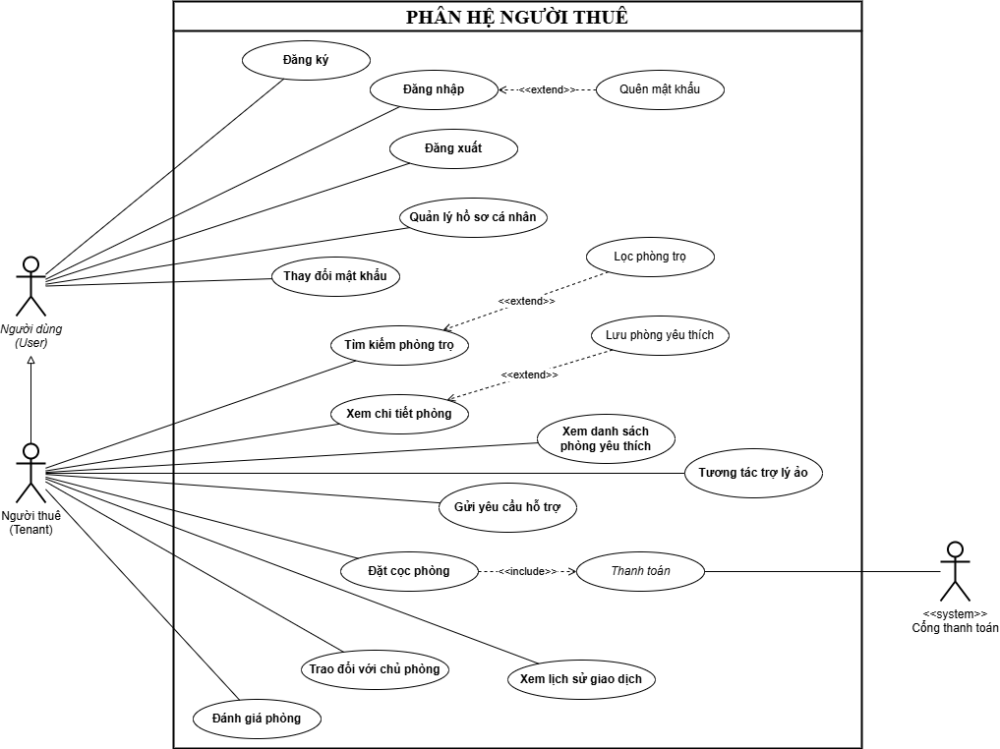

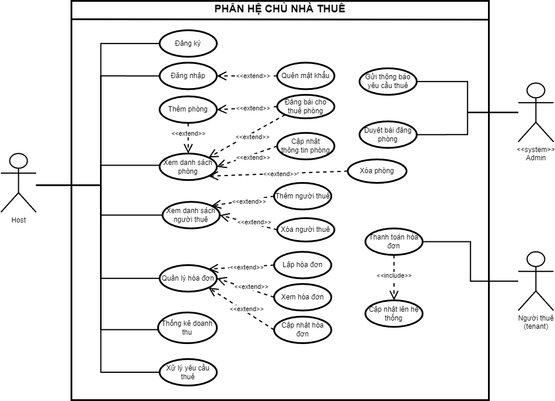

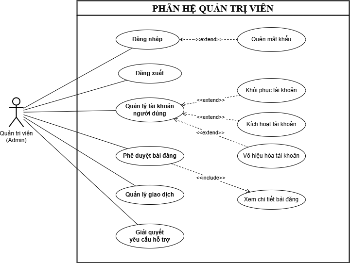

#### Đặc tả Use Case

##### UC1

| *Use case ID* | UC01 |
| --- | --- |
| *Use Case * | Đăng ký tài khoản |
| *Brief Description* | Là người dùng mới, tôi muốn tạo tài khoản trên hệ thống để có thể sử dụng các dịch vụ đặt phòng hoặc đăng tin. |
| *Actor* | Người thuê (Tenant/Guest), Chủ phòng (Host). |
| *Pre-Condition* | Người dùng chưa có tài khoản trên hệ thống. |
| *Result* | Tài khoản được tạo thành công, mật khẩu được băm (hash) và lưu trữ trong cơ sở dữ liệu PostgreSQL. |
| *Main Scenario* | 1. Người dùng chọn "Đăng ký" trên giao diện. 2. Hệ thống hiển thị form yêu cầu nhập: Họ tên, Email, Số điện thoại, Mật khẩu và Chọn vai trò (Người thuê/Chủ nhà). 3. Người dùng nhập thông tin và nhấn "Tạo tài khoản". 4. Hệ thống kiểm tra định dạng dữ liệu và tính duy nhất của Email/SĐT. 5. Hệ thống gửi mã OTP xác minh qua Email. 6. Người dùng nhập mã OTP. 7. Hệ thống xác thực OTP, tạo tài khoản và thông báo thành công |
| *Alternative Scenarios* | 3a. Thiếu thông tin: Hệ thống báo lỗi "Vui lòng điền đầy đủ thông tin". 4a. Tài khoản đã tồn tại: Hệ thống thông báo Email/SĐT đã được sử dụng và gợi ý đăng nhập. 6a. OTP hết hạn/sai: Hệ thống yêu cầu gửi lại mã hoặc nhập lại |
| *Non-Functional Constraints* | Mật khẩu phải tối thiểu 8 ký tự, bao gồm chữ cái, kí tự đặc biệt và số . Mã OTP hết hạn sau 10 phút |

##### UC2

| *Use case ID* | UC02 |
| --- | --- |
| *Use Case * | Đăng nhập |
| *Brief Description* | Là người dùng đã có tài khoản, tôi muốn đăng nhập vào hệ thống để sử dụng các dịch vụ. |
| *Actor* | Người thuê (Tenant/Guest), Chủ phòng (Host), Quản trị viên (Admin) |
| *Pre-Condition* | Người dùng đã có tài khoản hợp lệ trên hệ thống. |
| *Result* | Hệ thống cấp quyền truy cập qua JWT, chuyển hướng người dùng đến trang Dashboard tương ứng. |
| *Main Scenario* | 1. Người dùng chọn "Đăng nhập". 2. Người dùng nhập Email/Tên đăng nhập và Mật khẩu. 3. Hệ thống kiểm tra thông tin trong cơ sở dữ liệu. 4. Hệ thống xác thực thành công và thông báo "Đăng nhập thành công". 5. Chuyển hướng người dùng vào hệ thống. |
| *Alternative Scenarios* | 3a. Sai thông tin: Hệ thống báo lỗi "Mật khẩu hoặc Email không chính xác". 3b. Quên mật khẩu: Người dùng chọn "Quên mật khẩu" để bắt đầu quy trình khôi phục (Xem UC04) |
| *Non-Functional Constraints* | Khóa tài khoản tạm thời 10 phút nếu nhập sai quá 5 lần liên tiếp . Thời gian xác thực không quá 2 giây. |

##### UC3

| *Use case ID* | UC03 |
| --- | --- |
| *Use Case * | Quản lý hồ sơ cá nhân |
| *Brief Description* | Là người dùng đã có tài khoản, tôi muốn xem và cập nhật thông tin cá nhân. |
| *Actor* | Người thuê (Tenant/Guest), Chủ phòng (Host) |
| *Pre-Condition* | Người dùng đã đăng nhập vào hệ thống. |
| *Result* | Thông tin hồ sơ được cập nhật mới nhất trong hệ thống. |
| *Main Scenario* | 1. Người dùng truy cập vào mục "Hồ sơ cá nhân". 2. Hệ thống hiển thị thông tin hiện tại: Họ tên, Email, SĐT 3. Người dùng nhấn "Chỉnh sửa" và thay đổi các trường mong muốn. 4. Người dùng nhấn "Lưu thay đổi". 5. Hệ thống kiểm tra tính hợp lệ và ghi đè dữ liệu mới vào DB. 6. Hệ thống thông báo "Cập nhật thành công" |
| *Alternative Scenarios* | 5b. Email/SĐT trùng lặp: Hệ thống báo lỗi nếu người dùng đổi sang Email đã có người khác sử dụng. |
| *Non-Functional Constraints* | Ảnh đại diện được lưu trữ trên AWS S3 . Dữ liệu cá nhân được bảo mật theo tiêu chuẩn AES-128 hoặc tương đương. |

##### UC4

| *Use case ID* | UC04 |
| --- | --- |
| *Use Case * | Đổi mật khẩu / Quên mật khẩu |
| *Brief Description* | Là người dùng đã có tài khoản, tôi muốn khôi phục mật khẩu khi quên hoặc thay đổi định kỳ để bảo mật. |
| *Actor* | Người thuê (Tenant), Chủ phòng (Host) |
| *Pre-Condition* | Người dùng đã có tài khoản (đối với Quên mật khẩu) hoặc đang đăng nhập (đối với Đổi mật khẩu). |
| *Result* | Mật khẩu mới được thiết lập thành công và mã hóa an toàn. |
| *Main Scenario* | 1. Người dùng chọn "Quên mật khẩu" tại trang đăng nhập. 2. Nhập Email đã đăng ký. 3. Hệ thống kiểm tra Email và gửi mã OTP xác thực. 4. Người dùng nhập OTP và mã xác thực thành công. 5. Hệ thống hiển thị form nhập mật khẩu mới. 6. Người dùng nhập mật khẩu mới và nhấn "Xác nhận". 7. Hệ thống cập nhật mật khẩu mới và thông báo thành công. |
| *Alternative Scenarios* | 3a. Email không tồn tại: Hệ thống báo lỗi "Tài khoản không tồn tại". 6a. Mật khẩu mới trùng mật khẩu cũ: Hệ thống yêu cầu nhập mật khẩu khác để tăng tính bảo mật |
| *Non-Functional Constraints* | Hệ thống gửi thông báo xác nhận thay đổi mật khẩu qua Email ngay lập tức . Thời gian xử lý luồng khôi phục không quá 1 phút. |

##### UC5

| *Use case ID* | UC05 |
| --- | --- |
| *Use Case * | Nhắn tin thời gian thực (Real-time Chat) |
| *Brief Description* | Là người thuê/ chủ phòng, tôi muốn nhắn tin trực tiếp với chủ phòng/ người thuê. Đặc biệt, sau khi nhắn tin với chủ phòng tôi muốn chủ phòng nhận được tin nhắn ngay lập tức thông qua cơ chế xử lý realtime. |
| *Actor* | Người thuê (Tenant), Chủ phòng (Host). |
| *Pre-Condition* | 1. Tác nhân (Người gửi) đã đăng nhập vào hệ thống bằng tài khoản hợp lệ. 2. Tác nhân đã truy cập vào trang chi tiết phòng hoặc danh sách hội thoại và chọn nút "Nhắn tin". 3. Hệ thống đã thiết lập thành công kênh kết nối liên tục (Session/WebSocket) giữa thiết bị của Tác nhân và Máy chủ (Server). |
| *Result* | 1. Tin nhắn được lưu trữ toàn vẹn vào cơ sở dữ liệu hệ thống. 2. Tin nhắn hiển thị trên giao diện của Người nhận ngay lập tức (nếu đang online) hoặc Người nhận nhận được thông báo đẩy/email (nếu đang offline). |
| *Main Scenario* | 1. Tác nhân nhập nội dung văn bản vào khung chat và nhấn "Gửi" (hoặc Enter). 2. Giao diện Client (Trình duyệt/App) kiểm tra tính hợp lệ của tin nhắn (không rỗng, độ dài cho phép) và đẩy gói tin lên Máy chủ qua kênh kết nối đã mở. 3. Máy chủ tiếp nhận gói tin, phân tích định danh người gửi và người nhận. 4. Máy chủ lưu trữ nội dung tin nhắn vào cơ sở dữ liệu với trạng thái "Đã gửi". 5. Máy chủ kiểm tra trạng thái hoạt động của Người nhận. Nếu Người nhận đang kết nối (Online), Máy chủ lập tức "đẩy" (push) tin nhắn đó xuống thiết bị của Người nhận. 6. Giao diện của Người nhận hiển thị tin nhắn mới ngay lập tức mà không cần tải lại trang. 7. Máy chủ nhận tín hiệu xác nhận từ phía Người nhận và cập nhật trạng thái tin nhắn thành "Đã xem" bên phía Người gửi. |
| *Alternative Scenarios* | 5a. Người nhận ngoại tuyến (Offline): Ở Bước 5, nếu Máy chủ xác định Người nhận không có kết nối chủ động nào, Máy chủ sẽ chuyển hướng gói tin sang dịch vụ Thông báo (Push Notification/Email) để cảnh báo Người nhận có tin nhắn mới. 2a. Lỗi mất mạng đột ngột: Ở Bước 2, nếu Client mất kết nối Internet, hệ thống sẽ lưu tạm tin nhắn vào bộ nhớ đệm cục bộ (Local Storage), hiển thị biểu tượng "Đang gửi" hoặc "Lỗi gửi", và tự động thử gửi lại (Retry) khi có mạng trở lại. 2b. Gửi tệp đính kèm vi phạm: Nếu Tác nhân gửi hình ảnh/tệp tin vượt quá dung lượng quy định (ví dụ: >5MB) hoặc sai định dạng, hệ thống từ chối tải lên và hiển thị thông báo lỗi ngay tại Bước 2. |
| *Non-Functional Constraints* | 1. Hiệu năng: Độ trễ từ lúc bấm "Gửi" đến lúc tin nhắn xuất hiện trên màn hình người nhận (nếu cùng online) không được vượt quá 500ms để đảm bảo trải nghiệm hệ thống xử lý realtime. 2. Bảo mật: Nội dung tin nhắn phải được truyền tải qua giao thức mã hóa (WSS - WebSocket Secure / HTTPS). |

##### UC6

| *Use case ID* | UC06 |
| --- | --- |
| *Use Case * | Tìm kiếm và lọc phòng trọ (Bao gồm tích hợp Bản đồ) |
| *Brief Description* | Là người thuê, tôi muốn tìm phòng theo khoảng tiền có thể thuê, địa điểm, dịch vụ,... để thu hẹp phạm vi lựa chọn phù hợp với nhu cầu cá nhân. |
| *Actor* | Người dùng (Bao gồm Khách vãng lai chưa đăng nhập và Người thuê đã đăng nhập). |
| *Pre-Condition* | 1. Cơ sở dữ liệu hệ thống có chứa các bài đăng phòng ở trạng thái "Đang trống" (Active). 2. Dịch vụ Bản đồ (Mapping Service / API) đang hoạt động bình thường. |
| *Result* | Hệ thống trả về danh sách các phòng thỏa mãn toàn bộ tiêu chí tìm kiếm, hiển thị dưới dạng danh sách phân trang (Pagination). |
| *Main Scenario* | **1.** Tác nhân truy cập trang tìm kiếm và cung cấp các bộ lọc: từ khóa, khoảng giá, sức chứa, khu vực hành chính (Quận/Huyện, Phường/Xã), và tiện ích đi kèm. **2.** Tác nhân nhấn nút "Tìm kiếm" hoặc áp dụng bộ lọc trực tiếp. **3.** Giao diện Client đóng gói các tham số này và gửi yêu cầu (Request) lên Máy chủ. **4.** Máy chủ tiếp nhận, phân tích tham số và thực thi câu lệnh truy vấn trên Cơ sở dữ liệu để tìm các bản ghi khớp với điều kiện. **5.** Máy chủ trả về tập dữ liệu (JSON) chứa thông tin tóm tắt của các phòng hợp lệ (Ảnh bìa, Tiêu đề, Giá, Địa chỉ rút gọn). **6.** Giao diện Client kết xuất (Render) dữ liệu thành danh sách phân trang trên màn hình của Tác nhân. |
| *Alternative Scenarios* | **4a. Giao điểm tập hợp rỗng:** Ở Bước 4, nếu bộ lọc quá khắt khe (ví dụ: phòng ở trung tâm Quận 1 nhưng giá dưới 1 triệu) dẫn đến không có phòng nào thỏa mãn, CSDL trả về 0 kết quả. Hệ thống hiển thị thông báo "Không tìm thấy phòng phù hợp" và cung cấp nút thao tác nhanh để "Xóa bộ lọc". |
| *Non-Functional Constraints* | **1. Hiệu năng truy vấn:** Hệ thống phải xử lý những tác vụ không quá 2s từ lúc nhận yêu cầu đến lúc trả về kết quả để đảm bảo trải nghiệm mượt mà. **2. Tối ưu hóa bộ nhớ:** Việc trả về kết quả phải được giới hạn (Limit/Offset) theo từng trang thay vì tải toàn bộ cơ sở dữ liệu cùng lúc. |

##### UC7

| *Use case ID* | UC07 |
| --- | --- |
| *Use Case * | Xem chi tiết phòng trọ |
| *Brief Description* | Là người thuê, tôi muốn xem thông tin mô tả chi tiết của một phòng cụ thể, bao gồm hình ảnh trực quan, danh sách tiện ích, chính sách giá và vị trí chính xác trên bản đồ để đưa ra quyết định cuối cùng. |
| *Actor* | Người dùng (Bao gồm Khách vãng lai chưa đăng nhập và Người thuê đã đăng nhập). |
| *Pre-Condition* | 1. Tác nhân có quyền truy cập vào đường dẫn (URL) của phòng hoặc nhấp chọn từ danh sách kết quả tìm kiếm. 2. Bản ghi của phòng này đang tồn tại trong cơ sở dữ liệu và ở trạng thái cho phép hiển thị công khai. |
| *Result* | Hệ thống hiển thị giao diện chi tiết chứa toàn bộ thông tin của căn phòng, đồng thời kết xuất thành công bản đồ nhúng (Embedded Map) với điểm đánh dấu (Marker) tại vị trí của phòng. |
| *Main Scenario* | **1.** Tác nhân nhấp vào một thẻ phòng (Room Card) từ trang danh sách kết quả tìm kiếm. **2.** Giao diện Client (Trình duyệt) trích xuất mã định danh phòng (Room ID) và gửi yêu cầu (HTTP GET) lên Máy chủ. **3.** Máy chủ tiếp nhận yêu cầu, thực thi truy vấn để thu thập dữ liệu từ nhiều bảng (Thông tin cốt lõi, Hình ảnh, Tiện ích, Thông tin chủ phòng, Tọa độ Lat/Lng). **4.** Máy chủ trả về gói dữ liệu JSON hoàn chỉnh cho Client. **5.** Giao diện Client kết xuất các thành phần văn bản, bảng giá, và khởi tạo trình phát đa phương tiện (Image/Video Carousel) cho hình ảnh phòng. **6.** Giao diện Client trích xuất tọa độ Không gian (Vĩ độ, Kinh độ) từ gói JSON, gọi API Bản đồ (ví dụ: Google Maps/Mapbox) để vẽ khu vực xung quanh và đặt Marker tại vị trí tọa độ đó. **7.** Hệ thống hiển thị kèm các nút tương tác nghiệp vụ (Lưu yêu thích, Nhắn tin cho chủ phòng, Đặt cọc). |
| *Alternative Scenarios* | **3a. Xử lý tài nguyên không tồn tại (404 Not Found):** Ở Bước 3, nếu Room ID không hợp lệ hoặc phòng đã bị xóa/tạm ẩn bởi Chủ phòng hoặc Quản trị viên, Máy chủ trả về mã lỗi HTTP 404. Giao diện Client hiển thị màn hình lỗi thân thiện và điều hướng Tác nhân về trang chủ. **6a. Suy giảm chức năng bản đồ:** Ở Bước 6, nếu kết nối đến dịch vụ Bản đồ bên thứ ba bị gián đoạn, hệ thống tự động ẩn khung bản đồ hoặc hiển thị một khung màu xám có thông báo lỗi nhỏ, đảm bảo các thông tin văn bản và hình ảnh lõi vẫn hiển thị bình thường để không chặn luồng đọc của Tác nhân. |
| *Non-Functional Constraints* | **1. Hiệu năng tải trang:** Vì trang chi tiết chứa nhiều hình ảnh dung lượng lớn, hệ thống phải áp dụng kỹ thuật Lazy Loading (tải chậm) cho hình ảnh và bản đồ để đảm bảo giao diện khung xương (Skeleton) xuất hiện và xử lý những tác vụ không quá 2s. **2. Search Engine Optimization:** Đường dẫn URL của trang chi tiết phải được thiết kế dạng thân thiện (ví dụ: **/phong-tro/cho-thue-phong-quan-1-id123**) và hỗ trợ thẻ Meta (Open Graph) để tối ưu hóa việc chia sẻ lên mạng xã hội. |

##### UC8

| **Use case ID** | **UC08** |
| --- | --- |
| *Use Case * | Tương tác với Trợ lý ảo (AI Chatbot) |
| *Brief Description* | Là người thuê, tôi muốn có một trợ lý ảo tương tác và tự động gợi ý các căn phòng phù hợp dựa trên tiêu chí cá nhân, kèm theo giải thích và so sánh chi tiết. |
| *Actor* | Người thuê (Tenant/Guest) |
| *Pre-Condition* | Người dùng truy cập vào hệ thống website Booking-Room và mở khung giao tiếp Chatbot. |
| *Result* | Hệ thống hiển thị danh sách các phòng trọ phù hợp, được phân tích ưu/nhược điểm rõ ràng kèm liên kết trực tiếp đến trang đặt phòng. |
| *Main Scenario* | 1. Người dùng mở cửa sổ AI Chatbot trên giao diện hệ thống. 2. Người dùng nhập yêu cầu tìm kiếm bằng ngôn ngữ tự nhiên (VD: "Tìm phòng có tủ lạnh 4 ngăn, giá dưới 3 triệu ở Làng Đại Học"). 3. Hệ thống tiếp nhận luồng dữ liệu, gửi yêu cầu qua API của OpenAI kết hợp truy xuất Database nội bộ. 4. Chatbot phản hồi danh sách các phòng gợi ý kèm mô tả tóm tắt và hình ảnh. 5. Chatbot tự động diễn giải lý do đề xuất (đáp ứng tiêu chí nào) và so sánh sự khác biệt giữa các phòng. 6. Người dùng click vào liên kết được Chatbot cung cấp để đi đến trang "Xem chi tiết phòng". |
| *Alternative Scenarios* | 2a. Luồng nhập sai mục đích (Prompt Injection): - Người dùng hỏi các vấn đề không liên quan đến tìm phòng. Hệ thống/Chatbot từ chối trả lời và hướng dẫn người dùng quay lại đúng luồng chức năng. 3a. Hệ thống không tìm thấy phòng khớp 100% tiêu chí: - Hệ thống thông báo không có phòng thỏa mãn toàn bộ yêu cầu. - Chatbot chủ động gợi ý các căn phòng gần giống nhất (VD: chênh lệch giá nhẹ hoặc ở khu vực lân cận). 3b. Lỗi kết nối với API AI hoặc Timeout: - Chatbot thông báo: "Hệ thống trợ lý ảo đang bận, vui lòng thử lại sau ít phút hoặc sử dụng thanh tìm kiếm truyền thống." |
| *Non-Functional Constraints* | Tốc độ phản hồi của Chatbot không được vượt quá 10 giây. Dữ liệu gợi ý phải được đồng bộ chính xác với cơ sở dữ liệu thời gian thực của hệ thống. |

##### UC9

| **Use case ID** | **UC09** |
| --- | --- |
| *Use Case * | Đặt cọc phòng và thanh toán tiền cọc |
| *Brief Description* | Là người thuê, tôi muốn thanh toán trực tuyến khoản tiền cọc để giữ chỗ căn phòng ưng ý ngay lập tức mà không cần đến gặp trực tiếp chủ phòng. |
| *Actor* | Người thuê (Tenant/Guest), Cổng thanh toán (Payment System) |
| *Pre-Condition* | Người thuê đã đăng nhập vào hệ thống. Căn phòng muốn đặt cọc đang ở trạng thái hiển thị "Còn trống". |
| *Result* | Giao dịch cọc hoàn tất, hệ thống cập nhật trạng thái phòng thành "Đã đặt cọc", lưu lịch sử giao dịch và gửi thông báo xác nhận đến người thuê lẫn chủ phòng. |
| *Main Scenario* | 1. Người thuê nhấn nút "Đặt cọc phòng" tại giao diện Xem chi tiết phòng. 2. Hệ thống khóa phòng tạm thời (15 phút) và hiển thị biểu mẫu xác nhận thông tin cọc (Ngày dự kiến dọn vào, số tiền cọc theo quy định của chủ phòng). 3. Người thuê kiểm tra và chọn phương thức thanh toán trực tuyến (ví dụ: VNPAY). 4. Người thuê nhấn "Xác nhận và Thanh toán". 5. Hệ thống tự động mã hóa payload và chuyển hướng sang giao diện của cổng thanh toán tương ứng. 6. Người thuê thực hiện thao tác quét mã QR hoặc nhập thông tin thẻ để thanh toán. 7. Cổng thanh toán xử lý và trả về tín hiệu giao dịch thành công (Callback). 8. Hệ thống ghi nhận giao dịch, cập nhật trạng thái phòng thành "Đã đặt cọc" và giải phóng khóa bảo vệ. 9. Hệ thống tự động gửi thông báo/email xác nhận giữ phòng thành công đến cho Người thuê và Chủ phòng. |
| *Alternative Scenarios* | 1a. Luồng kẹt lệnh đặt (Race Condition): - Phòng vừa bị người khác khóa trước đó 1 giây. Hệ thống chặn thao tác ở bước 1 và báo: "Phòng đang có người thực hiện giao dịch, vui lòng thử lại sau 15 phút." 6a. Người thuê hủy bỏ thao tác thanh toán giữa chừng hoặc hết hạn 15p: - Cổng thanh toán trả về tín hiệu Hủy. - Hệ thống đưa người dùng quay lại trang chi tiết phòng kèm thông báo "Giao dịch thanh toán tiền cọc đã bị hủy", trạng thái phòng không thay đổi. 7a. Giao dịch thanh toán thất bại (Lỗi thẻ, hết số dư, timeout): - Hệ thống hiển thị lỗi "Thanh toán thất bại, vui lòng kiểm tra lại phương thức thanh toán và thử lại". |
| *Non-Functional Constraints* | Giao dịch tài chính phải được mã hóa bảo mật tuyệt đối. Quá trình xử lý callback thanh toán phải diễn ra tức thời (Real-time) để tránh xung đột khóa dữ liệu đặt chỗ với những người dùng khác. |

##### UC10

| *Use case ID* | UC10 |
| --- | --- |
| *Use Case * | Quản lý danh sách phòng yêu thích (Lưu, Bỏ lưu và Xem danh sách) |
| *Brief Description* | Là người thuê, tôi muốn lưu lại các phòng mà tôi quan tâm để dễ dàng tìm lại sau này. Đồng thời, tôi muốn xem danh sách các phòng mà tôi quan tâm để so sánh và đưa ra quyết định |
| *Actor* | Người thuê (Tenant - Yêu cầu đã đăng nhập). |
| *Pre-Condition* | 1. Tác nhân đã đăng nhập vào hệ thống với phiên làm việc (Session/Token) hợp lệ. 2. Tác nhân đang ở trang danh sách tìm kiếm hoặc trang chi tiết của một căn phòng cụ thể. |
| *Result* | Hệ thống ghi nhận trạng thái liên kết giữa Tác nhân và Căn phòng (Lưu hoặc Hủy lưu). Tác nhân có thể truy cập trang Quản lý cá nhân để xem lại toàn bộ các phòng đã lưu. |
| *Main Scenario* | **1.** Tác nhân nhấp vào biểu tượng "Yêu thích" (ví dụ: hình trái tim) trên thẻ thông tin phòng. **2.** Giao diện Client thay đổi trạng thái biểu tượng ngay lập tức (Optimistic UI) và gửi yêu cầu (HTTP POST/DELETE) ngầm lên Máy chủ kèm theo mã định danh phòng (Room ID). **3.** Máy chủ xác thực danh tính người dùng (User ID) qua Token. **4.** Máy chủ kiểm tra trong Cơ sở dữ liệu: - Nếu chưa tồn tại liên kết: Tạo bản ghi mới (Thêm vào danh sách). - Nếu đã tồn tại liên kết: Xóa bản ghi (Loại khỏi danh sách). **5.** Máy chủ trả về mã trạng thái thành công (HTTP 200). |
| *Alternative Scenarios* | 1. Tác nhân truy cập vào mục "Phòng yêu thích" từ trình đơn (Menu) quản lý hồ sơ. 2. Giao diện Client gửi yêu cầu lấy dữ liệu lên Máy chủ. 3. Máy chủ thực thi truy vấn kết hợp (JOIN) để lấy thông tin chi tiết của các phòng mà Tác nhân đã lưu, sắp xếp theo thời gian lưu mới nhất. 4. Giao diện Client kết xuất (Render) danh sách dưới dạng lưới để Tác nhân dễ dàng so sánh. |
| *Non-Functional Constraints* | 1a. Tác nhân chưa đăng nhập: Ở Kịch bản chính (Lưu phòng) Bước 1, nếu Tác nhân chưa đăng nhập, hệ thống chặn thao tác, lưu lại ngữ cảnh hiện tại và chuyển hướng (Redirect) Tác nhân đến trang Đăng nhập. Sau khi đăng nhập xong, tự động quay lại trang cũ. 3a. Phòng thay đổi trạng thái: Ở Kịch bản chính (Xem danh sách) Bước 3, nếu một phòng đã lưu bị Chủ phòng chuyển sang trạng thái "Đã cho thuê" hoặc "Tạm ẩn", Máy chủ vẫn trả về dữ liệu nhưng đánh dấu cờ (flag) trạng thái. Giao diện Client sẽ làm mờ (gray-out) thẻ phòng đó và hiển thị nhãn "Không còn trống" để tránh gây hiểu lầm. |
| *Use Case * | 1. Trải nghiệm người dùng (UX): Phản hồi thao tác lưu/bỏ lưu phải diễn ra tức thì trên giao diện (dưới 100ms) để không làm gián đoạn quá trình lướt xem phòng của người dùng. 2. Tính toàn vẹn dữ liệu: Cơ sở dữ liệu phải có cơ chế ngăn chặn việc lưu trùng lặp cùng một căn phòng nhiều lần cho cùng một người dùng. |

##### UC11

| **Use case ID** | **UC11** |
| --- | --- |
| *Use Case * | Xem lịch sử đặt phòng và giao dịch |
| *Brief Description* | Là người thuê, tôi muốn xem lại lịch sử các giao dịch đặt cọc và thanh toán để dễ dàng kiểm tra và làm bằng chứng khi cần thiết. |
| *Actor* | Người thuê (Renter) |
| *Pre-Condition* | 1. Tác nhân đã đăng nhập vào hệ thống với phiên làm việc hợp lệ. 2. Tác nhân đã từng khởi tạo ít nhất một yêu cầu đặt cọc/thanh toán (bất kể thành công hay thất bại). |
| *Result* | Hệ thống hiển thị danh sách các phòng trọ phù hợp, được phân tích ưu/nhược điểm rõ ràng kèm liên kết trực tiếp đến trang đặt phòng. |
| *Main Scenario* | **1.** Tác nhân truy cập vào mục "Lịch sử giao dịch" từ trình đơn quản lý tài khoản cá nhân. **2.** Giao diện Client gửi yêu cầu (HTTP GET) lên Máy chủ kèm theo Token xác thực. **3.** Máy chủ giải mã Token, trích xuất mã định danh người dùng (User ID) và thực thi truy vấn trên cơ sở dữ liệu bảng Transactions. **4.** Máy chủ trả về danh sách các giao dịch được sắp xếp theo trình tự thời gian giảm dần (mới nhất xếp trên). **5.** Giao diện Client kết xuất dữ liệu thành dạng bảng hoặc danh sách. Các trường hiển thị cơ bản gồm: Mã giao dịch (Transaction ID), Tên phòng, Số tiền, Thời gian, và Trạng thái (Thành công, Thất bại, Đang chờ, Đã hủy). **6.** Tác nhân nhấp vào một giao dịch cụ thể để xem "Chi tiết hóa đơn" (Bao gồm: Mã tham chiếu ngân hàng, Phương thức thanh toán, Thời gian thanh toán chính xác). |
| *Alternative Scenarios* | **4a. Tập dữ liệu rỗng:** Ở Bước 4, nếu Tác nhân chưa từng thực hiện giao dịch nào, Máy chủ trả về mảng rỗng []. Giao diện Client hiển thị màn hình trống thân thiện với thông điệp "Bạn chưa có giao dịch nào" và cung cấp nút điều hướng "Khám phá phòng ngay". **5a. Trạng thái giao dịch chưa đồng bộ:** Ở Bước 5, nếu Tác nhân vừa thanh toán xong trên ứng dụng ngân hàng nhưng hệ thống Máy chủ chưa nhận được phản hồi (Webhook) từ Cổng thanh toán, trạng thái giao dịch sẽ hiển thị là "Đang xử lý" kèm theo biểu tượng tải (loading) và dòng ghi chú cảnh báo Tác nhân không thực hiện thanh toán lại. |
| *Non-Functional Constraints* | **1. Phân quyền và Kiểm soát truy cập:** Hệ thống bắt buộc phải kiểm tra quyền sở hữu đối với từng mã giao dịch. Tác nhân chỉ được phép xem các bản ghi có user_id trùng khớp với Token của mình. **2. Che giấu dữ liệu nhạy cảm:** Trong phần "Chi tiết hóa đơn", các thông tin định danh thanh toán như số thẻ tín dụng hoặc số tài khoản ngân hàng phải được che đi một phần (ví dụ: ****** **** **** 1234**), tuân thủ tiêu chuẩn an toàn dữ liệu. |

##### UC12

| **Use case ID** | **UC12 ** |
| --- | --- |
| *Use Case * | Đánh giá và bình luận phòng trọ |
| *Brief Description* | Là người thuê đã sử dụng phòng, tôi muốn chia sẻ trải nghiệm thực tế, chấm điểm và bình luận về chất lượng phòng để người khác tham khảo. |
| *Actor* | Người thuê (Tenant/Guest) |
| *Pre-Condition* | Người thuê đã đăng nhập và hệ thống ghi nhận tài khoản này có lịch sử giao dịch thành công với căn phòng tương ứng. |
| *Result* | Đánh giá được lưu trữ, điểm trung bình của phòng được cập nhật và bình luận hiển thị công khai trên hệ thống. |
| *Main Scenario* | 1. Người thuê truy cập vào "Lịch sử giao dịch" hoặc trang chi tiết của căn phòng đã thuê. 2. Người thuê nhấn vào nút "Đánh giá phòng". 3. Hệ thống hiển thị hộp thoại đánh giá. 4. Người thuê chọn số sao (Từ 1 đến 5 sao) và nhập nội dung bình luận chi tiết. 5. Người thuê nhấn "Gửi đánh giá". 6. Hệ thống kiểm tra tính hợp lệ của nội dung và lưu vào cơ sở dữ liệu. 7. Hệ thống tính toán lại điểm đánh giá trung bình của phòng. 8. Hiển thị thông báo "Cảm ơn bạn đã đánh giá" và cập nhật bình luận lên trang chi tiết phòng. |
| *Alternative Scenarios* | 4a. Bình luận chứa từ ngữ vi phạm, thô tục: - Hệ thống lọc từ khóa, chặn thao tác gửi và hiển thị cảnh báo: "Nội dung bình luận chứa từ ngữ không phù hợp, vui lòng chỉnh sửa." |
| *Non-Functional Constraints* | Mỗi giao dịch thuê thành công có thể bình luận nhiều lần. Điểm số phải được cập nhật thời gian thực. |

##### UC13

| **Use case ID** | **UC13** |
| --- | --- |
| *Use Case * | Gửi yêu cầu hỗ trợ/Báo cáo sự cố |
| *Brief Description* | Là người thuê, tôi muốn gửi yêu cầu hỗ trợ hoặc báo cáo ngay lập tức một bài đăng có dấu hiệu lừa đảo, sai thông tin thực tế cho ban quản trị xử lý. |
| *Actor* | Người thuê (Tenant/Guest) |
| *Pre-Condition* | Người dùng đã đăng nhập vào hệ thống. |
| *Result* | Yêu cầu hỗ trợ/Báo cáo được ghi nhận vào hệ thống và gửi đến trang quản trị của Admin. |
| *Main Scenario* | 1. Người thuê nhấn vào nút "Báo cáo bài đăng" (tại trang chi tiết phòng) hoặc "Yêu cầu hỗ trợ" (tại trang cá nhân). 2. Hệ thống hiển thị form điền thông tin sự cố. 3. Người thuê chọn loại sự cố (Lừa đảo, lỗi hệ thống, lỗi thanh toán, không hiện hình ảnh,..) và nhập mô tả chi tiết. 4. Người thuê đính kèm hình ảnh bằng chứng (nếu có) và nhấn "Gửi yêu cầu". 5. Hệ thống xác thực dữ liệu và tạo mới một Ticket ghi nhận sự cố. 6. Hệ thống gửi thông báo xác nhận: "Yêu cầu của bạn đã được gửi." 7. Thông báo được đẩy về hệ thống của Admin. |
| *Alternative Scenarios* | 1a. Luồng chống Spam (Rate limiting): - Nếu người dùng gửi quá 1 báo cáo chưa được xử lý (trạng thái Open), hệ thống ẩn nút "Gửi yêu cầu" và thông báo: "Bạn đang có các yêu cầu chưa được xử lý, vui lòng chờ Admin phản hồi". 3a. Người thuê bỏ trống các trường bắt buộc: - Hệ thống bôi đỏ ô văn bản và yêu cầu nhập đầy đủ thông tin mô tả. 4a. File ảnh đính kèm sai định dạng hoặc quá dung lượng: - Hệ thống từ chối tải lên và thông báo: "Vui lòng chọn ảnh định dạng JPG/PNG và dung lượng dưới 5MB." |
| *Non-Functional Constraints* | Thao tác gửi báo cáo phải xử lý nhanh (dưới 2 giây). Dữ liệu đính kèm phải được upload an toàn lên Cloud (VD: AWS S3). API gửi báo cáo có giới hạn tần suất (Rate limit) để chống tấn công DDoS/Spam cấp ứng dụng. |

##### UC14

| **Use case ID** | **UC14** |
| --- | --- |
| *Use Case * | Thiết lập hồ sơ phòng. |
| *Brief Description* | Là chủ phòng, tôi muốn tạo hồ sơ lưu trữ thông tin căn phòng (diện tích, tiện ích, hình ảnh) để quản lý kho phòng, có thể lưu nháp mà chưa cần đăng bài công khai. |
| *Actor* | Chủ phòng (Host). |
| *Pre-Condition* | Chủ phòng đã đăng nhập thành công tài khoản thành công. |
| *Result* | Hồ sơ phòng được lưu vào danh sách tất cả các phòng của chủ phòng đó nhưng với trạng thái chưa đăng bài cho thuê phòng. |
| *Main Scenario* | 1. Chủ phòng chọn chức năng "Thêm phòng mới". 2. Hệ thống hiển thị các trường thông tin kỹ thuật (Diện tích, số giường, tiện ích, địa chỉ). 3. Chủ phòng tải lên bộ sưu tập hình ảnh thực tế. 4. Chủ phòng nhấn "Lưu hồ sơ" để có thể thêm phòng mới này vào danh sách phòng. 5. Hệ thống kiểm tra tính hợp lệ của dữ liệu và lưu trữ. 6. Hệ thống hiển thị thông báo "Đã tạo hồ sơ phòng thành công". |
| *Alternative Scenarios * | 4a. Thông tin thiếu hoặc sai định dạng: Hệ thống báo lỗi tại các trường tương ứng và yêu cầu chỉnh sửa lại trước khi lưu. |
| *Non-Functional Constraints * | Hồ sơ ở trạng thái này không được phép hiển thị trên thanh tìm kiếm của người thuê. |

##### UC15

| **Use case ID** | **U015** |
| --- | --- |
| *Use Case * | Đăng tin cho thuê và quản lý trạng thái tin bài. |
| *Brief Description* | Là chủ phòng, tôi muốn thiết lập các thông tin thương mại (giá, lịch trống) để đưa tin bài lên hệ thống hoặc ẩn tin khi cần thiết từ hồ sơ phòng có sẵn. |
| *Actor* | Chủ phòng (Host). |
| *Pre-Condition* | Hồ sơ phòng phải ở trạng thái hợp lệ (đã có đủ thông tin cơ bản và hình ảnh). |
| *Result* | Trạng thái tin bài được cập nhật (đang hiển thị hoặc đang ẩn tùy vào chủ phòng chỉnh sửa). |
| *Main Scenario* | 1. Chủ phòng vào "Danh sách phòng" và chọn hồ sơ phòng muốn đăng. 2. Chủ phòng chỉnh sửa thông tin bài đăng. 3. Hệ thống hiển thị biểu mẫu thương mại (Giá thuê theo đêm, phí dịch vụ, chính sách cọc, lịch trống). 4. Chủ phòng nhập thông tin và nhấn "Xác nhận đăng bài". 5. Hệ thống kiểm tra điều kiện đăng (Ví dụ: phải có giá và ít nhất 3 ảnh). 6. Bài đăng chuyển sang trạng thái "Đang hiển thị". |
| *Alternative Scenarios* | 4a. Thao tác ẩn tin: Chủ phòng chọn "Ẩn tin", hệ thống ngay lập tức rút bài đăng khỏi kết quả tìm kiếm nhưng vẫn giữ nguyên hồ sơ phòng để có thể tái sử dụng lại sau này. |
| *Non-Functional Constraints * | Thay đổi trạng thái hiển thị phải được cập nhật trên giao diện người thuê trong vòng dưới 2 giây. |

##### UC16

| **Use case ID** | **UC16** |
| --- | --- |
| *Use Case * | Phê duyệt yêu cầu đặt phòng. |
| *Brief Description* | Là chủ phòng, tôi muốn xem xét hồ sơ người thuê và thông báo đặt phòng (sau khi đã được hệ thống xác thực tài chính) để ra quyết định chấp nhận hoặc từ chối yêu cầu thuê. |
| *Actor* | Chủ phòng (Host). |
| *Pre-Condition* | Người thuê đã gửi yêu cầu đặt phòng và yêu cầu này được chấp nhận và gửi cho chủ phòng để xử lí tiếp. |
| *Result* | Yêu cầu đặt phòng được xác nhận hoàn tất hoặc bị hủy (kích hoạt luồng hoàn tiền nếu người thuê đã đặt cọc thành công). |
| *Main Scenario* | 1. Chủ phòng nhận được thông báo: "Có yêu cầu đặt phòng mới". 2. Chủ phòng truy cập vào mục "Quản lý đặt phòng". 3. Hệ thống hiển thị danh sách các yêu cầu đang chờ phê duyệt. 4. Chủ phòng chọn xem chi tiết một yêu cầu để kiểm tra: Hồ sơ người thuê, số điện thoại (nếu có), thời gian thuê, tin nhắn đính kèm và các thông tin liên quan. 5. Chủ phòng nhấn nút "Chấp nhận" hoặc "Từ chối". 6. Hệ thống yêu cầu xác nhận lại lựa chọn. 7. Hệ thống cập nhật trạng thái đặt phòng và gửi thông báo kết quả cho người thuê qua ứng dụng hoặc email. 8. Nếu chấp nhận, hệ thống tự động khóa lịch phòng trong khoảng thời gian tương ứng. |
| *Alternative Scenarios* | 5a. Chủ phòng chọn "Từ chối": Hệ thống sẽ yêu cầu chủ phòng cho lý do từ chối và chuyển thông tin hủy đơn cho Admin để thực hiện quy trình hoàn trả tiền cọc cho khách (nếu có). 5b. Yêu cầu hết hạn phê duyệt: Nếu sau một khoảng thời gian quy định (ví dụ 24h) mà Host không phản hồi, hệ thống tự động hủy yêu cầu và thông báo cho Host. |
| *Non-Functional Constraints* | Chỉ chủ sở hữu chính xác của mã phòng đó mới có quyền xác nhận yêu cầu cho thuê. Trạng thái phòng phải được cập nhật ngay lập tức để tránh tình trạng trùng có người khác đặt phòng thêm một lần nữa. |

##### UC17

| **Use case ID** | **UC17** |
| --- | --- |
| *Use Case * | Theo dõi doanh số. |
| *Brief Description* | Là chủ phòng, tôi muốn theo dõi doanh thu thực tế sau khi Admin của hệ thống đã đối soát và khấu trừ các khoản phí phụ thu trên hệ thống. |
| *Actor* | Chủ phòng (Host). |
| *Pre-Condition* | Hệ thống có dữ liệu các giao dịch đã hoàn tất và được Admin phê duyệt chi trả. |
| *Result* | Biểu đồ doanh thu và danh sách các khoản tiền chờ nhận. |
| *Main Scenario* | 1. Chủ phòng truy cập vào báo cáo doanh thu. 2. Hệ thống hiển thị Dashboard với 2 phần: Doanh thu thực nhận và Doanh thu đang giữ bởi Admin (doanh thu đang trong quá trình đối soát hoặc chờ khách hoàn tất lưu trú). 3. Chủ phòng chọn lọc theo tháng/quý để xem xu hướng kinh doanh. 4. Hệ thống hiển thị chi tiết từng mã đơn hàng, số tiền khách trả, phí hoa hồng và số tiền thực tế của tất cả các phòng cho thuê có doanh thu của chủ phòng đó trên hệ thống. 5. Chủ phòng có thể chọn xuất báo cáo để tải file đối soát định kỳ cho việc kiểm tra lại. |
| *Alternative Scenarios* | 3a. Không có dữ liệu: Hệ thống sẽ hiển thị chưa có giao dịch nào được phát sinh thay vì để màn hình trống làm xấu giao diện người dùng. |
| *Non-Functional Constraints * | Số liệu doanh thu phải cập nhật ngay khi một đơn hàng được chuyển qua trạng thái hoàn thành hay đã thanh toán thành công. |

##### UC18

| **Use case ID** | **UC18** |
| --- | --- |
| *Use Case * | Phản hồi đánh giá |
| *Brief Description* | Là chủ phòng, tôi muốn trực tiếp trả lời, giải thích hoặc cảm ơn các bình luận đánh giá của người thuê về căn phòng của mình để tăng tính tương tác và uy tín. |
| *Actor* | Chủ phòng (Host) |
| *Pre-Condition* | Chủ phòng đã đăng nhập. Căn phòng thuộc quyền sở hữu của chủ phòng và đã có ít nhất một đánh giá từ người thuê. |
| *Result* | Nội dung phản hồi của chủ phòng được lưu trữ và hiển thị công khai ngay bên dưới bình luận gốc của người thuê. |
| *Main Scenario* | 1. Chủ phòng truy cập vào trang "Quản lý phòng" hoặc xem chi tiết phòng của mình. 2. Chủ phòng di chuyển đến phần "Đánh giá của khách hàng". 3. Chủ phòng nhấn nút "Phản hồi" bên dưới một bình luận của người thuê. 4. Hệ thống hiển thị một ô nhập văn bản . 5. Chủ phòng nhập nội dung phản hồi và nhấn "Gửi". 6. Hệ thống kiểm duyệt và lưu phản hồi vào cơ sở dữ liệu. 7. Hệ thống làm mới khu vực bình luận, hiển thị phản hồi của chủ phòng. 8. Hệ thống gửi thông báo (Notification) đến tài khoản của người thuê đã viết đánh giá đó. |
| *Alternative Scenarios* | 5a. Chủ phòng nhấn "Gửi" nhưng ô văn bản đang trống: - Hệ thống chặn sự kiện và hiển thị tooltip nhắc nhở: "Vui lòng nhập nội dung phản hồi trước khi gửi." 5b. Luồng mất dữ liệu gốc (Bất đồng bộ): - Khi chủ phòng đang nhập văn bản phản hồi thì người thuê đã Xóa bình luận gốc. Lúc nhấn "Gửi", hệ thống kiểm tra và thông báo lỗi: "Bình luận này không còn tồn tại" và reset giao diện. 5c. Luồng vi phạm tiêu chuẩn cộng đồng: - Hệ thống lọc và chặn từ ngữ thô tục/vi phạm nếu chủ phòng sử dụng trong phần phản hồi. Chặn thao tác "Gửi" và yêu cầu chỉnh sửa lại văn phong. 6a. Kết nối mạng bị gián đoạn khi gửi: - Hệ thống báo lỗi và lưu trữ tạm thời đoạn văn bản chủ phòng đang gõ để tránh mất dữ liệu. |
| *Non-Functional Constraints* | Tính năng hiển thị đoạn chat/bình luận cần được cập nhật theo thời gian thực (Realtime) để đảm bảo tính tương tác cao. Chỉ định danh chính xác ID của chủ sở hữu mới hiển thị nút "Phản hồi". Đảm bảo kiểm duyệt nội dung gắt gao tương đương phía người thuê. |

##### UC19

| **Use case ID** | **UC19** |
| --- | --- |
| *Use Case * | Phê duyệt bài đăng mới |
| *Brief Description* | Là quản trị viên, tôi muốn kiểm duyệt nội dung bài đăng phòng trọ của chủ nhà (Host) trước khi bài đăng được hiển thị công khai lên hệ thống, nhằm đảm bảo thông tin minh bạch, chính xác, không vi phạm nội quy và tránh lừa đảo. |
| *Actor* | Quản trị viên (Admin) |
| *Pre-Condition* | - Host đã gửi bài đăng mới và bài đăng đang ở trạng thái "Chờ duyệt". - Admin đã đăng nhập thành công với quyền Admin. |
| *Result* | - Nếu duyệt: Bài đăng chuyển sang trạng thái "Đã duyệt", hiển thị công khai. - Nếu từ chối: Bài đăng chuyển sang "Bị từ chối", Host nhận được email thông báo kèm lý do và có thể chỉnh sửa gửi lại. |
| *Main Scenario* | 1. Admin truy cập trang "Quản lý bài đăng / Chờ duyệt". 2. Hệ thống hiển thị danh sách các bài đăng đang chờ duyệt (tiêu đề, Host, giá, địa chỉ, thời gian gửi). 3. Admin chọn một bài đăng để xem chi tiết (hình ảnh, mô tả, tiện ích, vị trí trên bản đồ). 4. Admin kiểm tra nội dung: hình ảnh rõ ràng, mô tả trung thực, giá hợp lý, không vi phạm bản quyền hay lừa đảo. 5. Admin nhấn nút "Duyệt bài". 6. Hệ thống hiển thị hộp thoại xác nhận "Xác nhận duyệt bài đăng này?" 7. Admin xác nhận "Có". 8. Hệ thống cập nhật trạng thái bài đăng thành "Đã duyệt", ghi log (Admin, thời gian). 9. Hệ thống tự động gửi email thông báo đến Host: "Bài đăng của bạn đã được duyệt và hiển thị công khai". |
| *Alternative Scenarios* | 5a. Từ chối bài đăng - Tại bước 5, Admin nhấn "Từ chối" thay vì "Duyệt bài". - Hệ thống hiển thị form yêu cầu nhập lý do từ chối (ví dụ: hình ảnh mờ, giá quá cao so với thực tế, nội dung vi phạm). - Admin nhập lý do và xác nhận. - Hệ thống cập nhật trạng thái thành "Bị từ chối", gửi email cho Host kèm lý do để họ chỉnh sửa. 4a. Chỉnh sửa nhẹ trước khi duyệt - Admin có thể sửa trực tiếp một số trường (tiêu đề, mô tả ngắn) nếu phát hiện lỗi chính tả, sau đó mới duyệt. |
| *Non-Functional Constraints* | - Thời gian phản hồi khi Admin nhấn duyệt/từ chối: < 1 giây. - Email thông báo phải được gửi trong vòng 10 giây sau khi duyệt/từ chối. - Chỉ Admin mới có quyền duyệt bài, không thể ủy quyền. |

##### UC20

| **Use case ID** | **UC20** |
| --- | --- |
| *Use Case * | Quản lý người dùng |
| *Brief Description* | Là quản trị viên, tôi muốn thực hiện khóa hoặc mở khóa tài khoản của người thuê (Guest) hoặc chủ nhà (Host) khi phát hiện vi phạm (lừa đảo, đăng tin ảo, spam, quấy rối, vi phạm nội quy nhiều lần) |
| *Actor* | Quản trị viên (Admin) |
| *Pre-Condition* | - Admin đã đăng nhập thành công. - Tồn tại tài khoản người dùng (Guest hoặc Host) cần xử lý |
| *Result* | - Khóa tài khoản: Người dùng không thể đăng nhập, không thể thực hiện bất kỳ hành động nào (đăng bài, nhắn tin, đặt phòng, thanh toán). - Mở khóa: Người dùng phục hồi mọi quyền, có thể sử dụng bình thường. |
| *Main Scenario* | 1. Admin truy cập trang "Quản lý người dùng". 2. Hệ thống hiển thị danh sách tất cả tài khoản (kèm phân trang, tìm kiếm theo tên/email/SĐT, lọc theo vai trò Guest/Host và trạng thái Hoạt động/Bị khóa). 3. Admin tìm tài khoản cần khóa (ví dụ: Host có hành vi lừa đảo qua khiếu nại). 4. Admin chọn tài khoản đó, nhấn nút "Khóa tài khoản". 5. Hệ thống hiển thị hộp thoại: "Bạn có chắc muốn khóa tài khoản [tên] không?" kèm ô nhập lý do khóa (bắt buộc). 6. Admin nhập lý do và xác nhận "Có". 7. Hệ thống cập nhật trạng thái tài khoản thành "Bị khóa", ghi log chi tiết (Admin, thời gian, lý do). 8. Hệ thống gửi email thông báo đến người dùng bị khóa kèm lý do và hướng dẫn liên hệ Admin nếu muốn khiếu nại. |
| *Alternative Scenarios* | 4a. Mở khóa tài khoản - Admin chọn một tài khoản đang bị khóa. - Admin nhấn nút "Mở khóa". - Xác nhận, hệ thống cập nhật trạng thái thành "Hoạt động" và gửi email thông báo mở khóa. 4b. Xem lịch sử vi phạm trước khi khóa - Trước khi khóa, Admin có thể xem nhật ký (log) các hành vi vi phạm, số lần bị khiếu nại, các bài đăng đã bị từ chối để có cơ sở. |
| *Non-Functional Constraints* | - Thao tác khóa/mở khóa phải hoàn tất trong < 1 giây. - Email thông báo phải gửi đi ngay sau khi thay đổi trạng thái. - Chỉ Admin mới có quyền, không thể thực hiện qua API công khai. |

##### UC21

| **Use case ID** | **UC21** |
| --- | --- |
| *Use Case * | Quản lý giao dịch hệ thống |
| *Brief Description* | Là quản trị viên, tôi muốn giám sát toàn bộ các giao dịch đặt cọc và thanh toán phát sinh giữa Guest và Host. Khi xảy ra tranh chấp (Host lừa cọc, Guest hủy đặt không đúng quy định), tôi có thể tra cứu chi tiết giao dịch, xem lịch sử chat và quyết định hoàn cọc hoặc đóng băng giao dịch. |
| *Actor* | Quản trị viên (Admin) |
| *Pre-Condition* | - Đã có giao dịch đặt cọc/thanh toán trong hệ thống. - Admin đã đăng nhập. |
| *Result* | - Admin nắm rõ dòng tiền, có thể can thiệp giải quyết tranh chấp (cập nhật trạng thái giao dịch thành "Đã hoàn tiền", "Đã giải quyết", hoặc "Đóng băng"). - Guest và Host nhận được thông báo về kết quả. |
| *Main Scenario* | 1. Admin truy cập trang "Quản lý giao dịch". 2. Hệ thống hiển thị danh sách giao dịch với các cột: Mã GD, Guest, Host, Số tiền, Trạng thái (Thành công/Chờ/Hoàn tiền/Đã hủy), Thời gian. 3. Admin sử dụng bộ lọc (lọc theo ngày, trạng thái, tên người dùng) để tìm giao dịch đang có tranh chấp. 4. Admin nhấn vào một giao dịch để xem chi tiết: thông tin phòng, số tiền cọc, phương thức thanh toán (sandbox), thời gian đặt cọc, nội dung chat liên quan (giữa Guest và Host). 5. Admin xem xét bằng chứng (nếu Guest gửi khiếu nại kèm ảnh chụp). 6. Admin quyết định: - Nếu Host lừa đảo: chọn hành động "Hoàn tiền cho Guest". - Nếu Guest hủy đặt sai quy định: không hoàn tiền, đánh dấu "Tranh chấp đã giải quyết". - Nếu chưa rõ: "Đóng băng giao dịch" để tạm thời không cho rút tiền (ở môi trường thật, nhưng với sandbox chỉ cập nhật trạng thái). 7. Admin nhập ghi chú lý do xử lý. 8. Hệ thống cập nhật trạng thái giao dịch, gửi email thông báo cho cả Guest và Host. |
| *Alternative Scenarios* | 6a. Giao dịch bất thường (nghi ngờ rửa tiền, cọc ảo) - Admin có thể đánh dấu giao dịch "Nghi vấn" và tạm thời ẩn khỏi báo cáo doanh thu của Host. 3a. Xem lịch sử giao dịch của một Host/Guest - Admin có thể lọc theo một Host để xem tổng số tiền cọc nhận được, phát hiện bất thường. |
| *Non-Functional Constraints* | - Danh sách giao dịch phải tải < 2 giây với dữ liệu lên đến 1000 bản ghi. - Mọi thay đổi trạng thái giao dịch đều được ghi log (Admin, thời gian, hành động, lý do). - Tuân thủ tính minh bạch: Guest và Host đều nhận được thông báo đầy đủ. |

##### UC22

| **Use case ID** | **UC22** |
| --- | --- |
| *Use Case * | Tiếp nhận và xử lý khiếu nại |
| *Brief Description* | Là quản trị viên, tôi nhận các báo cáo/khiếu nại từ Guest hoặc Host về các hành vi vi phạm (bài đăng giả, lừa đảo tiền cọc, spam, quấy rối qua chat). Tôi xem xét, đối chiếu bằng chứng và đưa ra biện pháp xử lý: cảnh báo, khóa tài khoản tạm thời, gỡ bài đăng, hoặc từ chối khiếu nại. |
| *Actor* | Quản trị viên (Admin) |
| *Pre-Condition* | - Đã có khiếu nại được gửi từ người dùng qua form "Báo cáo vi phạm". - Admin đã đăng nhập. |
| *Result* | - Khiếu nại được chuyển sang trạng thái "Đã xử lý". - Người vi phạm bị áp dụng hình thức xử lý (nếu có). - Người khiếu nại nhận được phản hồi qua email và có thể xem kết quả. |
| *Main Scenario* | 1. Admin truy cập trang "Quản lý khiếu nại". 2. Hệ thống hiển thị danh sách các khiếu nại chưa xử lý, xếp theo thời gian tạo (mới nhất lên đầu), kèm mức độ ưu tiên (nếu có). 3. Admin chọn một khiếu nại để xem chi tiết: - Người khiếu nại (Guest/Host). - Người bị khiếu nại. - Loại vi phạm (lừa đảo, spam, bài đăng giả, ...). - Mô tả và bằng chứng (hình ảnh, link bài đăng, trích đoạn chat). 4. Admin xem thông tin liên quan: bài đăng (nếu có), lịch sử chat giữa hai bên (đã lưu trong database). 5. Admin đưa ra quyết định: - Nếu vi phạm có căn cứ: chọn hành động "Cảnh báo", "Khóa tài khoản 3 ngày", "Gỡ bài đăng", hoặc "Khóa vĩnh viễn". - Nếu không vi phạm: chọn "Từ chối khiếu nại". 6. Admin nhập ghi chú giải thích quyết định. 7. Hệ thống thực thi hành động (ví dụ: cập nhật trạng thái tài khoản, gỡ bài) và gửi email thông báo đến cả hai bên. |
| *Alternative Scenarios* | 3a. Khiếu nại trùng lặp - Cùng một người bị nhiều người khiếu nại. Admin có thể gộp các khiếu nại để xử lý một lần. 3b. Khiếu nại thiếu bằng chứng - Admin có thể nhấn nút "Yêu cầu bổ sung bằng chứng", hệ thống gửi email yêu cầu người khiếu nại cập nhật thêm. Khi đó khiếu nại chuyển sang trạng thái "Chờ bổ sung". |
| *Non-Functional Constraints* | - Admin có badge thông báo số lượng khiếu nại chưa xử lý ngay trên dashboard. - Mỗi khiếu nại cần được phản hồi tối đa 48 giờ (theo cam kết SLAs). - Lưu trữ toàn bộ lịch sử khiếu nại (tối thiểu 6 tháng). |

##### UC23

| **Use case ID** | **UC23** |
| --- | --- |
| *Use Case * | Quản lý cấu hình AI và Bản đồ |
| *Brief Description* | Là quản trị viên, tôi giám sát trạng thái hoạt động của AI Chatbot (OpenAI API) và Google Maps API. Xem các chỉ số hiệu năng (số request, tỷ lệ lỗi, thời gian phản hồi trung bình), cập nhật API key, điều chỉnh model AI, kiểm tra log lỗi để kịp thời khắc phục sự cố. |
| *Actor* | Quản trị viên (Admin) |
| *Pre-Condition* | - Hệ thống đã tích hợp OpenAI API và Google Maps API. - Admin đã đăng nhập và có quyền truy cập trang cấu hình hệ thống. |
| *Result* | - Admin nắm rõ tình trạng hoạt động của các dịch vụ bên thứ ba. - Có thể thay đổi cấu hình (key, model) để đảm bảo dịch vụ liên tục. - Các log lỗi được lưu lại để phân tích. |
| *Main Scenario* | 1. Admin truy cập trang "Quản lý hệ thống / Giám sát dịch vụ". 2. Hệ thống hiển thị dashboard với các chỉ số: - AI Chatbot: Trạng thái (Online/Offline), model đang dùng (gpt-3.5-turbo), số request hôm nay/tháng, tỷ lệ thành công trung bình, thời gian phản hồi trung bình (ms). - Google Maps API: Trạng thái, số request còn lại trong quota, tỷ lệ lỗi (nếu có). 3. Admin xem log lỗi gần đây cho từng dịch vụ (ví dụ: lỗi 429 quota exceeded, lỗi 401 invalid key). 4. Nếu phát hiện key sắp hết hạn hoặc quota thấp, Admin nhấn nút "Cấu hình" bên cạnh dịch vụ tương ứng. 5. Hệ thống hiển thị form cho phép: - Nhập API key mới (ẩn dấu). - Đối với AI: chọn model (gpt-3.5-turbo, gpt-4o-mini). - Đối với Maps: chọn vùng ưu tiên (Việt Nam). 6. Admin nhập thay đổi và lưu. 7. Hệ thống kiểm tra kết nối với API mới, nếu thành công thì lưu cấu hình vào biến môi trường, ghi log "Admin đã cập nhật API key cho AI". 8. Hệ thống thông báo "Cập nhật thành công". |
| *Alternative Scenarios* | 3a. Phát hiện mất kết nối API - Hệ thống tự động hiển thị cảnh báo đỏ trên dashboard Admin. - Admin có thể nhấn nút "Kiểm tra lại" để thử gửi request ping đến API. 4a. Xem lịch sử thay đổi cấu hình - Admin có thể xem log "Ai đã thay đổi cấu hình, lúc nào, từ giá trị nào sang giá trị nào" để truy vết. |
| *Non-Functional Constraints* | - Dashboard giám sát tự động refresh mỗi 30 giây hoặc có nút làm mới thủ công. - Các API key không được hiển thị dưới dạng plain text trên giao diện (chỉ hiển thị dấu ***). - Chỉ Admin mới có quyền truy cập trang này |

#### Mockup/Protype

##### Màn hình đăng ký

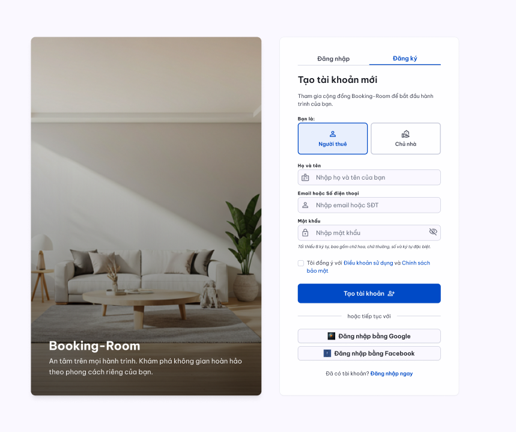

**Mục tiêu:** Cho phép người dùng mới tạo tài khoản để tham gia cộng đồng Booking-Room, bắt đầu hành trình tìm kiếm không gian sống hoặc đăng tin cho thuê phòng.

**Khu vực Lựa chọn vai trò (Bạn là):**

- Cung cấp hai tùy chọn đối tượng: **"Người thuê"** và **"Chủ nhà"** để hệ thống phân loại quyền hạn và giao diện dashboard phù hợp ngay sau khi đăng ký.
**Khu vực Biểu mẫu thông tin cá nhân:**

- **Họ và tên:** Ô nhập dữ liệu tên đầy đủ của người dùng để hiển thị trên hồ sơ.
- **Email hoặc Số điện thoại:** Thông tin định danh chính dùng để liên lạc, xác thực và đăng nhập.
- **Mật khẩu:** Trường nhập mật khẩu đi kèm yêu cầu bảo mật tối thiểu 8 ký tự (bao gồm chữ hoa, chữ thường, số, ký tự đặc biệt) và tính năng ẩn/hiện mật khẩu.
**Khu vực Pháp lý & Đăng ký nhanh:**

- **Checkbox đồng ý:** Xác nhận người dùng đã đọc và chấp thuận "Điều khoản sử dụng" và "Chính sách bảo mật" của hệ thống.
- **Tiếp tục với mạng xã hội:** Cho phép người dùng tạo tài khoản nhanh thông qua liên kết trực tiếp với **Google** hoặc **Facebook**.
**Các nút thao tác chính:**

- **"Tạo tài khoản":** Nút chính màu xanh nổi bật để gửi toàn bộ dữ liệu đăng ký lên hệ thống.
- **"Đăng nhập ngay":** Liên kết chuyển hướng dành cho người dùng đã có tài khoản.

##### Màn hình đăng nhập

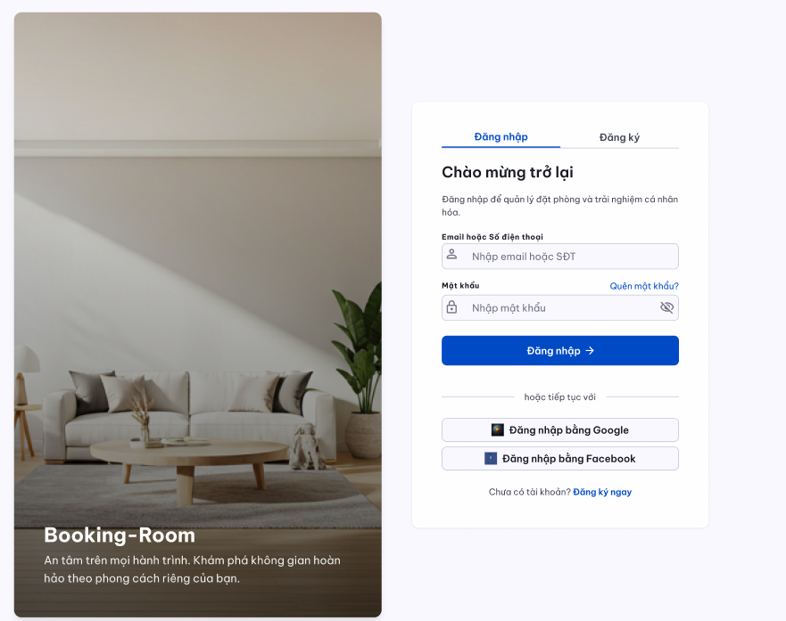

**Mục tiêu:** Giúp người dùng (Người thuê/Chủ nhà) truy cập vào hệ thống để quản lý phòng, tin đăng,... (Đối với chủ nhà) và tìm kiếm , đặt phòng,... (Đối với người thuê)

**Khu vực biểu mẫu truy cập:**

- **Email hoặc số điện thoại:** Nhập thông tin tài khoản đã đăng ký thành công trên hệ thống.
- **Mật khẩu:** Nhập mật khẩu truy cập kèm theo liên kết **"Quên mật khẩu?"** để hỗ trợ khôi phục quyền truy cập khi cần thiết.
**Khu vực Đăng nhập nhanh:**

- Hỗ trợ người dùng đăng nhập một chạm thông qua tài khoản **Google** hoặc **Facebook** đã liên kết trước đó.
**Các nút thao tác chính:**

- **"Đăng nhập":** Nút xác nhận để bắt đầu phiên làm việc trên nền tảng.
- **"Đăng ký ngay":** Liên kết dẫn tới trang tạo tài khoản dành cho người dùng mới.

##### Dashboard Quản trị viên/Admin

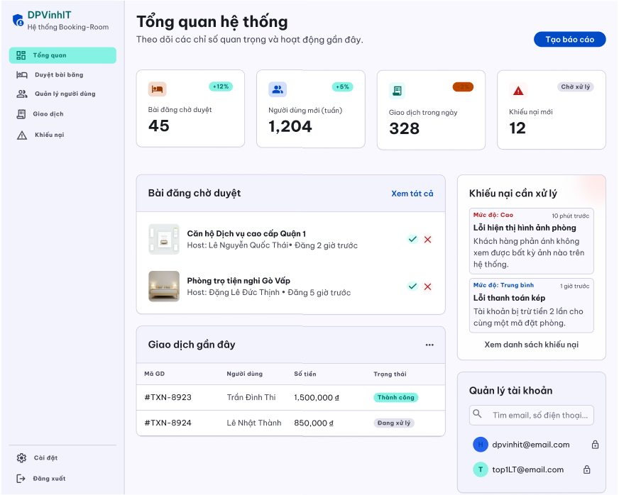

**Mục tiêu:** Cung cấp cho Admin cái nhìn toàn cảnh về tình hình hoạt động của hệ thống, hỗ trợ phê duyệt nội dung nhanh chóng và giải quyết kịp thời các khiếu nại từ người dùng.

**Tổng quan hệ thống:**

- Hiển thị các thẻ thông số quan trọng (Real-time): Tổng số người dùng mới, Tổng số giao dịch trong ngày, Tổng số bài đăng đang chờ duyệt, và Số khiếu nại chưa xử lý.
**Khu vực bài đăng chờ duyệt:**

- Danh sách dạng bảng các bài đăng phòng mới từ Host cần được kiểm duyệt trước khi public.
- Hiển thị: Tiêu đề bài đăng, tên Host, thời gian đăng tải, và cột hành động.
**Khu vực khiếu nại cần xử lý:**

- Danh sách các vé hỗ trợ (Ticket) hoặc khiếu nại từ Khách thuê (VD: Phòng không giống ảnh, Lỗi thanh toán kép, Host không hoàn cọc).
- Hiển thị: Mức độ ưu tiên (Cao/Trung bình/Thấp), tiêu đề khiếu nại, tên người gửi, và thời gian gửi.
**Khu vực quản lý tài khoản người dùng**:

- Danh sách tài khoản hiển thị các cột: Avatar, Họ và tên, Email/SĐT liên hệ, Vai trò (Guest/Host), và Trạng thái (Đang hoạt động, Chờ xác thực, Bị khóa).
- Thanh tìm kiếm (Search bar) cho phép tra cứu nhanh theo ID, Email hoặc Số điện thoại
**Khu vực quản lý giao dịch hệ thống:**

- Danh sách các giao dịch được sắp xếp ưu tiên hiển thị từ mới nhất đến cũ nhất.
- Các cột thông tin cốt lõi: Mã giao dịch (Transaction ID), Người chuyển khoản (Guest), Người thụ hưởng (Host), Số tiền cọc, Phương thức thanh toán (VNPAY/Stripe), Thời gian, và Trạng thái (Thành công, Đang chờ, Thất bại, Đã hoàn tiền).
**Các nút thao tác chính:**

- **Thao tác trong tab duyệt bài đăng (Thanh sidebar bên trái):**
- **Nút "Xem chi tiết" (Icon con mắt):** Mở bản xem trước (Preview) của bài đăng để Admin kiểm tra hình ảnh, giá cả, nội dung mô tả xem có dấu hiệu lừa đảo hay vi phạm nội quy không.
- **Nút "Duyệt bài" (Màu xanh lá):** Xác nhận bài đăng hợp lệ. Trạng thái bài đăng chuyển thành "Active" và lập tức hiển thị trên luồng tìm kiếm của người thuê.
- **Nút "Từ chối" (Màu đỏ):** Từ chối bài đăng vi phạm. Khi bấm vào, hệ thống sẽ bật lên một hộp thoại yêu cầu Admin chọn hoặc nhập "Lý do từ chối" (VD: Hình ảnh không rõ nét, sai thông tin định danh). Thông báo này sẽ được tự động gửi qua email/app cho Host để họ khắc phục.
- **Thao tác trong tab khiếu nại (Thanh sidebar bên trái):**
- **Nút "Tiếp nhận xử lý":** Chuyển trạng thái khiếu nại từ "Mới" sang "Đang xử lý", đồng thời gắn tên Admin đang phụ trách vào ticket đó để tránh trùng lặp công việc.
- **Nút "Yêu cầu cung cấp bằng chứng":** Mở khung chat hoặc form gửi email trực tiếp từ hệ thống đến Khách thuê/Host để yêu cầu bổ sung hình ảnh, video hoặc biên lai giao dịch.
- **Nút "Hoàn tiền" (Refund):** (Áp dụng cho các tranh chấp liên quan đến tiền cọc). Kích hoạt lệnh hoàn lại tiền thông qua cổng thanh toán về tài khoản của Khách thuê nếu xác định lỗi thuộc về Host.
- **Nút "Cảnh báo / Khóa tài khoản":** Thao tác áp dụng hình phạt đối với tài khoản vi phạm sau khi xử lý xong khiếu nại.
- **Nút "Đóng khiếu nại" (Mark as Resolved):** Đánh dấu sự cố đã được giải quyết dứt điểm và lưu toàn bộ tiến trình vào lịch sử hệ thống.

##### Dashboard Chủ phòng (Host)

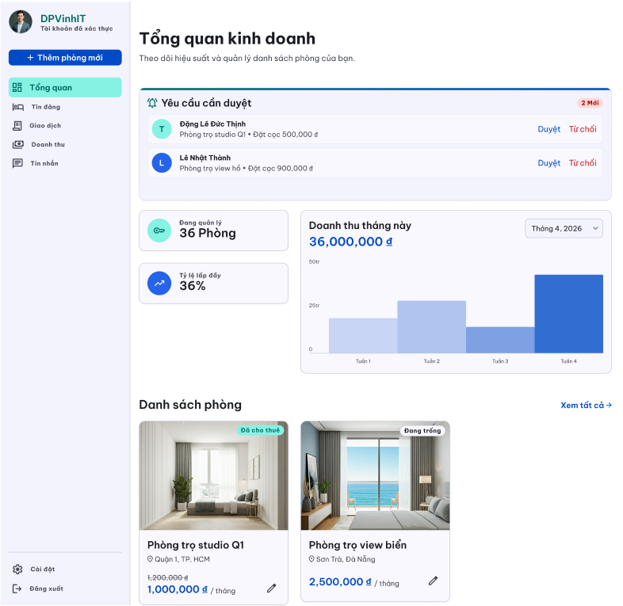

**Mục tiêu:** Giúp chủ phòng (Host) theo dõi chi tiết hiệu suất kinh doanh, tỷ lệ lấp đầy và quản lý nhanh danh sách các phòng trọ/căn hộ đang sở hữu trên nền tảng.

**Thanh thống kê tổng quan (Chỉ số kinh doanh):**

- **Doanh thu:** Hiển thị tổng doanh thu theo tháng/quý/năm. Đi kèm là biểu đồ (cột/đường) minh họa sự tăng trưởng hoặc sụt giảm so với kỳ trước.
- **Tỷ lệ lấp đầy:** Hiển thị dưới dạng phần trăm (%) (Ví dụ: 85% - 17/20 phòng đã cho thuê). Đi kèm biểu đồ tròn (Pie chart) trực quan.
- **Lượt tương tác:** Hiển thị tổng số lượt xem phòng, lượt lưu vào danh sách yêu thích và số yêu cầu đặt cọc mới.
**Khu vực danh sách phòng:**

- Hiển thị danh sách các phòng đang quản lý dưới dạng thẻ (Card).
- Mỗi thẻ bao gồm: Ảnh đại diện phòng, tiêu đề (VD: Căn hộ Studio Q1), giá thuê/tháng, và trạng thái hiện tại (Đang trống, Đã cho thuê, Đang bảo trì).
**Khu vực duyệt yêu cầu:**

- Hiển thị danh sách các yêu cầu đặt phòng/đặt cọc dưới dạng thẻ (Card) hoặc bảng liệt kê chi tiết để dễ dàng quản lý.
- Mỗi thẻ yêu cầu bao gồm các thông tin cốt lõi: Ảnh đại diện căn phòng, tiêu đề phòng (VD: Căn hộ Studio Q1), giá thuê/tháng, tên người thuê và số tiền cọc dự kiến.
**Các nút thao tác chính:**

- **Bộ lọc thời gian (Dropdown):** Cho phép Host chọn xem dữ liệu thống kê theo Tuần, Tháng, hoặc Năm để đánh giá hiệu quả kinh doanh.
- **"Thêm phòng mới" (Nút màu xanh/cam nổi bật):** Mở biểu mẫu để Host đăng tải thông tin một phòng/căn hộ mới lên hệ thống.
- **"Chỉnh sửa" (Icon cây bút):** Nằm trên từng thẻ phòng, cho phép Host cập nhật lại giá, hình ảnh hoặc mô tả.
- **"Đổi trạng thái":** Công tắc (Toggle) để Host chuyển nhanh trạng thái phòng từ "Đang trống" sang "Đã cho thuê" (ẩn khỏi kết quả tìm kiếm).

##### Trang chủ tìm kiếm phòng

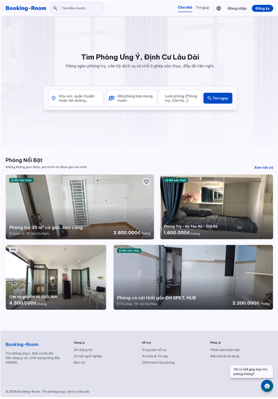

**Mục tiêu:** Cung cấp nền tảng tìm kiếm phòng trọ trực quan, cho phép mọi đối tượng người dùng (khách vãng lai và thành viên) dễ dàng tra cứu, lọc thông tin và tương tác với AI để tìm kiếm không gian sống phù hợp trước khi tiến hành các thủ tục đăng ký cũng như pháp lý liên quan.

**Khu vực Thanh tìm kiếm thông minh:**

- **Tiêu đề truyền cảm hứng:** "Tìm Phòng Ưng Ý, Định Cư Lâu Dài" – Khẳng định giá trị cốt lõi về sự tin cậy.
- **Bộ lọc nhanh:**
  - **Địa điểm:** Cho phép chọn địa điểm để có thể tìm theo khu vực, quận/huyện hoặc tên đường cụ thể.
  - **Khoảng giá:** Tùy chỉnh ngân sách mong muốn của người dùng.
  - **Loại hình:** Nhiều sự lựa chọn đa dạng cho người dùng giữa phòng trọ truyền thống, căn hộ dịch vụ hoặc ở ghép.
- **Nút "Tìm ngay":** Dùng kích hoạt bộ lọc để hiển thị kết quả chính xác theo mong muốn của người dùng.
**Khu vực Danh sách Phòng Nổi Bật:**

- **Thẻ thông tin phòng:** Hiển thị hình ảnh thực tế, giá thuê theo tháng và vị trí địa lý của phòng.
- **Hệ thống nhãn:**
  - **"Đã xác thực":** Đảm bảo phòng đã qua kiểm duyệt về hình ảnh và pháp lý.
  - **"Mới":** Đánh dấu các tin đăng vừa được cập nhật.
  - …
- **Thông tin định hướng:** Tập trung vào các tiện ích xung quanh như gần các trường Đại học lớn (ĐH VL, IUH, SPKT, HUB...), phù hợp với đối tượng sinh viên và người đi làm.
**Khu vực Trợ lý tìm phòng (AI Chatbot):**

- **Cửa sổ tương tác:** Nằm ở góc phải màn hình, luôn sẵn sàng hỗ trợ bằng ngôn ngữ tự nhiên.
- **Tính năng tư vấn:** Cho phép cả khách vãng lai và client đặt câu hỏi (VD: "Tìm phòng quanh trường HCMUS giá dưới 3 triệu") mà không cần thao tác lọc thủ công.
- **Đề xuất thông minh:** AI tự động gửi các gợi ý phòng kèm hình ảnh ngay trong khung chat dựa trên nhu cầu thực tế của người dùng.
**Quy trình Phân quyền & Hành động:**

- **Quyền xem và tra cứu:** Cả hai đối tượng (người dùng và khách vãng lai) đều có quyền truy cập toàn bộ kho dữ liệu phòng, sử dụng bộ lọc và chat với AI để tham khảo thông tin.
- **Quyền Đặt phòng:** Người dùng nhấn vào nút đặt phòng hoặc yêu cầu xem hợp đồng, hệ thống sẽ yêu cầu **Đăng nhập/Đăng ký**. Vì hệ thống yêu cầu đảm bảo tính danh chính chủ, lưu trữ lịch sử giao dịch và thực hiện các cam kết về pháp lý giữa chủ nhà và người thuê.

##### Kết quả tìm kiếm phòng

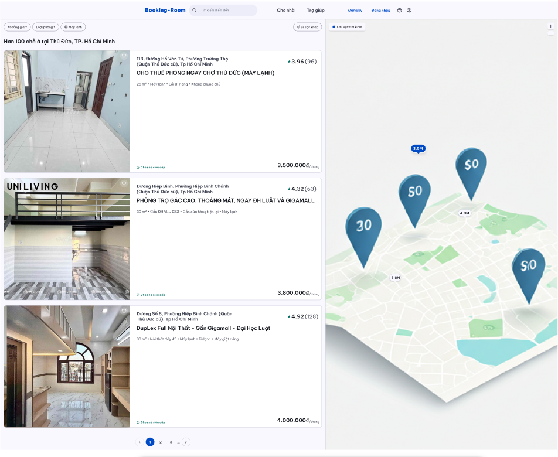

**Mục tiêu:** Cung cấp danh sách các lựa chọn nơi ở phù hợp với nhu cầu của người dùng sau khi lọc, kết hợp giữa danh sách trực quan và bản đồ địa lý để tối ưu hóa việc so sánh giá cả và vị trí.

**Khu vực Thanh điều hướng và Bộ lọc:**

- **Thanh tìm kiếm nhanh:** Cho phép người dùng thay đổi địa điểm hoặc từ khóa tìm kiếm ngay tại trang kết quả mà không cần quay lại trang chủ.
- **Hệ thống lọc:**
  - **Khoảng giá:** Giới hạn ngân sách để loại bỏ các phòng không phù hợp.
  - **Loại phòng:** Lọc nhanh giữa Phòng trọ, Căn hộ, Duplex hoặc Ở ghép.
  - **Tiện ích đi kèm:** Các nhãn lọc nhanh như "Máy lạnh", "Máy giặt", "Không chung chủ".
  - **Bộ lọc khác:** Mở rộng các tiêu chí chuyên sâu (diện tích, hướng phòng, chính sách cọc).
**Khu vực Danh sách Kết quả:**

- **Tiêu đề tóm tắt:** Hiển thị tổng số lượng kết quả tìm thấy tại khu vực cụ thể (VD: "Hơn 100 chỗ ở tại Thủ Đức, TP. Hồ Chí Minh").
- **Thẻ thông tin phòng:**
  - **Hình ảnh:** Trình chiếu các góc nhìn thực tế của căn phòng (phòng khách, nhà vệ sinh, gác lửng).
  - **Thông tin địa chỉ:** Hiển thị chi tiết số nhà, tên đường và phường để người dùng ước lượng khoảng cách.
  - **Đặc điểm nổi bật:** Các dòng mô tả ngắn gọn như "Phòng trọ gác cao", "Duplex full nội thất", "Gần ĐH Luật và Gigamall".
  - **Thông số kỹ thuật:** Diện tích (ví dụ: **25m²**, **30m²**), tình trạng nội thất và các tiện ích cốt lõi.
  - **Đánh giá (Rating):** Hiển thị số sao và số lượng đánh giá từ những người thuê trước đó để tăng độ tin cậy.
  - **Giá thuê:** Niêm yết rõ ràng theo đơn vị **VNĐ/tháng** ở góc phải dưới của thẻ.
**Khu vực Bản đồ Tương tác:**

- **Giao diện 3D/Perspective:** Bản đồ trực quan giúp người dùng hình dung rõ địa hình và các trục đường chính tại khu vực tìm kiếm.
- **Ghim giá:** Các điểm đánh dấu trên bản đồ hiển thị mức giá rút gọn (VD: 3.5M, 4.0M).
- **Liên kết dữ liệu:** Khi chọn một vị trí trên bản đồ, thẻ phòng tương ứng ở bên trái sẽ được làm nổi bật để người dùng dễ dàng đối chiếu.
**Khu vực Chuyển trang: **Nằm ở cuối danh sách kết quả, cho phép người dùng di chuyển giữa các trang để khám phá thêm nhiều lựa chọn khác mà không làm giảm tốc độ tải trang.

##### Xem thông tin chi tiết phòng

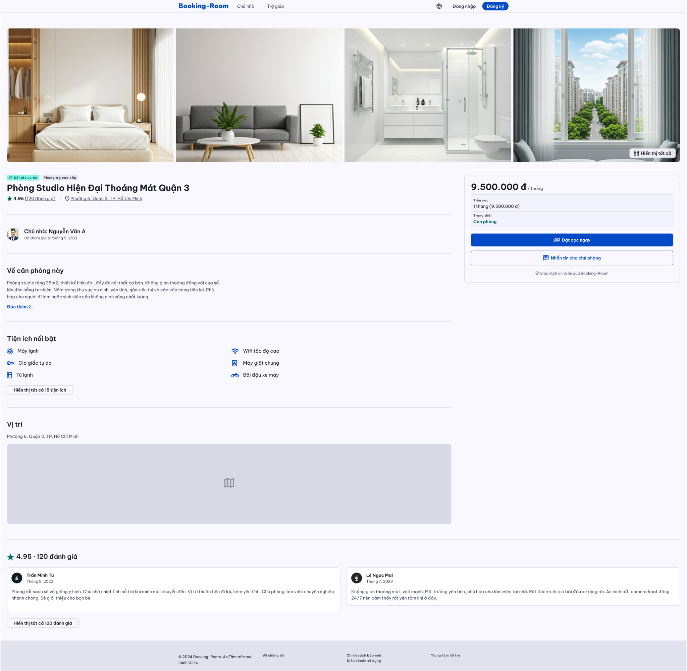

**Mục tiêu:** Cung cấp thông tin toàn diện, minh bạch và trực quan nhất về một không gian lưu trú cụ thể. Xây dựng lòng tin cho người thuê (Guest) thông qua hình ảnh, thông số thực tế và đánh giá cộng đồng; từ đó thúc đẩy hành động chuyển đổi cốt lõi (Conversion) là "Đặt cọc" hoặc "Liên hệ chủ phòng".

**Khu vực Hình ảnh trực quan:**

- **Hiển thị:** Bố cục dạng lưới với 4 hình ảnh đại diện lớn (phòng ngủ, phòng khách, phòng tắm, view cửa sổ), giúp Guest ngay lập tức hình dung được không gian sống.
- **Nút hành động:** Nút "Hiển thị tất cả" (kèm biểu tượng lưới) đặt ở góc dưới cùng bên phải của ảnh cuối. Khi click sẽ mở ra một Modal/Lightbox dạng Gallery trượt chứa toàn bộ hình ảnh của căn phòng.
- **Mục đích:** Thỏa mãn nhu cầu thị giác, yếu tố quyết định đầu tiên trong trải nghiệm tìm phòng.
**Khu vực Thông tin tổng quan:**

- **Nhãn (Tags) phân loại:** "Đối tác uy tín" (màu xanh ngọc), "Phòng trọ cao cấp" (màu xám nhạt) – giúp định vị phân khúc phòng.
- **Tiêu đề:** "Phòng Studio Hiện Đại Thoáng Mát Quận 3" (Font chữ to, in đậm, nổi bật).
- **Đánh giá & Vị trí:** Điểm số "4.95" kèm số lượng "(120 đánh giá)", định dạng link có thể click để cuộn nhanh (scroll-to) xuống phần Đánh giá. Kèm theo là text địa chỉ ngắn gọn "Phường 6, Quận 3, TP. Hồ Chí Minh".
- **Thông tin Chủ nhà (Host Info):** Avatar, Tên chủ nhà ("Nguyễn Văn A"), Thời gian tham gia nền tảng. Có thể click vào để xem trang Profile của chủ nhà.
**Khu vực Chi tiết & Tiện ích căn phòng:**

- **Về căn phòng này:** Đoạn văn bản mô tả khái quát diện tích (35m2), phong cách thiết kế, đối tượng phù hợp. Giới hạn hiển thị 3-4 dòng đầu, có nút "Đọc thêm >" để mở rộng toàn bộ nội dung (Expand/Collapse text).
- **Tiện ích nổi bật:** Bố cục chia 2 cột hiển thị tối đa 6 tiện ích quan trọng nhất (kèm icon trực quan như Máy lạnh, Giờ giấc tự do, Wifi...).
- **Nút hành động:** "Hiển thị tất cả 15 tiện ích" mở ra một Popup liệt kê đầy đủ các trang thiết bị, quy định của phòng.
- **Mục đích:** Cung cấp thông số kỹ thuật (Specs) chi tiết để Guest đối chiếu với nhu cầu cá nhân.
**Khu vực Vị trí (Location/Map):**

- **Hiển thị:** Tóm tắt lại địa chỉ. Một khung hình chữ nhật lớn (hiện đang là placeholder có icon bản đồ), sẽ được tích hợp Google Maps API hoặc tương đương.
- **Tính năng:** Cho phép Guest tương tác (phóng to, thu nhỏ) để xem cảnh quan xung quanh, đường đi, tiện ích lân cận (siêu thị, trạm xe buýt).
**Khu vực Đánh giá từ cộng đồng:**

- **Tổng quan:** Hiển thị lại điểm số trung bình (4.95) và tổng số lượt đánh giá.
- **Card đánh giá:** Hiển thị mặc định 2 đánh giá nổi bật/mới nhất. Mỗi card bao gồm: Avatar, Tên Guest, Thời gian đánh giá, Nội dung nhận xét chi tiết.
- **Nút hành động:** "Hiển thị tất cả 120 đánh giá" để mở Modal đọc toàn bộ review.
**Khu vực Bảng điều khiển hành động:**

- **Khối Giá & Trạng thái:** Giá thuê hiển thị to, rõ ràng: "9.500.000 đ / tháng".
  - Bảng thông tin phụ: "Tiền cọc: 1 tháng (9.500.000 đ)" và "Trạng thái: Còn phòng" (Text màu xanh lá khẳng định tính khả dụng).
- **Khối Nút hành động (Call to Action):**
  - Nút Primary (Xanh đậm, nổi bật nhất): "Đặt cọc ngay" -> Dẫn người dùng sang luồng thanh toán (Checkout flow).
  - Nút Secondary (Trắng, viền xanh): "Nhắn tin cho chủ phòng" -> Mở module Chat thời gian thực (Real-time chat).
- **Khối Cam kết:** Dòng chữ nhỏ "Giao dịch an toàn qua Booking-Room" kèm icon khiên bảo vệ, tăng cường yếu tố niềm tin trước khi người dùng ra quyết định xuất tiền.

##### Thanh toán đăng cọc

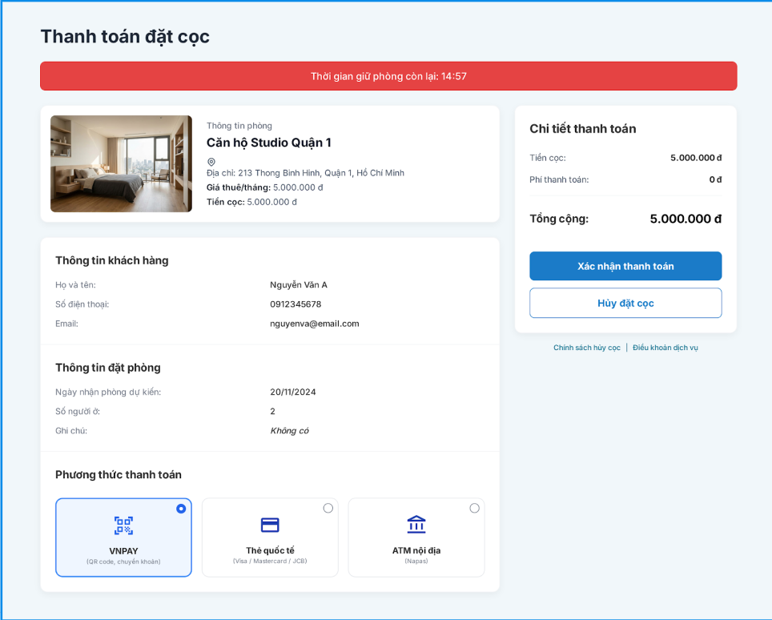

**Mục tiêu**:Cho phép người thuê (Guest) kiểm tra lại toàn bộ thông tin phòng, thông tin cá nhân, chi tiết tài chính, lựa chọn phương thức thanh toán và xác nhận đặt cọc. Hệ thống tự động khóa phòng tạm thời trong 15 phút (hiển thị bộ đếm ngược) để đảm bảo quyền ưu tiên thanh toán, tránh tranh chấp trùng lặp.

**Khu vực bộ đếm ngược giữ phòng:**

- Hiển thị dòng cảnh báo nổi bật: *“Thời gian giữ phòng còn lại: 14:59”* (định dạng mm:ss, đếm lùi từ 15 phút).
- Khi về 00:00, hệ thống tự động hủy phiên đặt cọc, giải phóng phòng và thông báo để người dùng thao tác lại.
**Khu vực thông tin phòng:**

- Hiển thị ảnh thumbnail (hình đại diện), tên phòng (ví dụ: "Căn hộ Studio Quận 1"), địa chỉ chi tiết, giá thuê/tháng và số tiền cọc yêu cầu.
- Đảm bảo dữ liệu được truyền đồng bộ từ trang chi tiết phòng, không cho phép chỉnh sửa tại màn hình này.
**Khu vực thông tin khách hàng:**

- Hiển thị các trường: Họ và tên, Số điện thoại, Email – được lấy tự động từ hồ sơ đã đăng nhập của Guest.
- Hỗ trợ nút “Chỉnh sửa” (nếu cần) để quay lại trang hồ sơ cá nhân.
**Khu vực thông tin đặt phòng:**

- Bao gồm: Ngày nhận phòng dự kiến, Số người ở, Ghi chú (nếu có).
- Các trường này được khởi tạo từ lúc Guest bắt đầu yêu cầu đặt cọc; có thể cho phép chỉnh sửa hạn chế (ví dụ: thay đổi ngày nhận phòng) và cập nhật lại tổng tiền nếu có phát sinh.
**Khu vực chi tiết thanh toán (Sidebar bên phải):**

- Danh sách các khoản: Tiền cọc, Phí thanh toán (nếu có), Tổng cộng.
- Số tiền được hiển thị rõ ràng, định dạng theo chuẩn VNĐ (kèm ký tự ₫).
- Khu vực này có thể được bố trí dưới dạng thẻ tóm tắt để người dùng dễ dàng đối chiếu.
**Khu vực chọn phương thức thanh toán:**

- Cung cấp 3 tùy chọn dạng thẻ bấm (radio/card):
  - VNPAY (hỗ trợ QR code, chuyển khoản) – kèm mô tả phụ.
  - Thẻ quốc tế (Visa / Mastercard / JCB).
  - ATM nội địa (Napas, các ngân hàng Việt Nam).
- Highlight thẻ đang được chọn (active). Bắt buộc người dùng chọn ít nhất một phương thức thì nút “Xác nhận thanh toán” mới được kích hoạt.
**Khu vực nút hành động:**

- Nút “Xác nhận thanh toán” (màu xanh chính): Khi nhấn, hệ thống tạo giao dịch với trạng thái Pending, chuyển hướng đến cổng thanh toán tương ứng (sandbox VNPAY/Stripe) hoặc mô phỏng chuyển sang màn hình thành công.
- Nút “Hủy đặt cọc” (đường viền): Quay lại trang chi tiết phòng, hủy phiên giữ phòng và giải phóng khóa tạm thời.
- Footer liên kết: “Chính sách hủy cọc” và “Điều khoản dịch vụ” – mở popup hoặc trang mới để người dùng tham khảo trước khi thanh toán.
**Ràng buộc kỹ thuật & phi chức năng:**

- Toàn bộ quá trình truyền tải thông tin thanh toán phải qua HTTPS, không lưu trữ thông tin thẻ trên server.
- Bộ đếm ngược đồng bộ giữa client và server để tránh tấn công thay đổi thời gian cục bộ.
- Thao tác xác nhận thanh toán phải hoàn tất dưới 6 giây (bao gồm callback từ cổng thanh toán).
- Giao diện responsive, ưu tiên hiển thị tốt trên thiết bị di động (do người dùng có thể thanh toán qua điện thoại).

##### Đặt cọc thành công

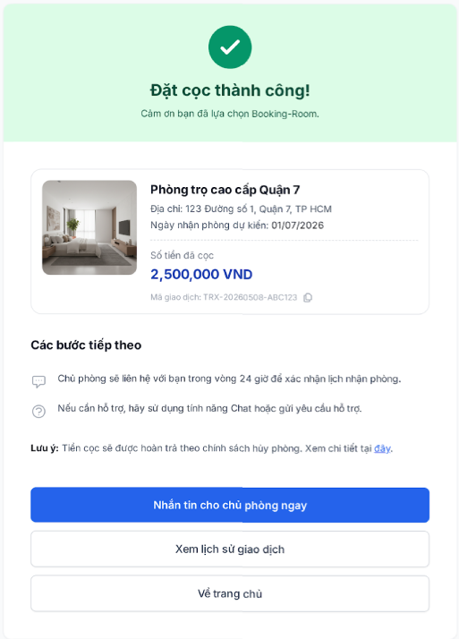

**Mục tiêu:** Xác nhận giao dịch đặt cọc đã hoàn tất thành công, cung cấp thông tin chi tiết về giao dịch (mã giao dịch, số tiền, thông tin phòng) và hướng dẫn các bước tiếp theo để người thuê chủ động liên hệ với chủ phòng cũng như tra cứu lại hồ sơ khi cần thiết.

**Khu vực thông báo kết quả:**

- Hiển thị tiêu đề nổi bật: “Đặt cọc thành công!” kèm biểu tượng ✓ trong vòng tròn màu xanh lá.
- Dòng phụ chúc mừng: *“Cảm ơn bạn đã lựa chọn Booking-Room.”* – tạo thiện cảm và khẳng định thương hiệu.
**Khu vực thông tin phòng đã đặt cọc:**

- Tên phòng (ví dụ: “Phòng trọ cao cấp Quận 7”).
- Địa chỉ chi tiết.
- Ngày nhận phòng dự kiến.
- Số tiền đã cọc (định dạng VND, in đậm để nổi bật).
**Khu vực mã giao dịch:**

- Hiển thị dòng: “Mã giao dịch: TRX-20260508-ABC123” – mã duy nhất do hệ thống sinh ra.
- Kèm theo nút “Copy” (biểu tượng hoặc chữ) để người dùng dễ dàng lưu lại mã phục vụ tra cứu hoặc khiếu nại sau này.
**Khu vực các bước tiếp theo (hướng dẫn):**

- Dòng 1: *“Chủ phòng sẽ liên hệ với bạn trong vòng 24 giờ để xác nhận lịch nhận phòng.”*
- Dòng 2: *“Nếu cần hỗ trợ, hãy sử dụng tính năng Chat hoặc gửi yêu cầu hỗ trợ.”*
- Mục đích: Định hướng hành động tiếp theo cho Guest, giảm băn khoăn sau khi đặt cọc.
**Khu vực cảnh báo chính sách hoàn tiền:**

- Dòng chữ lưu ý: *“Lưu ý: Tiền cọc sẽ được hoàn trả theo chính sách hủy phòng. Xem chi tiết tại đây.”* – kèm link mở popup hoặc trang điều khoản.
- Đảm bảo minh bạch về tài chính
**Khu vực nút hành động:**

- “Nhắn tin cho chủ phòng ngay” (màu xanh chính) – mở khung chat realtime để Guest trao đổi trực tiếp.
- “Xem lịch sử giao dịch” – giúp Guest kiểm tra lại toàn bộ các giao dịch đã thực hiện.
- “Về trang chủ” – quay lại màn hình tìm kiếm phòng, tiếp tục khám phá các phòng khác.
**Ràng buộc kỹ thuật & phi chức năng**:

- Mã giao dịch phải được tạo từ server, duy nhất toàn hệ thống, không trùng lặp.
- Sau khi hiển thị màn hình này, hệ thống tự động gửi email xác nhận kèm hóa đơn (biên lai điện tử) cho cả Guest và Host.
- Giao diện nên có hiệu ứng nhẹ (confetti hoặc fade-in) để tăng trải nghiệm người dùng.
- Nút “Copy mã giao dịch” cần hiển thị thông báo “Đã copy” tạm thời khi nhấn thành công.

##### Trợ lý ảo giúp hỗ trợ tìm phòng

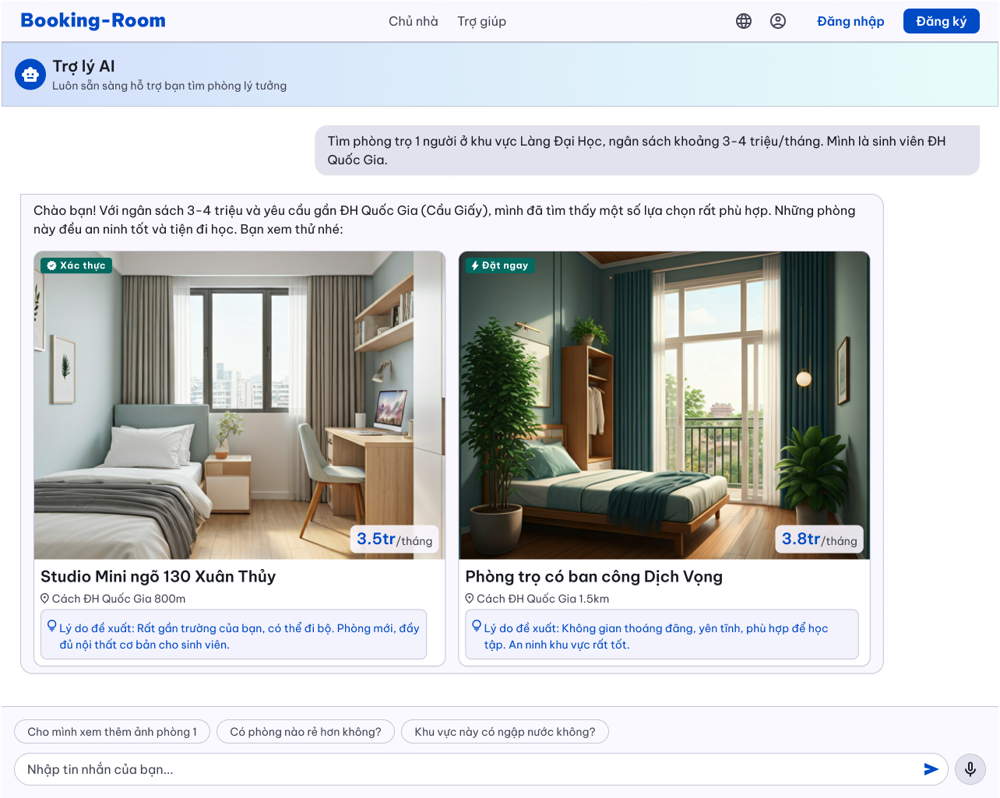

**Mục tiêu:** Chuyển đổi luồng tìm kiếm truyền thống (dùng bộ lọc/filter cứng nhắc) sang luồng tìm kiếm bằng ngôn ngữ tự nhiên (Natural Language). Mục đích là giảm thiểu thời gian thao tác cho người dùng (Guest), đồng thời cá nhân hóa kết quả gợi ý dựa trên ngữ cảnh cụ thể (ngân sách, vị trí, thân phận sinh viên), từ đó tăng tốc độ ra quyết định.

**Khu vực Tiêu đề & Định danh:**

- **Hiển thị:** Tên "Trợ lý AI" kèm Icon Robot thân thiện và dòng miêu tả "Luôn sẵn sàng hỗ trợ bạn tìm phòng lý tưởng".
- **Mục đích UX:** Thiết lập kỳ vọng cho người dùng rằng họ đang tương tác với một hệ thống tự động, không phải người thật, đồng thời tạo cảm giác đồng hành, hỗ trợ.
**Khu vực Khung Chat:**

- **Tin nhắn của người dùng:** Khung bong bóng chat (Chat bubble) màu xám nhạt nằm bên phải. Ghi nhận câu lệnh ngôn ngữ tự nhiên: *"Tìm phòng trọ 1 người ở khu vực Làng Đại Học, ngân sách khoảng 3-4 triệu/tháng. Mình là sinh viên ĐH Quốc Gia."*
- **Phản hồi văn bản của AI:** Khung bong bóng nằm bên trái. AI phản hồi lại bằng ngôn ngữ tự nhiên, xác nhận lại các thực thể (Named Entities) đã trích xuất được từ câu lệnh: Ngân sách (3-4 triệu), Vị trí mục tiêu (ĐH Quốc Gia - Cầu Giấy).
**Khu vực Thẻ Kết quả Đa phương tiện (Rich Media Result Cards):** Đây là phần cốt lõi thể hiện khả năng tích hợp dữ liệu của hệ thống. Thay vì chỉ trả về text, AI trả về các Component UI động.

- **Cấu trúc Thẻ:** Giao diện trả về 2 thẻ phòng trọ trực quan. Mỗi thẻ bao gồm:
  - **Hình ảnh Thumbnail:** Ảnh chất lượng cao của phòng.
  - **Huy hiệu (Badge):** "Xác thực" (màu xanh lá) hoặc "Đặt ngay" (biểu tượng tia chớp). Thể hiện trạng thái dữ liệu (Trust metric & Availability).
  - **Giá tiền:** Nổi bật góc dưới ảnh (ví dụ: 3.5tr/tháng).
  - **Tiêu đề & Khoảng cách:** Tên phòng ("Studio Mini ngõ 130 Xuân Thủy") và thông số tính toán khoảng cách thực tế ("Cách ĐH Quốc Gia 800m").
- **Khối "Lý do đề xuất" (Explainable AI Block):** Hiển thị một khung nhỏ màu xanh nhạt có biểu tượng bóng đèn, giải thích lý do hệ thống chọn phòng này (Ví dụ: *"Rất gần trường của bạn, có thể đi bộ..."*).
**Khu vực Gợi ý Hành động (Suggestion Chips / Quick Replies):**

- **Hiển thị:** Các nút bấm hình viên thuốc (Pill buttons) nằm ngay trên thanh nhập liệu: *"Cho mình xem thêm ảnh phòng 1"*, *"Có phòng nào rẻ hơn không?"*, *"Khu vực này có ngập nước không?"*.
- **Mục đích:** Đóng vai trò là công cụ điều hướng cuộc hội thoại (Conversation routing). Giảm tải rào cản nhận thức (Cognitive load) cho người dùng khi họ không biết phải hỏi gì tiếp theo.
**Khu vực Nhập liệu đa phương thức (Multimodal Input Area):**

- **Hiển thị:** Khung text "Nhập tin nhắn của bạn...", nút Send (Gửi), và đặc biệt là nút Microphone (Nhập liệu bằng giọng nói - Voice to Text).
- **Bản chất:** Cho phép Guest linh hoạt về mặt thiết bị, đặc biệt tối ưu cho người dùng trên Mobile khi việc gõ một đoạn prompt dài là bất tiện.
