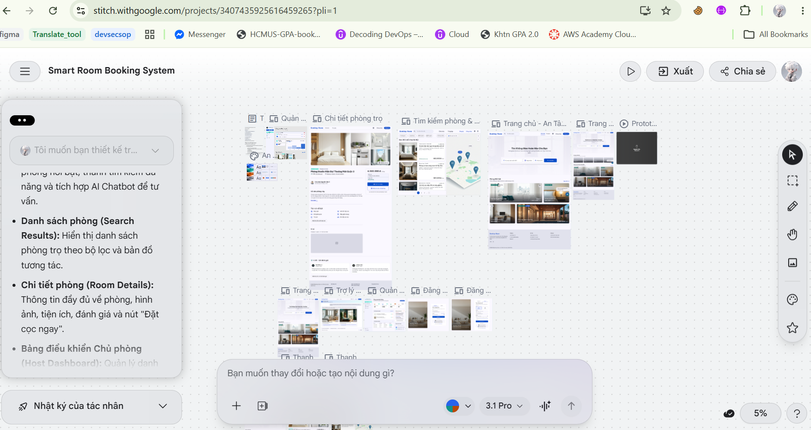
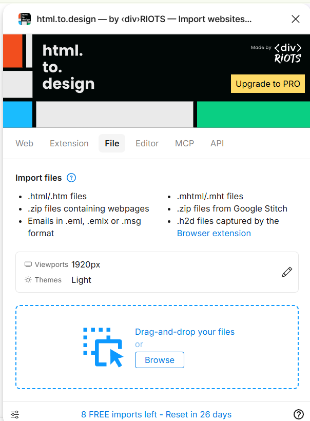
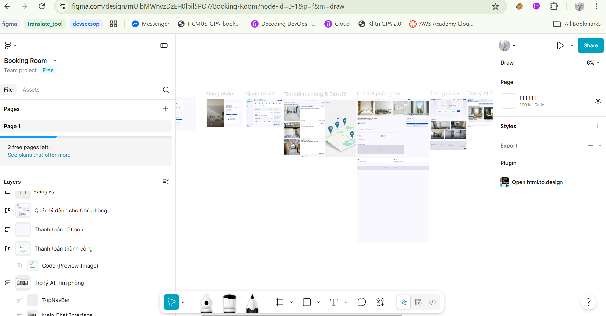
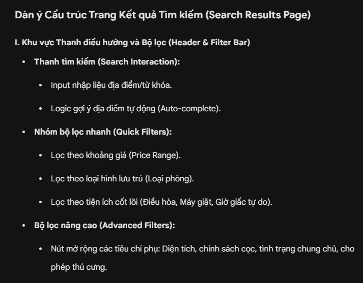
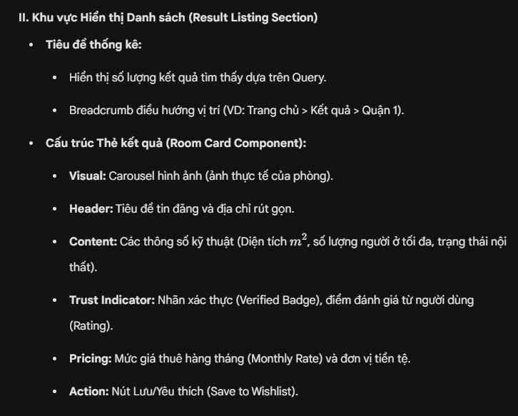
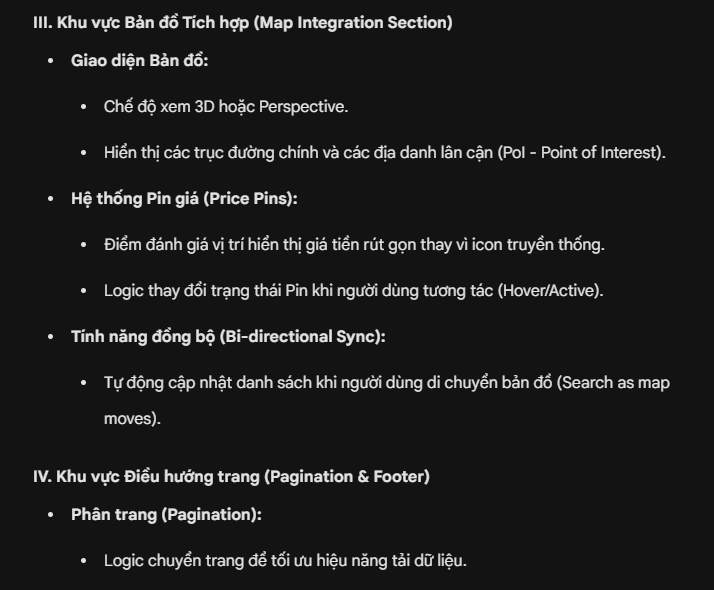
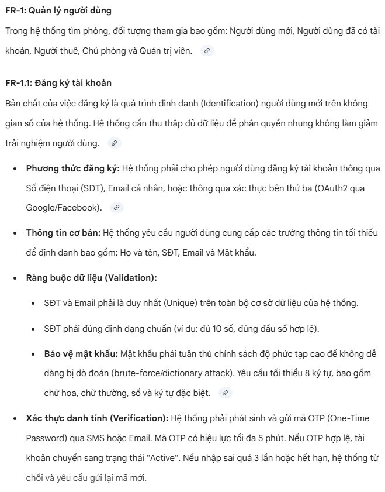
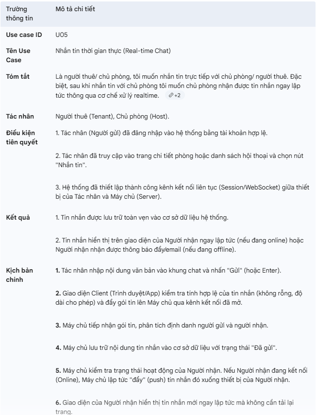
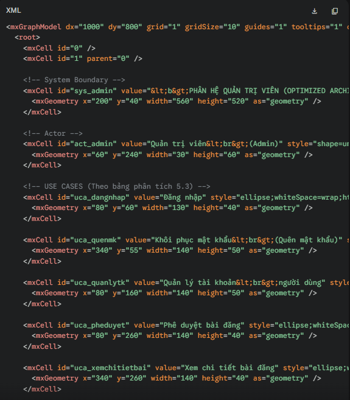
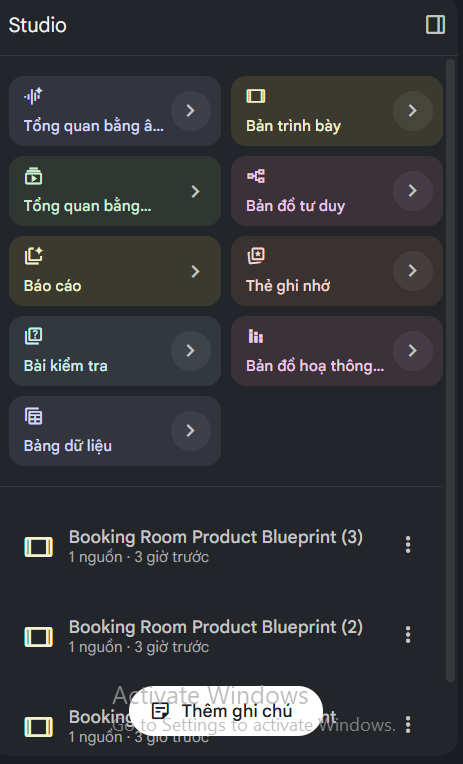

# Mục đích sử dụng AI

Based on the provided AI Usage Guideline document, teams must submit their AI usage declaration here. Students are encouraged to leverage AI tools creatively and effectively in this project.

**5.1. Công cụ Google Stitch AI**

- **Tên công cụ: **Stitch AI (Web platform - [Stitch](https://stitch.withgoogle.com/)).
- **Thời gian truy cập: **Từ 14:00 đến 21:00 ngày 06/05/2026 và 08/05/2026.
- **Mục đích sử dụng: **Sử dụng tính năng Text-to-UI để khởi tạo nhanh giao diện thô (wireframe/mockup) cho các màn hình chính của hệ thống dựa trên đặc tả Use Case.
- **Câu lệnh (prompt) đã sử dụng:**
- Đầu vào là các đặc tả use case đã viết và sơ đồ use case của dự án
- Câu prompt : “Tôi muốn bạn thiết kế trang web Booking Room dựa trên yêu cầu trong file cụ thể là các đặc tả use case và sơ đồ use case , thiết kế dựa trên các use case chính ”
- **Nội dung do AI tạo ra: **
- Bố cục tổng thể (Layout) của các màn hình: Trang chủ, Tìm kiếm, Chi tiết phòng, Dashboard Admin/Host, và giao diện AI Chatbot.
- Các thành phần giao diện cơ bản (UI Components) như: Thẻ phòng (Card), thanh tìm kiếm, bộ lọc, biểu đồ doanh thu và khung chat.
- **Công cụ hỗ trợ thiết kế**
  - Dùng plugin **html.to****.design **của figma để hỗ trợ import file (sau khi đã tải bản thiết kế từ Stitch thành file .zip) thành project trong figma để có thể dễ dàng tự chỉnh sửa theo ý muốn

- Kết quả:
**5.2. Công cụ Google Gemini**

- **Tên công cụ, phiên bản và nền tảng: **Gemini, Gemini 3 Flash, chạy trên nền tảng Web.
- **Thời gian truy cập:** 12:19 ngày 08 tháng 05 năm 2026.
- **Mục đích sử dụng:** Sử dụng để xây dựng cấu trúc logic và dàn ý cho phần "Mô tả chi tiết trang kết quả tìm kiếm" trong thiết kế hệ thống Booking-Room.
- **Câu lệnh (Prompt) đã sử dụng:** “Dựa trên hình ảnh giao diện Figma đã cung cấp, hãy xây dựng một dàn ý kỹ thuật chi tiết cho trang kết quả tìm kiếm của hệ thống Booking-Room. Yêu cầu bố cục rõ ràng bao gồm: Thanh điều hướng & Bộ lọc, Danh sách phòng (hiển thị diện tích, giá theo tháng), Bản đồ tương tác (sử dụng pin giá thay cho icon) và Logic phân quyền giữa khách vãng lai và thành viên.”
- **Nội dung do AI tạo ra:** Toàn bộ cấu trúc các mục lớn (I, II, III, IV), các gạch đầu dòng chi tiết về thành phần UI và bảng logic phân quyền người dùng.
- **Kết quả do AI tạo ra:**

**5.3. Sử dụng Google Gemini hỗ trợ đặc tả yêu cầu**

- **Tên công cụ:** Gemini Pro
- **Mục đích:** Sử dụng Gemini để phân tích và mô tả chi tiết đặc tả yêu cầu phần mềm. Đảm bảo kết quả đầu ra được trình bày logic, trực quan, bám sát nghiệp vụ và đạt chuẩn chuyên nghiệp của tài liệu kỹ thuật.
- **Thực hiện:**
  - Trước tiên, cần cung cấp danh sách các tính năng phần mềm đã được đề xuất ở phần *3.1.1. Đề xuất giải pháp* (thuộc Template Project Proposal). Danh sách này được tổng hợp vào một tệp văn bản (**.md**) với tên gọi tạm thời là **application-requirements.md**.
  - Tiếp theo, để định hướng Agent sinh ra bản mô tả yêu cầu đạt chất lượng cao, các tiêu chí đánh giá kết quả được thiết lập chặt chẽ như sau:
    - **Chính xác, đầy đủ:** Mô tả phải bao phủ toàn bộ các kịch bản sử dụng. Cần định nghĩa rõ ràng các ràng buộc dữ liệu đầu vào/đầu ra, các quy tắc nghiệp vụ và các yêu cầu phi chức năng (bảo mật, hiệu năng) đi kèm.
    - **Không phức tạp hóa vấn đề làm vượt quá quy mô dự án:** Tuyệt đối không tự ý thêm thắt các tính năng nằm ngoài tài liệu **application-functions.md** hoặc đề xuất các cơ chế quá mức cần thiết.
    - **Rõ ràng, không mâu thuẫn nhau:** Phải sử dụng thuật ngữ kỹ thuật đồng nhất xuyên suốt bản đặc tả. Logic nghiệp vụ giữa các module, các vai trò (Roles) và các chu trình trạng thái phải liên kết chặt chẽ, không có sự xung đột về quy trình thao tác hoặc phân quyền.
  - **Để đảm bảo các đặc tính trên, em đã thiết lập System Prompt như sau:** *"Hãy đọc hiểu file **application-functions.md** và viết đặc tả yêu cầu phần mềm chi tiết cho từng tính năng. Yêu cầu bắt buộc: (1) Trình bày chính xác, đầy đủ các luồng nghiệp vụ, các ràng buộc dữ liệu và tiêu chuẩn bảo mật. (2) Bám sát phạm vi dự án, tuyệt đối không bịa đặt thêm tính năng không có trong tài liệu. (3) Sử dụng văn phong kỹ thuật, học thuật, thống nhất thuật ngữ để không tạo ra mâu thuẫn logic giữa các chức năng."*
  - **Cuối cùng,** thay vì yêu cầu Agent sinh toàn bộ tài liệu cùng lúc dễ dẫn đến việc thiếu chi tiết, em áp dụng chiến lược chia để trị: Yêu cầu Agent sinh bản đặc tả lần lượt cho từng Requirement.
  - **Ví dụ thực thi với Requirement FR-1 (Đăng ký/Đăng nhập tài khoản người dùng):** Agent sẽ được cung cấp nội dung file **application-requirements.md** và nhận một User Prompt cụ thể như sau: *"Dựa vào các nguyên tắc đã thống nhất và nội dung của **application-functions.md**, hãy viết đặc tả chi tiết cho requirement 'FR-1: Đăng ký/Đăng nhập tài khoản người dùng'. Lưu ý: Hệ thống bao gồm các vai trò: Người dùng mới, Người dùng đã có tài khoản, Người thuê, Chủ phòng và Quản trị viên. Hãy chú trọng đặc tả kỹ các ràng buộc định dạng dữ liệu, cơ chế xác thực đa yếu tố, bảo mật mật khẩu lưu trữ và quy trình nâng cấp, phê duyệt phân quyền từ Người thuê lên Chủ phòng."*
  - **Bước cuối cùng: **Sau khi Agent sinh ra bản đặc tả yêu cầu cho từng chức năng (ví dụ: FR-1), kết quả không được sử dụng ngay mà phải trải qua một quy trình kiểm duyệt và tinh chỉnh thủ công để gia tăng tính chính xác.
    - Nếu kết quả khác xa kỳ vọng, em sẽ tạo một đoạn Chat mới với Gemini và bắt đầu lại từ đầu với những tinh chỉnh trong câu prompt để đảm bảo thỏa mãn những thiếu sót với câu prompt trước.
    - Nếu kết quả đúng hoặc gần đúng kỳ vọng, em sẽ trực tiếp sử dụng kết quả hoặc tinh chỉnh thủ công kết quả và sử dụng tùy theo từng mức độ.
- **Minh họa kết quả thu được:**

**5.4. Sử dụng Google Gemini hỗ trợ đặc tả Use Case**

- **Tên công cụ:** Gemini Pro
- **Mục đích:** Sử dụng Gemini để chuẩn hóa và cấu trúc hóa các Use Cases của hệ thống. Đảm bảo luồng tương tác giữa Tác nhân và Hệ thống được mô tả logic, bao phủ được cả luồng sự kiện chính và các luồng ngoại lệ/thay thế.
- **Thực hiện:** Quy trình đặc tả Use Case bằng AI được thực hiện tương tự như quy trình đặc tả yêu cầu, nhưng tập trung sâu hơn vào luồng hành vi:
  - Chuẩn bị dữ liệu đầu vào Cung cấp cho Agent danh sách các tác nhân đã được định nghĩa và sơ đồ Use Case tổng quát. Đối với mỗi Use Case, em sẽ tóm tắt ngắn gọn mục tiêu (Goal) và công nghệ cốt lõi dự kiến sử dụng (ví dụ: RESTful API hay WebSockets).
  - Để Agent sinh ra một bản Use Case đạt chuẩn công nghiệp, prompt được thiết kế với các tiêu chí rành mạch:
    - Cấu trúc chuẩn: Bắt buộc phải có các thành phần: Tên, Tóm tắt, Tác nhân, Tiền/Hậu điều kiện, Kịch bản chính, Kịch bản phụ và Ràng buộc phi chức năng.
    - Phân định rõ ràng: Phải tách biệt rạch ròi giữa "Hành động của Tác nhân" (Người dùng làm gì) và "Phản hồi của Hệ thống" (Hệ thống xử lý và hiển thị ra sao).
    - Bắt buộc phải suy nghĩ đến các trường hợp lỗi mạng, dữ liệu không hợp lệ hoặc tác nhân đang ở trạng thái không phản hồi.
  - Câu lệnh (Prompt) được sử dụng: *"Dựa trên danh sách Tác nhân và mô tả tóm tắt, hãy viết đặc tả chi tiết cho Use Case 'Nhắn tin thời gian thực (Real-time Chat)'. Yêu cầu: Trình bày theo form chuẩn (Tóm tắt, Tác nhân, Tiền/Hậu điều kiện, Kịch bản chính, Kịch bản phụ, Ràng buộc phi chức năng). Chú trọng phân tích chi tiết sự tương tác giữa Client và Server. Đặc biệt suy nghĩ đến các kịch bản phụ liên quan đến: (1) Mất kết nối mạng đột ngột, (2) Người nhận đang offline, và (3) Xử lý tải trọng (payload) không hợp lệ. Đảm bảo ngôn từ học thuật và sử dụng đúng thuật ngữ kỹ thuật mạng."*
  - Sau khi nhận được kết quả, văn bản không được sao chép nguyên mẫu mà phải trải qua quá trình đánh giá và tinh chỉnh thủ công tương tự như bước Sử dụng Google Gemini hỗ trợ đặc tả yêu cầu
- **Minh họa kết quả thu được:**

**5.4 Sử dụng Gemini Pro lên ý tưởng thiết kế Use Case**

- **Tên công cụ:** Gemini Pro, [Draw.io](http://draw.io)
- **Thời gian truy cập:** 8:12 ngày 6/5/2026
- **Mục đích: **Sử dụng Gemini để phân tích yêu cầu nghiệp vụ từ tài liệu, nhận diện các Tác nhân, trích xuất các Use Case cốt lõi và đề xuất cấu trúc biểu đồ đạt chuẩn UML. Đảm bảo hệ thống hóa các chức năng mạch lạc, tránh sự phân rã rườm rà và xác định đúng các mối liên kế (extend, include,kế thừa) để tối ưu hóa thiết kế kiến trúc phần mềm.
- **Thực hiện:**
Trước tiên, em tổng hợp các Functional Features của hệ thống từ Template0-Proposal vào một file [**functional-features.**](http://functional-features.md)**docx** và sau đó cung cấp cho Gemini Pro.

Tiếp theo, để định hướng Agent sinh ra bản phác thảo và cấu trúc Use Case đạt chất lượng học thuật cao, các tiêu chí đánh giá kết quả như:

**– Chính xác, chuẩn UML:** Nhận diện đúng Actor chính (như Người thuê, Quản trị viên) và Actor phụ (Hệ thống bên thứ 3 như Cổng thanh toán). Sử dụng chính xác quan hệ **<<include>>** cho các luồng bắt buộc và **<<extend>>** cho các luồng không bắt buộc người dùng phải làm.

**– Tối ưu tính trừu tượng cho Use case:** Không phức tạp hóa vấn đề bằng cách phân rã chức năng thành các thao tác nhỏ hơn. Tuyệt đối tránh gom nhóm sai bản chất (ví dụ: không dùng Generalization để gom các thao tác CRUD thành một Use Case vô nghĩa)

**– Rõ ràng, logic:** Đảm bảo tính đa hình của Actor thông qua kế thừa (Generalization), nhằm giảm thiểu sự chồng chéo của các đường association trên biểu đồ, giúp giao diện trực quan và dễ theo dõi hơn.

Để đảm bảo Usecase đầy đủ và chính xác, em đã thiết lập System Prompt như sau:

*“Bạn hãy đóng vai là một Chuyên gia thiết kế hệ thống đây là bài tập của môn Nhập Môn CNPM . Đọc hiểu file features-list.docx và đề xuất ý tưởng thiết kế biểu đồ Use Case. Yêu cầu bắt buộc: Trích xuất chính xác các Actor và Use Case cốt lõi.Thiết lập cấu trúc các mối quan hệ <>, <>, và Generalization tuân thủ nghiêm ngặt lý thuyết UML. Và output là mã XML và chia theo từng phân hệ người dùng.”*

- **Kết quả:** Sau khi Agent cung cấp mã PlantUML/XML. Sau đó, em dùng [Draw.io](http://draw.io), vào Edit Diagram paste phần mã XML vào để dựng và xem lại Use case, chỉnh sửa cho hình ảnh được rõ ràng hơn, chỉnh sửa lại tên Use Case trong gọn gàng rõ nghĩa hơn và chỉnh sửa những chức năng còn thiếu hoặc dư thừa trong quá trình AI sinh ra.
- **Hình ảnh minh họa kết quả nhận được:**

**5.4 Sử dụng Notebooklm **

- **Tên công cụ:** Notebooklm
- **Thời gian truy cập:** 18h00 ngày 9/5/2026
- **Mục đích: **Sử dụng Notebooklm để tạo ra slide nhằm cho mục đích Presentation để tóm tắt lại những gì đã làm trong đồ án
- **Câu prompt: **Không cần prompt ở mục này vì có tính năng sẵn để tạo slide
- **Kết quả : **

